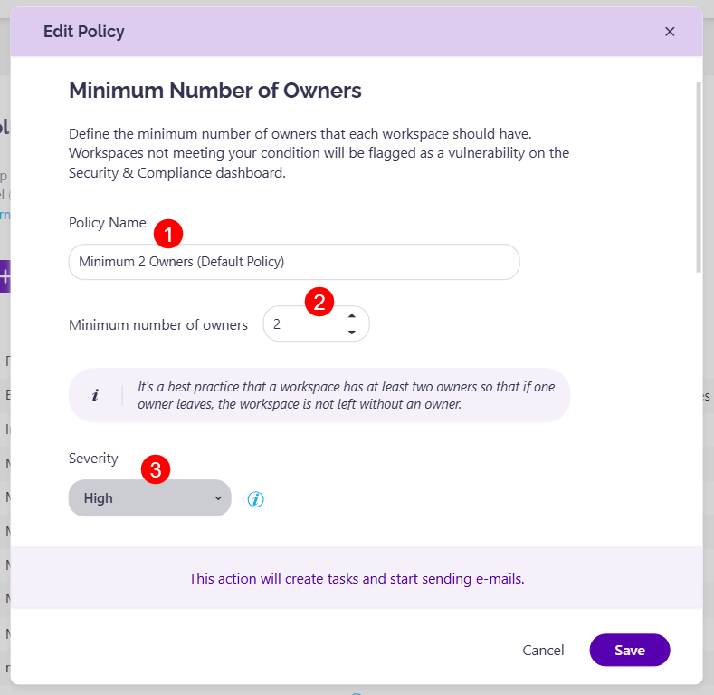

# Minimum Number of Owners

A predefined policy - **Minimum 2 Owners** - is located on the Policies screen. 
Click the **Edit (1)** icon to view all defined options for the policy. 

The **Edit Policy** dialog opens where you can:
* **Define the policy name (1)**
* **Define the maximum number of allowed owners (2)**; this is set to 5 by default
* **Choose the severity level (3)**; this option is enabled by default
* * **Enable Task Delegation (4)** by clicking the toggle next to it and selecting your task delegation preferences:
  * **Send reminder to reviewers (5)** 3 work days before due date; this option is enabled by default
  * **Choose what to do if owners don't resolve the policy vulnerability until the due date (6)**. The following options are available:
    * **Reassign Task**; when selected, you can define who will get the task - **Manager of the Reviewer**, **Syskit Point Administrators**, or **custom recipients**; this option is selected by default, and the tasks are reassigned to Manager of Reviewer
    * **Automatically Remove Owners**; if selected, **Syskit Point will remove existing owners starting from users with the oldest sign-in date** until the defined maximum number of owners is reached to comply with the policy
  * **Click the checkbox to allow owners to accept risk for the policy (7)**
* Click **Save (8)** once you are done with the policy configuration.  

For details on how collaborators can [**resolve Minimum Number of Owners policy vulnerability tasks**, navigate to the following article](../../point-collaborators/resolve-governance-tasks/minimum-number-of-owners.md).