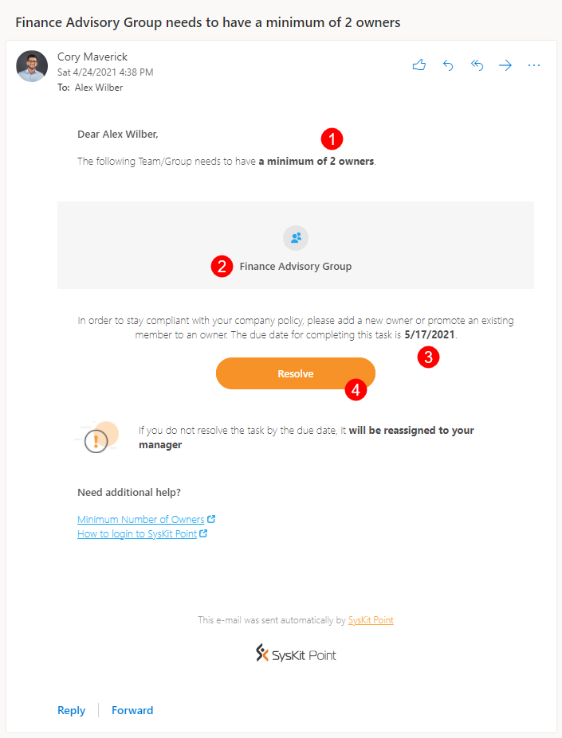
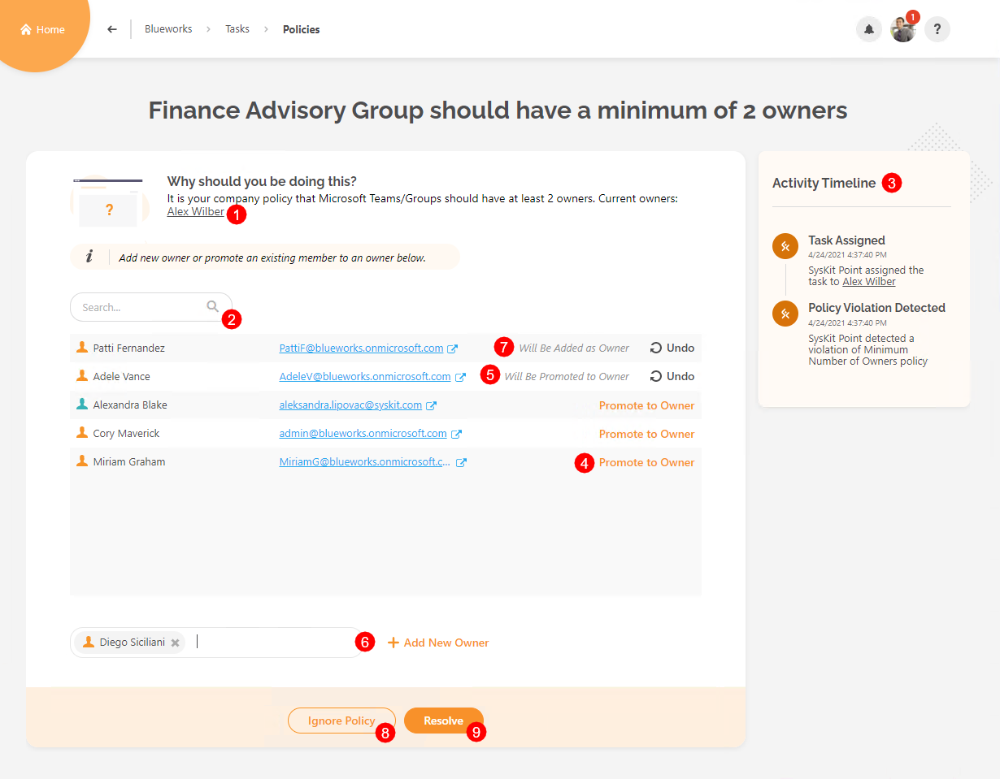
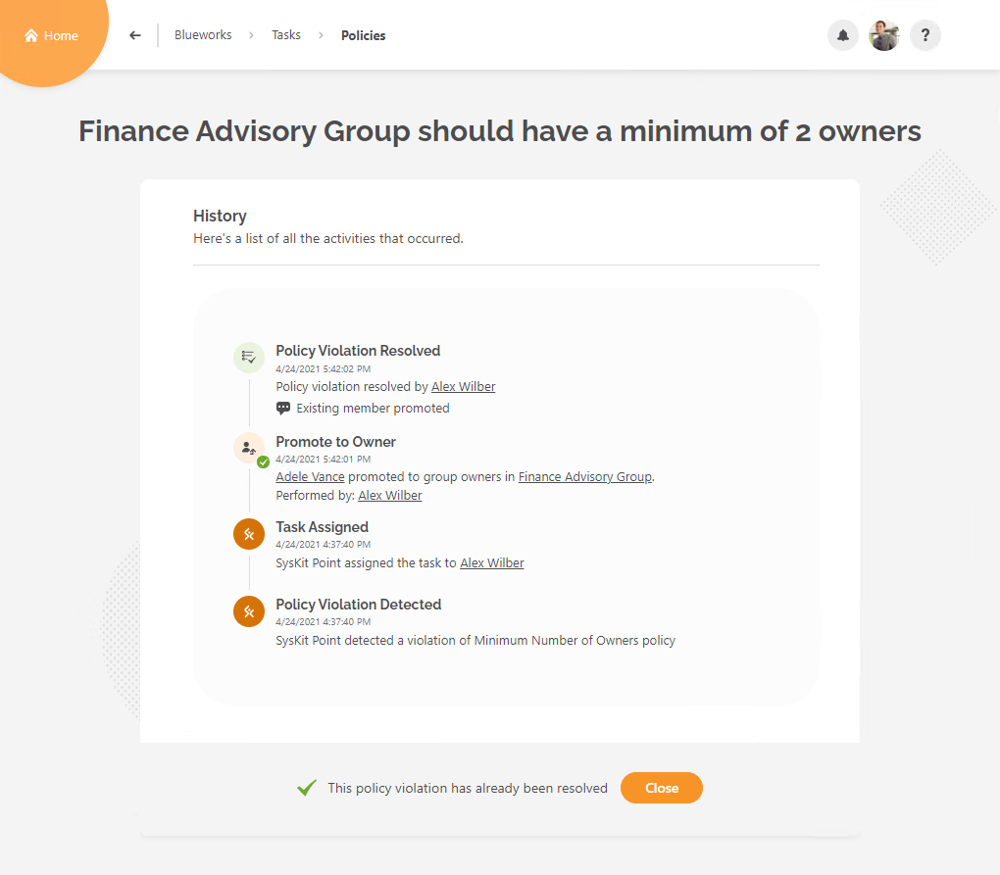
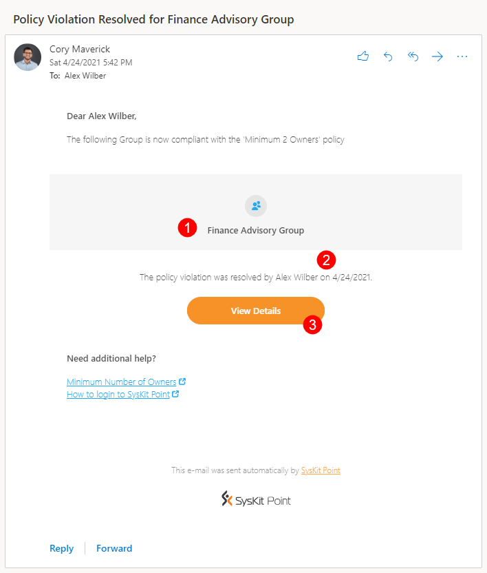
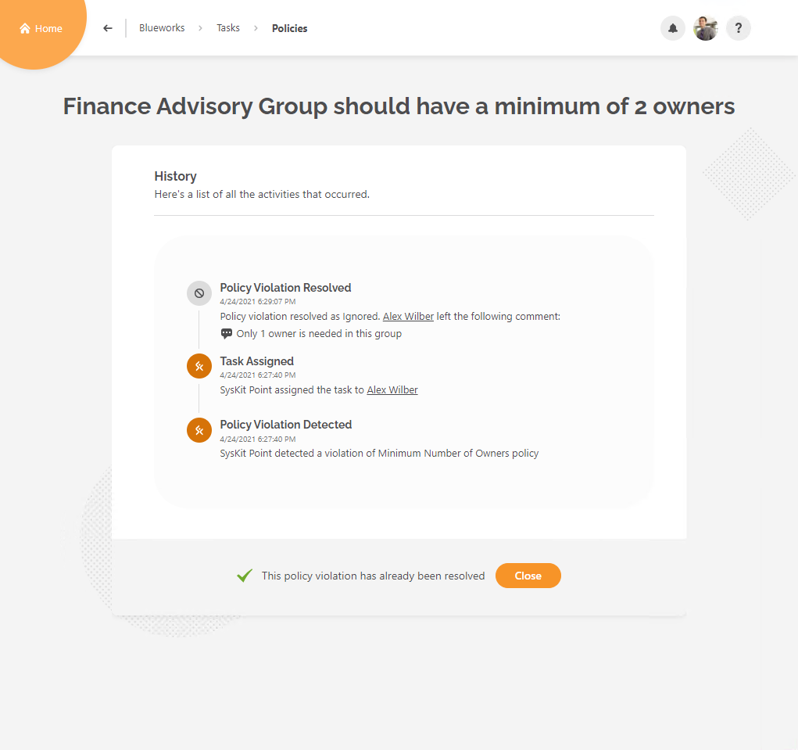

# Minimum Number of Owners

**This article shows how Microsoft Teams and Microsoft 365 Group owners can resolve a policy violation regarding the minimum number of owners** required by the organization’s policy defined in SysKit Point. 


By default, **SysKit Point suggests that Microsoft Teams and Microsoft 365 Groups should have at least 2 owners** so that if one owner leaves, the Microsoft Teams, and Microsoft 365 Groups are not left without an owner. 
[SysKit Point Administrators can change the minimum number of required owners to fit the organization’s policies.](set-up-automated-workflows.md)


When SysKit Point detects that Microsoft Teams or Microsoft 365 Groups you are the owner of do not have a minimum number of owners predefined by your organization’s policies, **you will receive an e-mail to resolve the policy violation**.

## Policy Violation E-mail

**SysKit Point sends an e-mail to existing owners** when Microsoft Teams or Microsoft 365 Groups are detected that do not have a minimum number of owners predefined in the policy settings. 

You can find the following information in the e-mail:
* **Minimum number of required owners (1)**
* **Microsoft Teams** or **Microsoft 365 Group where the policy violation was detected (2)**
* **Due date to resolve the policy violation (3)**
* **Resolve button (4) that takes you to SysKit Point**, where you can resolve the policy violation

**Click the Resolve button to open the policy violation task** in SysKit Point.

## Policy Violation Task

Along with the e-mail, **SysKit Point creates a policy violation task** that provides you with all information and actions needed to resolve the policy violation. 
The following is available on the task screen:
* **List of current owners (1)**
* **Search (2)**, which can help you to find existing members
* **Activity Timeline (3)** showing all steps in the automated workflow
* **Promote to Owner action (4)**; once clicked, an **appropriate message appears next to the promoted user along with the Undo action (5)**
* **Add New Owner action (6)**; to add a new owner, **start typing the user's name in the input field**; once you select a user, **confirm your addition by clicking the Add New Owner link**; once clicked, an **appropriate message is displayed for the user, along with the Undo action (7)**
* **Ignore Policy button (8)** that enables you to disregard the company policy in case there is a valid reason to do so
* **Resolve button (9)** that gets **enabled when you promote members to owners or add new ones to comply with the company policy** regarding the minimum number of owners; **once clicked, a dialog opens, enabling you to input a comment and resolve the policy violation**


**Please note!**  
**When you click an action within the policy violation task, think of it as a preview** of what will happen after resolving the policy violation.
**All actions are performed after you click the Resolve button**.


## Policy Violation Resolved 

**After you resolve the policy violation, the History screen opens**, giving you an overview of all actions performed within the workflow.

**After you resolve the policy violation, an e-mail is also sent to owners**, showing the following information:
* **Microsoft Teams or Microsoft 365 Group where an owner resolved the policy violation (1)**
* **Who and when (2) resolved the policy violation**
* **View Details button (3)** that **opens the History screen** in SysKit Point, showing all the activities that were performed within the automated workflow

## Policy Violation Ignored


**Please note!**  
**In case you decide to ignore the policy violation**, **Microsoft Teams** or **Microsoft 365 Groups where the policy violation was detected will be considered compliant for the next 6 months**. **For the next 6 months**, **SysKit Point will not send any policy violation e-mails or create policy violation tasks**.


**After you ignore the policy violation**, **the history screen opens**, as shown in the image below. 

