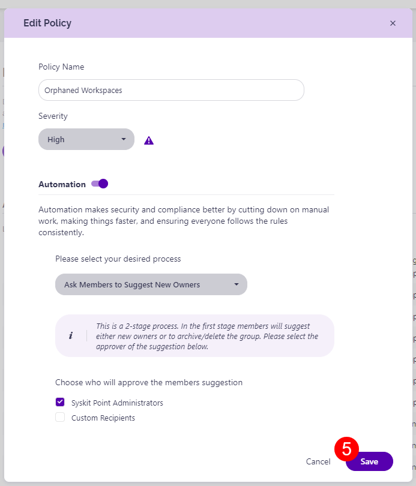

# ## Orphaned Resources

A predefined policy - **Orphaned Groups & Teams** - can be found on the Automated Workflows screen. 

Click the **Edit (1)** icon to view all defined options for the policy. 

The **Edit Policy** dialog opens where you can:
* **Define the policy name (1)**
* **Choose the severity level (2)**; this option is enabled by default
* Select your **automation preferences**:
  * **Automatically assign new owners or ask users to assign them (3)**, if a policy violation is detected; this option is enabled by default
   * **Select between the 3 available processes (4)**:
     * **Ask Specific Users to Assign New Owners**; this is a **1-stage process**, where selected users - Syskit Point Administrators and/or custom recipients - **get a task to assign new owners**
     * **Ask Members to Suggest New Owners**; this is a **2-stage process**, where members can suggest new owners, and afterward, the selected users - Syskit Point Administrators and/or custom recipients - **get a task to resolve the task base on the suggestions from owners**; by default, this option is selected
     * **Automatically Assing New Owners**; if selected, **Syskit Point will automatically assign the manager of the latest owner as a new owner**
      * If the manager cannot be found, Syskit Point will escalate the task to the defined user
 * Click **Save (5)** once you are done with the policy configuration 

For details on how collaborators can [**resolve Orphanes Resources policy violation tasks**, navigate to the following article](../../point-collaborators/resolve-governance-tasks/orphaned-resources.md).