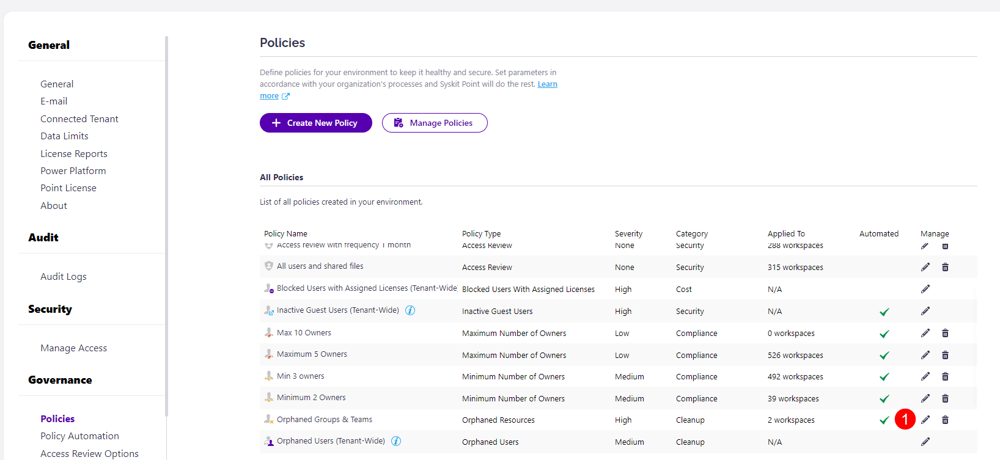
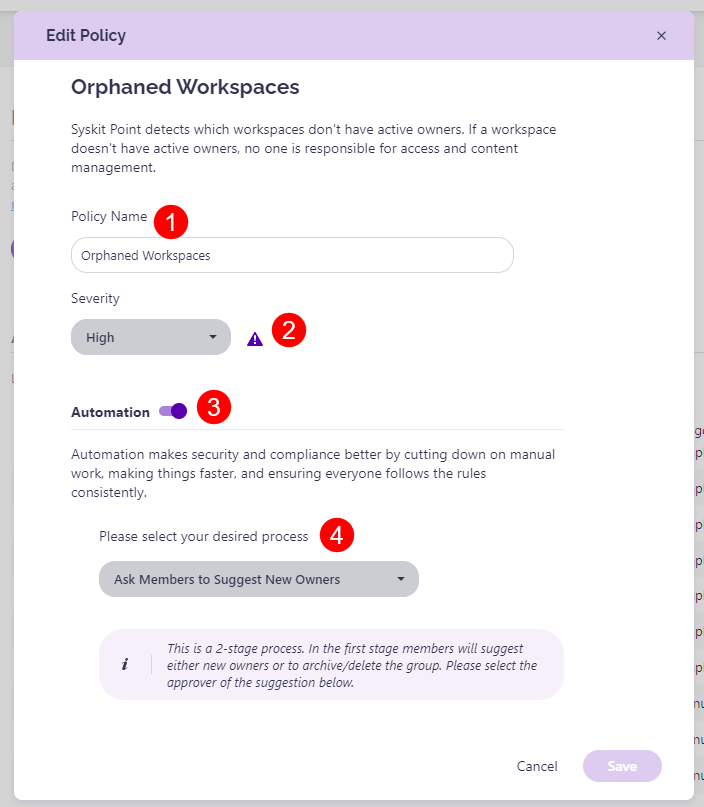

# ## Orphaned Resources

A predefined policy - **Orphaned Groups & Teams** - can be found on the Automated Workflows screen. 

Click the **Edit (1)** icon to view all defined options for the policy. 

The **Edit Policy** dialog opens where you can:
* **Enable or disable the policy (1)**; by default, this policy is enabled but not applied to any resources
* **Define the policy name (2)**
* **Decide between 3 processes**:
    * **Ask Specific Users to Assign New Owners (3)**; this is a **1-stage process**, where selected users - SysKit Point Administrators and/or custom recipients - **get a task to assign new owners**
    * **Ask Members to Suggest New Owners (4)**; this is a **2-stage process**, where members can suggest new owners, and afterward, the selected users - SysKit Point Administrators and/or custom recipients - **get a task to resolve the task base on the suggestions from owners**; by default, this option is selected
    * **Automatically Assing New Owners (5)**; if selected, **SysKit Point will automatically assign the manager of the latest owner as a new owner**
      * If the manager cannot be found, SysKit Point will escalate the task to the defined user

Click **Save (8)** once you are done with the policy configuration. 

For details on how collaborators can [**resolve Orphanes Resources policy violation tasks**, navigate to the following article](../../point-collaborators/resolve-governance-tasks/orphaned-resources.md).