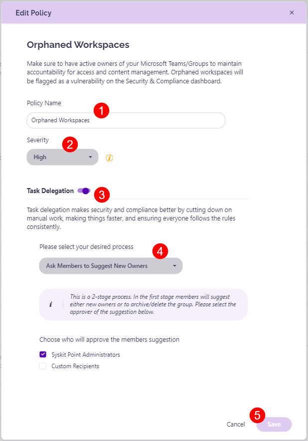

# Orphaned Workspaces

Syskit Point detects **workspaces that don't have active owners**, which helps you ensure there is always someone responsible for access and content management for your workspaces. 

A predefined policy - **Orphaned Workspaces** - can be found on the Policies screen. 

Click the **Edit (1)** icon to view all defined options for the policy. 

The **Edit Policy** dialog opens where you can:
* **Define the policy name (1)**
* **Choose the severity level (2)**; this option is enabled by default
* **Enable Task Delegation (3)** by clicking the toggle next to it and select your task delegation preferences:
  * **Select between the 3 available processes (4)**:
     * **Ask Specific Users to Assign New Owners**; this is a **1-stage process**, where selected users - Syskit Point Administrators and/or custom recipients - **get a task to assign new owners**
     * **Ask Members to Suggest New Owners**; this is a **2-stage process**, where members can suggest new owners, and afterward, the selected users - Syskit Point Administrators and/or custom recipients - **get a task to resolve the task base on the suggestions from owners**; by default, this option is selected
     * **Automatically Assign New Owners**; if selected, Syskit Point **automatically assigns the last owner's manager as a new owner**
       * If the manager cannot be found, Syskit Point escalates the task to the user specified when creating the policy
 * Click **Save (5)** once you are done with the policy configuration 



**Please note:** The Orphaned Workspaces policy vulnerability is detected when there are 0 active owners assigned to a workspace. 

If 1 owner is assigned to a workspace when resolving the Orphaned Workspaces vulnerability, Syskit Point will detect the [Minimum Number of Owners policy](../../point-collaborators/resolve-governance-tasks/minimum-number-of-owners.md) vulnerability, as the default requirement is to have at least 2 owners per workspace. 



For details on how collaborators can [**resolve Orphanes Workspaces policy vulnerability tasks**, navigate to the following article](../../point-collaborators/resolve-governance-tasks/orphaned-resources.md).