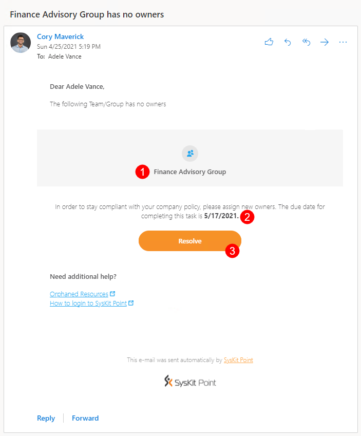
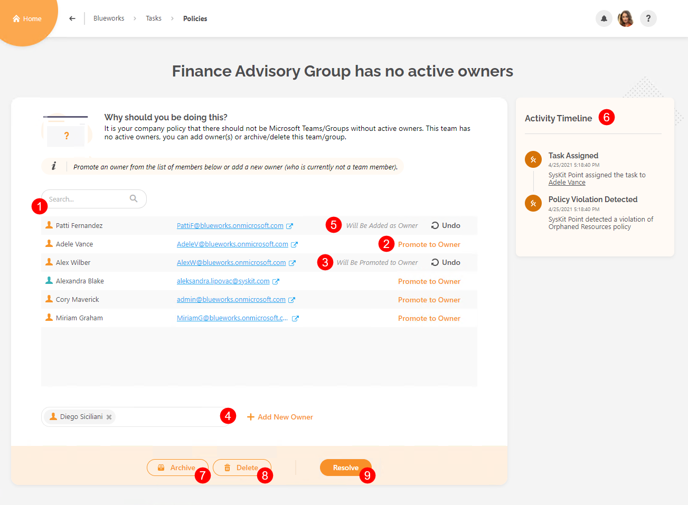
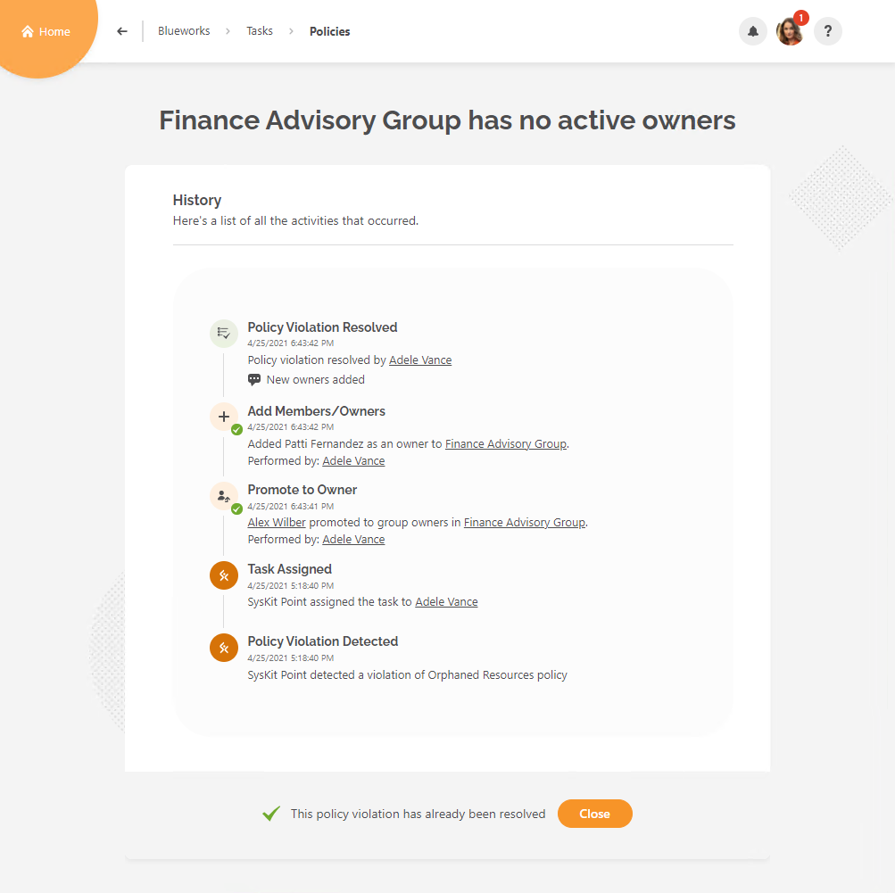
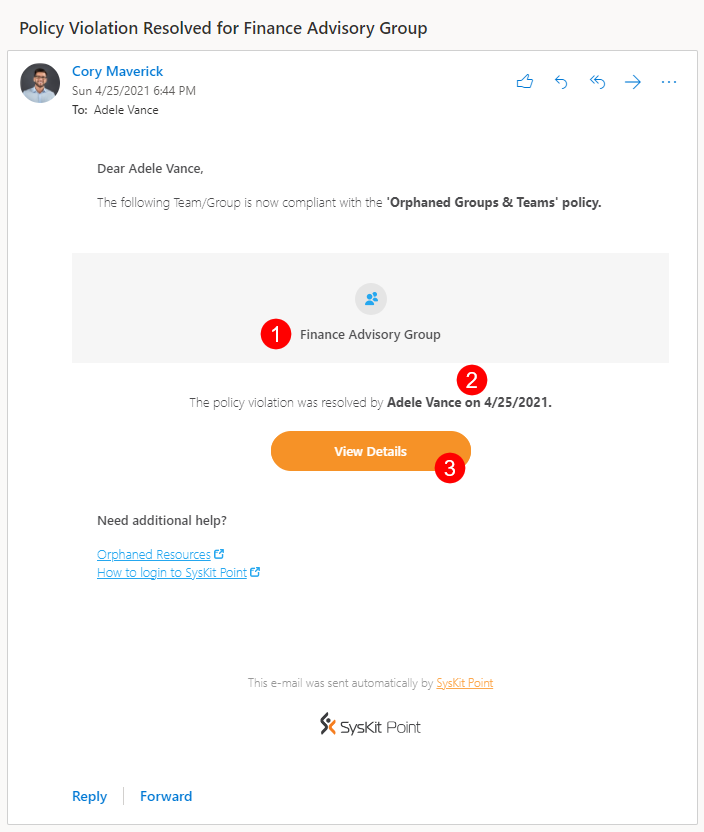

# Orphaned Resources

**This article shows how you can resolve the Orphaned Resources policy violation** triggered when SysKit Point detects that Microsoft Teams and Microsoft 365 Groups don’t have active owners. 


SysKit Point Administrators can [decide whether specific users will be responsible for assigning new owners or existing team/group members will suggest new owners](set-up-automated-workflows.md).
The first option is a **1-stage process** where the policy violation is resolved when you promote members to owners or add new owners.
The second option is a **2-stage process** where after the members suggest new owners, an additional step is required from defined users to approve the suggestion. 


In both cases, SysKit Point will send you an e-mail that will guide you through the process of resolving the policy violation. 

Below, both cases are separately explained in more detail.

## 1-Stage Process

### Policy Violation E-Mail

SysKit Point sends you an **e-mail asking you to assign new owners** when Microsoft Teams or Microsoft 36 Groups are detected that have no active owners.

You can find the following information in the e-mail:
* **Microsoft Teams or Microsoft 365 Group where the policy violation was detected (1)**
* **Due date to resolve the policy violation (2)**; you have 15 workdays to resolve the policy violation
* **Resolve button (3)** that takes you to SysKit Point, where you can resolve the policy violation

### Policy Violation Task

Along with the e-mail, SysKit Point creates a policy violation task that provides you with all information and actions needed to resolve the policy violation. 
The following is available on the task screen if you were selected to assign new owners:
* **List of current members along with Search to help you filter out specific ones (1)**
* **Promote to Owner action (2)**; once clicked, an **appropriate message appears next to the promoted user along with the Undo action (3)**
* **Add New Owner action (4)**; to add a new owner, start typing the user's name in the input field; once you select a user, confirm your addition by clicking the Add New Owner link; once clicked, an **appropriate message is displayed for the user, along with the Undo action (5)**
* **Activity Timeline (6)** showing all steps in the automated workflow
* **Archive button (7)** that enables you to Archive the Microsoft Team or Microsoft 365 Group
* **Delete button (8)** that enables you to Delete the Microsoft Team or Microsoft 365 Group
* **Resolve button (9)** that gets enabled when you promote members to owners or add new ones to comply with the company policy; once clicked, a dialog opens, enabling you to input a comment and **resolve the policy violation**


**Please note!**
**When you click an action within the policy violation task, think of it as a preview** of what will happen after resolving the policy violation.
**All actions that change users' access are performed after you click the Resolve button**. 


### Policy Violation Resolved

**After you resolve the policy violation, the History screen opens**, giving you an overview of all actions performed within the workflow.

**After you resolve the policy violation**, **a confirmation email is sent to all users that were assigned with the task**, showing the following information:
* **Microsoft Teams or Microsoft 365 Group where the policy violation was resolved (1)**
* **Who and when (2) resolved the policy violation**
* **View Details button (3) that opens the History screen in SysKit Point, showing all the activities that were performed within the automated workflow**

## 2-Stage Process

#TODO