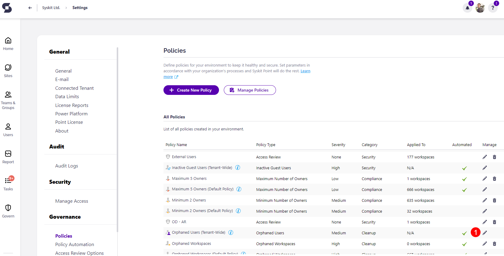
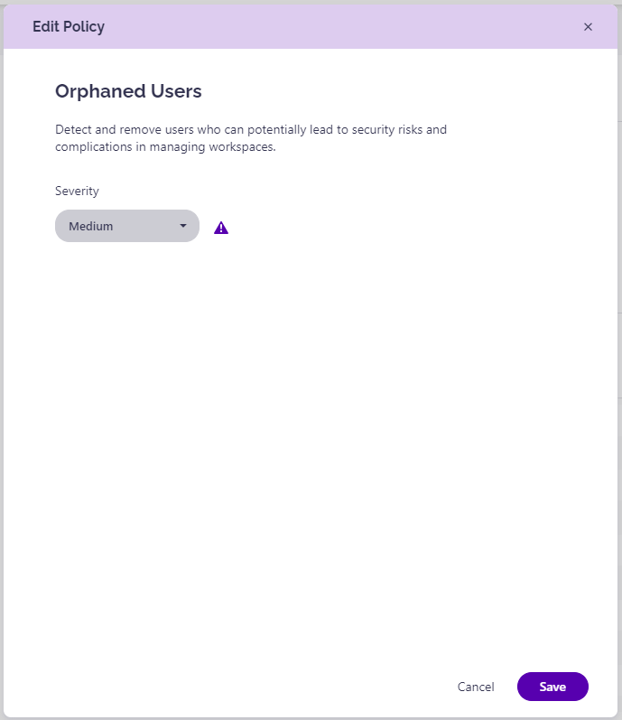

# Orphaned Users

Syskit Point provides a predefined **Orphaned Users policy** that is applied tenant-wide and cannot be deleted. 

This policy helps you detect and remove users who can potentially lead to risks and complications in managing workspaces. 

To edit the policy, navigate to the Policies settings screen and **click the Edit Policy (1)** icon.

The **Edit Policy** dialog opens where you can select the **Severity level (1)**.
  * The severity level set by default for this policy is **Medium**
  
You can select between three levels of severity: 

  * High
  * Medium
  * Low

Once you've selected the one that best suits your needs for this policy, **click the Save button (2)** to store your preference. 

