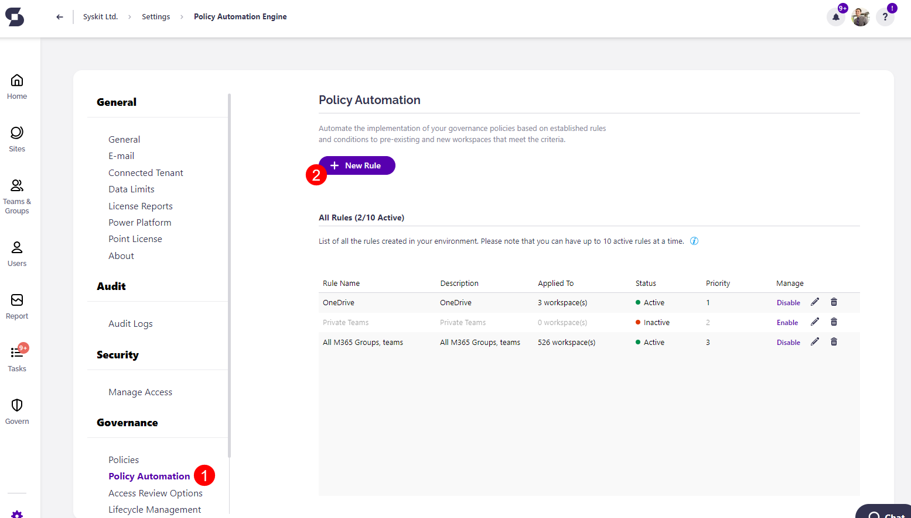
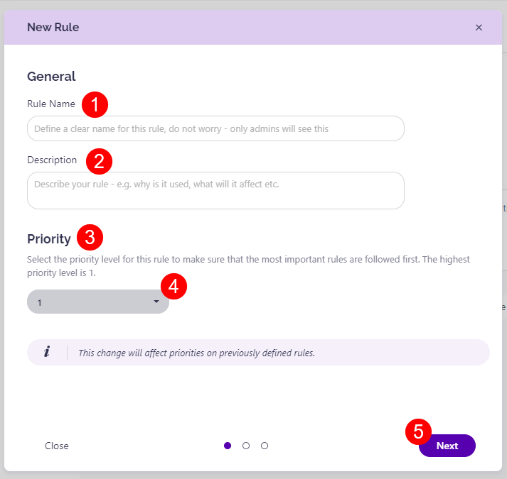
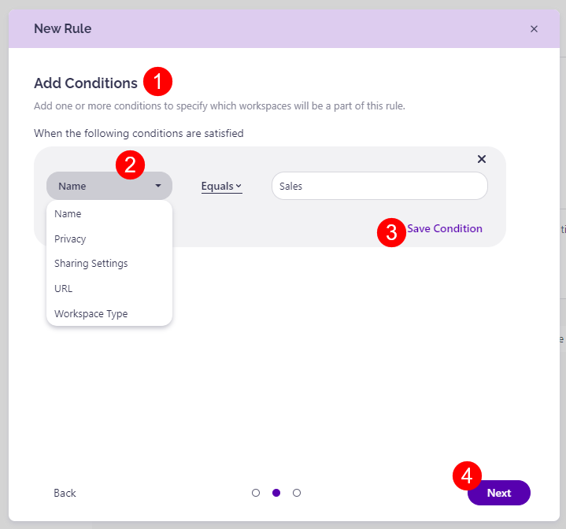

# Policy Automation

The Policy Automation feature **lets you create rules for auto-applying policies** based on:
  * Name
  * Privacy
  * Sensitivity Label
  * Sharing Settings
  * URL
  * Workspace Type

Custom metadata is planned to be implemented into the feature soon as well. 

Policy Automation makes managing your environment and keeping it secure easier and more efficient. With policy automation, **you can define rules in Syskit Point that will automatically apply policies** (for example, Access review, Maximum or Minimum number of owners, etc.) to your newly created workspaces **without having to apply them manually**. It also means you'll need to create fewer provisioning templates to secure your environment. 


**Please Note!**
To activate rules for auto-applying policies, please make sure you have already set up your policies under the policies section. [Follow this article for more information. ](../automated-workflows/set-up-policies.md)


## Default Rule

**When you acquire Syskit Point, a default rule is created that applies default policies to all workspaces in your environment - Minimum 2 Owners (Default Policy), Maximum 5 Owners (Default Policy), and Orphaned Workspaces (Default Policy)**; these policies serve to give you an overview of workspaces that are potentially not configured according to best practices; 
* Default policies are configured as **detection-only policies**, meaning that **Syskit Point will not create tasks or send emails**.
* If you already applied Policies to your workspaces, **the default rule is configured to have the lowest priority, meaning that all additional rules that you create will have precedence**.
* **The default rule is hidden from settings an cannot be modified or deleted**.

## Create Rules

To create rules for auto-applying policies, take the following steps:

* Open your Syskit Point and **navigate to Settings** and under **Governance** select **Policy Automation (1)**
* **Click the New Rule button (2)** and a pop-up will appear

To create the rule, fill out the following information, as requested on the pop-up:

* Under the General section, fill out the following:
  * **Rule Name (1)** - in this space, you can write your desired rule name
  * **Description (2)** - use it to describe the rule which you want to create
* Under the **Priority section (3)**, set your desired level of priority for this rule by **selecting a number (4)** from the drop-down menu
  * Priority will be **set as 1 by default** and is the number that signifies the highest priority, with the number furthest from 1 signifying the lowest priority level
  * This change also affects priorities on previously defined rules
  * For more details on this, take a look at the [Priority and Overrides section of this article](../../governance-and-automation/automated-workflows/policy-automation.md#priority-and-priority-overrides)
* When ready, **click Next to continue (5)**

* Under the **Add Conditions (1)** section, **set the conditions for your rule (2)** by using the drop-down menu
  * Once you've set the condition, **click the Save Condition (3)** button
  * Once saved, if you want to make changes **click the edit button** 
  * Once saved, if you want to delete it, **click the delete button**
* When you're ready, **click Next to continue (4)**

* Under the **Apply Policies (1)** section, you can select which policies the rule should apply for 
  * In the section **Apply following policies** select the **Add Policy (2)** button and **select your desired policy (3)** from the drop-down menu available
  * Once you've selected the policy or policies, **click the Save Policy (4)** button
  * If you've set a policy but want to change it,  **click the edit button** 
  * If you've set a policy but want to delete it, **click the delete button**
* **Click the Preview button (5)** when your preferences have been set to see how this new rule would affect your workspaces
   * By clicking preview, you can also see if there are **any “Priority Overrides”** on any of your workspace
* **Click the Create Rule button (6)** to finalize your selection

The rule is enabled once you've created it and will start applying defined policies for the workspaces that meet the defined conditions. 


**Please Note!**
While you can create more than 10 rules for policies, **only 10 rules can be active at once**. If you already have 10 rules active, you will not be able to create new rules without disabling one or [contacting Syskit support](https://www.syskit.com/contact-us/). 


## Priority and Priority Overrides

When it comes to setting the priority for your rules and how an override is applied to them, there are a few key things to keep in mind. 

* **Manually applied policies always have the highest priority**
  * This means that even if a rule's priority is set as 1 if there is a policy that was manually applied, the rule will not apply a policy of the same type to that workspace
  * It also means that **if you have provisioning set up** and policies defined in your templates, they will **have precedence over the rules you create** for within the Policy Automation settings

* When considering **priority levels** for your rules, note that the **lower the number the higher the priority**
  * This means that the **highest priority rule should be set as 1** and the lowest priority rule should be set as the highest number available

* If there are **two rules that apply policies of the same type**, the rule with the **highest priority level** applies the policy
  * **Clicking Preview shows you the Priority Override** for the workspaces where the rule with the higher priority number will apply policies over the rule with a lower priority 

* If **two rules contain different policy types** that apply to the same workspace, **both rules apply the policies**

* If there is a **workspace that has a Do not apply/No policy option enabled**, no policies are applied for the workspace that meets the conditions

## Manage Rules

Once you save a rule, it is enabled by default, but you can still edit or remove it. 

To manage your rules, complete the following:

* **Navigate to Settings > Governance > Policy Automation (1)**
* Under the **All Rules (1)** section, you can see a list of all rules created for your environment as well as a number that shows the number of currently active rules out of the 10 active spots available
* To **disable a rule** in order to place another rule as active, **click the Disable button (2)** located under the Manage column
   * This can be done if you fill all 10 spots open for active rules and want to replace one or in case a rule should be temporarily deactivated
* To **edit a rule** and make changes, **click the Edit button (3)** located under the Manage column
* To delete a rule and remove it from the list completely, **click the Delete button (4)** located under the Manage column



If you **disable, delete or update a rule with policies assigned to it**, any tasks related to those policies will be set as Canceled.

Additionally, by clicking on the resolve task email you received, the site in Syskit Point will show the task as canceled due to the policy having been removed from the workspace. 

When the rule is **enabled again**, the **old tasks will remain as canceled**, but when triggered, a **new task will be assigned**. 

**Access Review is the only policy** where the task will **not be canceled if the rule is disabled, deleted, or updated**. 

