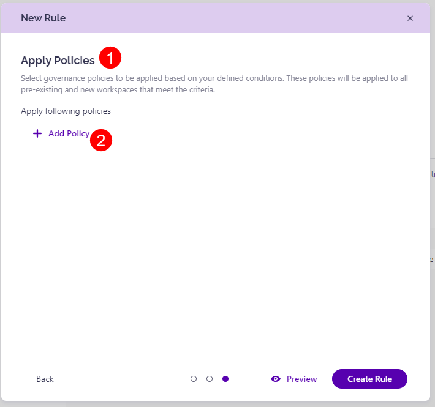

# Policy Automation

The Policy Automation feature **lets you create rules for auto-applying policies based on specific metadata and built-in properties**. 

This makes managing your environment and keeping it secure easier and more efficient. With policy automation, **you can define rules in Syskit Point that will automatically apply policies** (for example, Access Review, Guest Users Expiration, Maximum Owners, etc.) to your newly created workspaces **without having to apply them manually**. It also means you'll need to create fewer provisioning templates to secure your environment. 


**Please Note!**

To activate rules for auto-applying policies, please make sure you have already set up your policies under the automated workflow section. [Follow this article for more information. ](../automated-workflows/set-up-automated-workflows.md)



## Create Rules

To create rules for auto-applying policies, take the following steps:

* Open your Syskit Point and **navigate to Settings** and under **Governance** select **Policy Automation (1)**
* **Click the New Rule button (2)** and a pop-up will appear

To create the rule, fill out the following information, as requested on the pop-up:

* Under the General section, fill out the following:
  * **Rule Name (1)** - in this space, you can write your desired rule name
  * **Description (2)** - this space can be used to describe the rule which you want to create
* Under the **Priority section (3)**, set your desired level of priority for this rule by **selecting a number (4)** between 1-6 from the drop-down menu
  * Priority will be **set as 1 by default** and is the number that signifies the highest priority, with 6 being the lowest priority
  * This change also affects priorities on previously defined rules
* When ready, **click Next to continue (5)**

* Under the **Add Conditions (1)** section, **set the conditions for your rule (2)** by using the drop-down menu
  * Once you've set the condition, **click the Save Condition (3)** button
  * Once saved, if you want to make changes **click the edit button** 
  * Once saved, if you want to delete it, **click the delete button**
* When you're ready, **click Next to continue (4)**

* Under the **Apply Policies (1)** section, you can select which policies the rule should apply for 
  * In the section **Apply following policies** select the **Add Policy (2)** button and **select your desired policy (3)** from the drop-down menu available
  * Once you've selected the policy or policies, **click the Save Policy (4)** button
  * If you've set a policy but want to change it,  **click the edit button** 
  * If you've set a policy but want to delete it, **click the delete button**
* **Click the preview button (5)** when your preferences have been set to see how this new rule would affect your workspaces
   * By clicking preview, you can also see if there are **any “Priority Overides”** on any of your workspace
* **Click the Create Rule button (6)** to finalize your selection

The rule is automatically applied once you've created it. 


**Please Note!**
While you are able to create more than 10 rules for policies, **only 10 rules can be active at once**. If you already have 10 rules active, you will not be able to create new rules without disabling one or contacting Syskit support. 


## Manage Rules

Once you save a rule, it is enabled by default, but you can still edit or remove it. 

To manage your rules, complete the following:

* **Navigate to Settings > Governance > Policy Automation (1)**
* Under the **All Rules (1)** section, you can see a list of all rules created for your environment as well as a number that shows the number of currently active rules out of the 10 active spots available
* To **disable a rule** in order to place another rule as active, **click the Disable button (2)** located under the Manage column
   * This can be done if you fill all 10 spots open for active rules and want to replace one or in case a rule should be temporarily deactivated
* To **edit a rule** and make changes, **click the Edit button (3)** located under the Manage column
* To delete a rule and remove it from the list completely, **click the Delete button (4)** located under the Manage column

