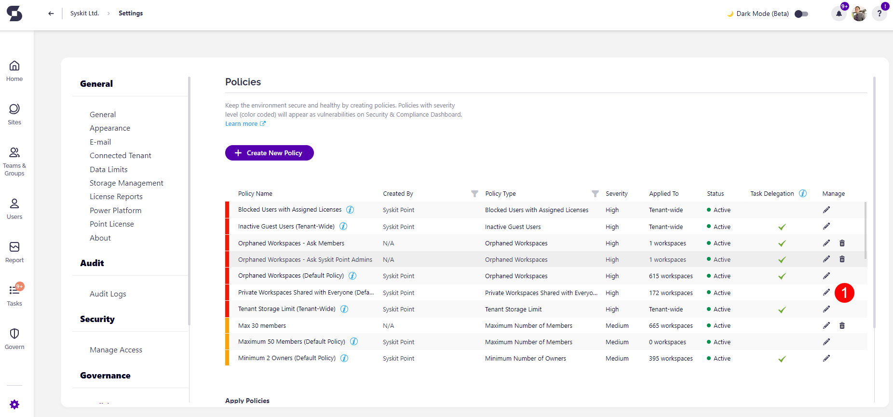
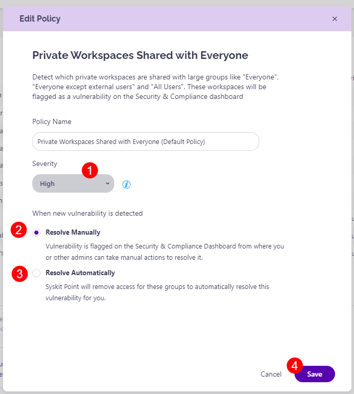

# Private Workspaces Shared with Everyone

Syskit Point provides a predefined **Private Workspaces Shared with Everyone policy** that is applied tenant-wide to **private** Microsoft 365 Groups, Microsoft Teams, and Sites.

A vulnerability is detected if Syskit Point discovers a **private** Microsoft 365 Group, Microsoft Teams, or Site with access given to one of the following security groups - **Everyone**, **Everyone except external users**, or **All Users**.

Oversharing workspaces might lead to **security risks, administration difficulty, and a challenge managing access control**.

To edit the policy, navigate to the Policies settings screen and **click the Edit Policy (1)** icon.

The **Edit Policy** dialog opens where you can select:
* The **Severity level (1)**.
  * The severity level set by default for this policy is **High**
  * You can select between three levels of severity: 
    * High
    * Medium
    * Low
* How to **resolve a vulnerability when it's detected.** The options are:
  * **Resolve Manually (2)**: Selecting this detects the vulnerability and shows it on the Security and Compliance Dashboard, where manual actions can be taken to resolve it. 
  * **Resolve Automatically (3)**: Selecting this means that Syskit Point automatically resolves the vulnerability by removing access via Everyone / Everyone except external users / All users. 
  * By **default**, the policy is set as **Resolve Manually**. 

Once you've selected the one that best suits your needs for this policy, **click the Save button (4)** to store your preference. 

For more information on how to resolve the vulnerability in Syskit Point, read the [following article](../security-compliance-checks/private-workspaces-shared-with-everyone.md).