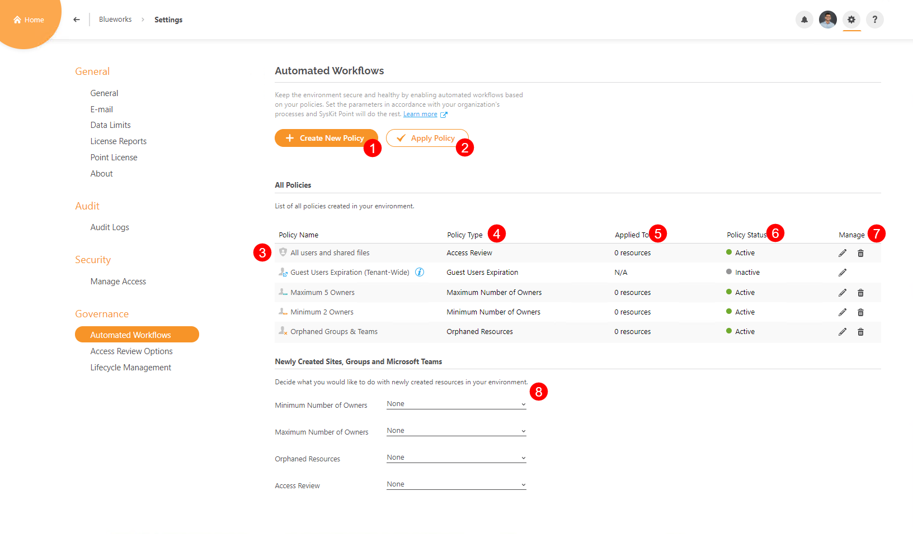
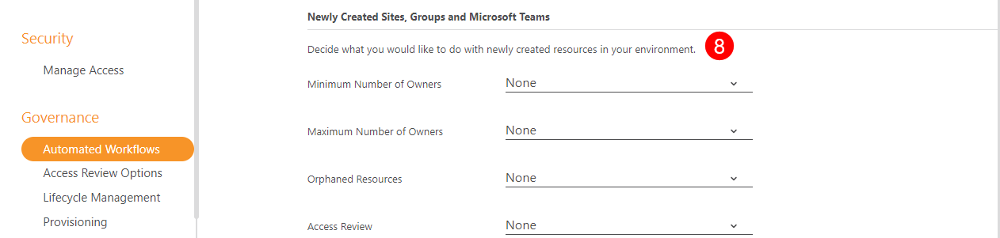

# Set Up Automated Workflows


**Automated Workflows** are available in the Governance plan and higher tiers. See the [pricing page](https://www.syskit.com/products/point/pricing/) for more details.


## Prerequisites

To use the advantages of Automated Workflows in SysKit Point, you need to:

* [set up e-mail settings](../../configuration/set-up-email.md)
* [enable SysKit Point Collaborators role](../../configuration/enable-role-based-access.md)


**Please note!**
Only users with the role of **SysKit Point Admin** assigned can access and configure Settings in SysKit Point.


## Automated Workflows and Policies

**Automated workflows in SysKit Point consist of e-mails and tasks created when a policy violation is detected.**
  * Policies in SysKit Point contain rules to be followed when dealing with Microsoft Teams, Microsoft 365 Groups, and user access.

SysKit Point enables creating policies that will make sure the following is set correctly and reviewed when needed:
* **Ownership on Microsoft Teams and Microsoft 365 Groups**
* **Guest users expiration**
* **User's access**

When dealing with automated workflows, you can either:
* **Adjust predefined policies and apply them to your resources**, or
* **Create new policies from scratch and apply them to your resources**


**For simple use cases** where the same policies are applied to all resources, you can **adjust the predefined policies to speed up the configuration**. 
**For a more complex setup**, you can **create multiple policies of the same policy type** and **apply them to a subset of your resources**.


## Policies

SysKit Point enables you to create and apply three types of ownership policies that make sure your **Microsoft Teams and Microsoft 365 Groups comply with your company's policy regarding ownership** as well as a tenant-wide policy that **requires Guest User Access validation**. 

Take a look at the articles below to learn how to set up each governance policy:

* [**Minimum Number of Owners**](minimum-number-of-owners-admin.md) - when enabled and applied to Microsoft Teams and Microsoft 365 Groups, this policy **triggers an automated workflow when the team/group has fewer owners** than defined in the policy settings
* [**Maximum Number of Owners**](maximum-number-of-owners-admin.md) - when enabled and applied to Microsoft Teams and Microsoft 365 Groups, this policy **triggers an automated workflow when the team/group has more owners** than defined in the policy settings
* [**Orphaned Resources**](orphaned-resources-admin.md) - when enabled and applied to Microsoft Teams and Microsoft 365 Groups, this policy **triggers an automated workflow when the team/group has no active owners**
* [**Guest Users Expiration**](guest-users-expiration-admin.md) - periodically checks Guest Users' access, or when SysKit Point detects a guest user is inactive

By clicking on the names of each policy, you can **find an article with information on creating and enabling** all mentioned policy types. 

How to apply the created policies is described below. 

## Automated Workflows Settings

To **open the Automated Workflows settings screen**, navigate to **Settings** &gt; **Governance** &gt; **Automated Workflows**.

Here, you can:
* **Create a new policy (1)**
* **Apply policies to Microsoft Teams, Microsoft 365 Groups, OneDrive, and sites (2)**
* **View all predefined policies (3)**; SysKit Point comes with a predefined policy for each policy type to help you get started
* **View additional information about each policy**; the following information is available **policy type (4)**, **to how many resources a policy is applied (5)**, and **whether a policy is active or inactive (6)**
* **Manage policies (7)**; **Edit** and **Delete** actions are provided for each policy, **except the Guest Users Expiration policy**, which can not be deleted
* **Define policies that SysKit Point will automatically apply to newly created Microsoft Teams, Microsoft 365 Groups, OneDrive, and sites (8)**

 

## Resolving Policy Tasks

For more information on how collaborators **can resolve specific policy violations**, navigate to the articles given below:
* [Resolve Minimum Number of Owners policy violation](../../point-collaborators/resolve-governance-tasks/minimum-number-of-owners.md)
* [Resolve Maximum Number of Owners policy violation](../../point-collaborators/resolve-governance-tasks/maximum-number-of-owners.md)
* [Resolve Orphaned Resources policy violation](../../point-collaborators/resolve-governance-tasks/orphaned-resources.md)
* [Resolve Guest User Expiration](../../point-collaborators/resolve-governance-tasks/guest-user-expiration.md)