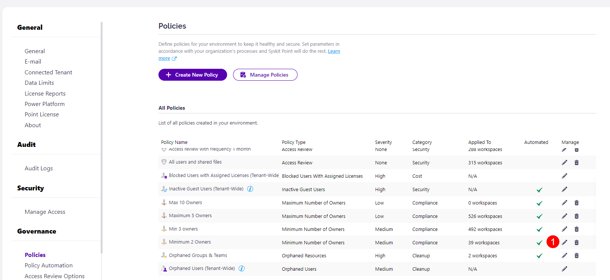
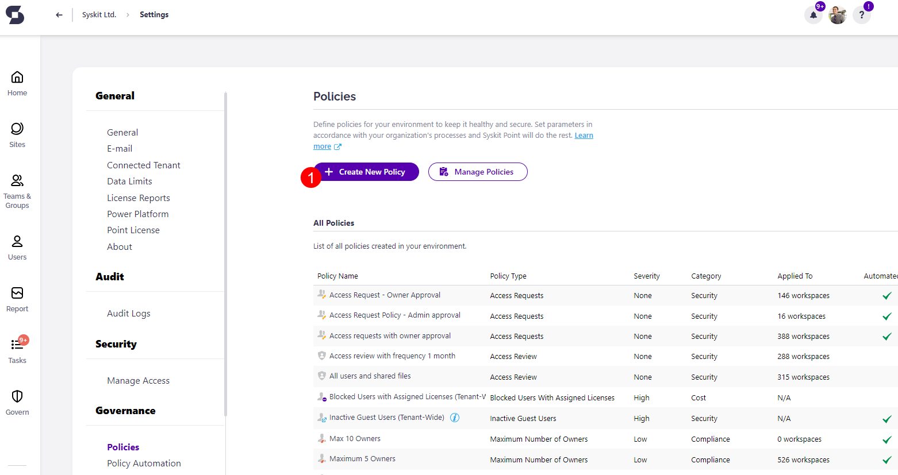
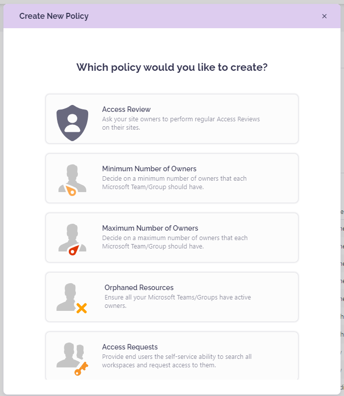

# Set Up Automated Workflows


**Automated Workflows** are available in the Governance plan and higher tiers. See the [pricing page](https://www.syskit.com/products/point/pricing/) for more details.


## Prerequisites

To use the advantages of Automated Workflows in Syskit Point, you need to:

* [set up e-mail settings](../../configuration/set-up-email.md)
* [enable Syskit Point Collaborators role](../../configuration/enable-role-based-access.md)


**Please note!**
Only users with the role of **Syskit Point Admin** assigned can access and configure Settings in Syskit Point.


## Automated Workflows and Policies

**Automated workflows in Syskit Point consist of e-mails and tasks created when a policy violation is detected.**
  * Policies in Syskit Point contain rules to be followed when dealing with Microsoft Teams, Microsoft 365 Groups, and user access.

Syskit Point enables creating policies that will make sure the following is set correctly and reviewed when needed:
* **Ownership on Microsoft Teams and Microsoft 365 Groups**
* **Guest users expiration**
* **User's access**

When dealing with automated workflows, you can either:
* **Adjust predefined policies and apply them to your resources**, or
* **Create new policies from scratch and apply them to your resources**


**For simple use cases** where the same policies are applied to all resources, you can **adjust the predefined policies to speed up the configuration**. 
**For a more complex setup**, you can **create multiple policies of the same policy type** and **apply them to a subset of your resources**.


## Ownership Policies
Syskit Point enables you to create and apply three types of policies that will make sure your Microsoft Teams and Microsoft 365 Groups comply with your company's policy regarding ownership:
* **Minimum Number of Owners** - when enabled and applied to Microsoft Teams and Microsoft 365 Groups, **this policy triggers an automated workflow when the team/group has fewer owners than defined in the policy settings**
* **Maximum Number of Owners** - when enabled and applied to Microsoft Teams and Microsoft 365 Groups, **this policy triggers an automated workflow when the team/group has more owners than defined in the policy settings**
* **Orphaned Resources** - when enabled and applied to Microsoft Teams and Microsoft 365 Groups, **this policy triggers an automated workflow when the team/group has no active owners**

In this article, you can **find information on how to create, enable, and apply** all mentioned policy types, along with **explanations for all policy options.**

For more information on how **to resolve specific policy violations**, **navigate to the appropriate article given below**:
* [Resolve Minimum Number of Owners policy violation](minimum-number-of-owners.md)
* [Resolve Maximum Number of Owners policy violation](maximum-number-of-owners.md)
* [Resolve Orphaned Resources policy violation](orphaned-resources.md)

## Guest Users Expiration Policy
With Syskit Point, you can **enable a tenant-wide policy** that will **require Guest User Access validation periodically or when Syskit Point detects that a guest user is inactive**. 

In this article, you can **find information on how to enable the policy**, along with detailed **descriptions of all policy options.**

[To learn how to resolve the Guest Users Expiration policy violation, navigate to the following article](guest-users-expiration.md). 

## Automated Workflows Settings

To **open the Automated Workflows settings screen**, navigate to **Settings** &gt; **Governance** &gt; **Automated Workflows**.
Here, you can:
* **create a new policy (1)**
* **Apply policies to Microsoft Teams, Microsoft 365 Groups, OneDrive, and sites (2)**
* **View all predefined policies (3)**; Syskit Point comes with a predefined policy for each policy type to help you get started
* **View additional information about each policy**; the following information is available **policy type (4)**, **to how many resources a policy is applied (5)**, and **whether a policy is active or inactive (6)**
* **Manage policies (7)**; **Edit** and **Delete** actions are provided for each policy, **except the Guest Users Expiration policy**, which can not be deleted
* **Define policies that Syskit Point will automatically apply to newly created Microsoft Teams, Microsoft 365 Groups, OneDrive, and sites (8)**

## Guest Users Expiration
Syskit Point provides a predefined **Guest Users Expiration policy** that is applied tenant-wide. 
To activate the policy, navigate to the Automated Workflows settings screen and **click the Edit Policy (1)** icon.

The **Edit Policy** dialog opens where you can:
* **Enable the policy (1)** by clicking the toggle next to the policy name; this policy is disabled by default.
* **Choose between two renewal options**:
    * **Require guest users renewal when Syskit Point detects that a guest user is inactive (2).**
      * When selected, you can **define the number of days after which a guest user is considered inactive** if no sign-ins are detected; this option is selected by default, and the number of days is set to 20.
    * **Validate all guest users periodically (3)**
      * When selected, you can configure how often the validation is required; this is set to 3 months by default
* **Select who will validate guest users:**
    * **Manager of Guest User (4)**; when the option is selected, **the person responsible for the validation, in case the Guest User does not have a defined manager, needs to be chosen**
    * **Syskit Point Administrators (5)**; this option is selected by defaut
    * **Custom Recipients (6)**; when selected, use the input field to select custom users that will be responsible for the validation of Guest Users
* **Enable Syskit Point to automatically delete Guest Users (7)** if there is no answer from the defined users; this option is disabled by default
* **Enable Syskit Point to send a reminder three workdays before the due date (8)**; this option is enabled by default

Click **Save** once you are done with the policy configuration.  

Based on your configuration, **Syskit Point will start the automated workflow periodically or when an inactive Guest User is detected**. 


**Please note!**
**You should have at least one user in your tenant with the Azure AD Premium P1 license assigned to detect sign-in times for guest users accurately.**


## Maximum Number of Owners

A predefined policy - set as **Maximum 5 Owners** - is located on the Automated Workflows screen. 

Click the **Edit (1)** icon to view all defined options for the policy. 

The **Edit Policy** dialog opens where you can:
* **Enable or disable the policy (1)**; this policy is enabled by default but not applied to any resources
* **Define the policy name (2)**
* **Define the maximum number of allowed owners (3)**; this is set to 5 by default
* **Choose whether Syskit Point will send a reminder 3 workdays before the due date (4)**; this option is enabled by default
* **Choose what to do if owners don't resolve the policy violation until the due date**. The following options are available:
    * **Reassign Task (5)**; when selected, you can define who will get the task - **Manager of the Reviewer**, **Syskit Point Administrators**, or **custom recipients**; this option is selected by default, and the tasks are reassigned to Manager of Reviewer
    * **Automatically Remove Owners (6)**; if selected, **Syskit Point will remove existing owners starting from users with the oldest sign-in date** until the defined maximum number of owners is reached to comply with the policy

Click **Save (7)** once you are done with the policy configuration.  

## Minimum Number of Owners

A predefined policy - **Minimum 2 Owners** - is located on the Automated Workflows screen. 
Click the **Edit (1)** icon to view all defined options for the policy. 

The **Edit Policy** dialog opens where you can:
* **Enable or disable the policy (1)**; by default, this policy is enabled but not applied to any resources
* **Define the policy name (2)**
* **Define the minimum number of required owners (3)**; this is set to 2 by default
* **Select whether Syskit Point will send a reminder three workdays before the due date (4)**; this option is enabled by default
* **Decide what to do if owners don't resolve the policy violation until the due date**. The following options are available:
    * **Reassign Task (5)**; when selected, you can define who will get the task - **Manager of the Reviewer**, **Syskit Point Administrators**, or **custom recipients**; this option is selected by default, and the tasks reassigned to Manager of Reviewer
    * **Automatically Archive (6)**; if selected, **Syskit Point will automatically archive the team/group** that has fewer owners than defined in the policy settings
    * **Automatically Delete (7)**; if selected, **Syskit Point will automatically delete the team/group** that has fewer owners than defined in the policy settings

Click **Save (8)** once you are done with the policy configuration.  

## Orphaned Resources

A predefined policy - **Orphaned Groups & Teams** - can be found on the Automated Workflows screen. 

Click the **Edit (1)** icon to view all defined options for the policy. 

The **Edit Policy** dialog opens where you can:
* **Enable or disable the policy (1)**; by default, this policy is enabled but not applied to any resources
* **Define the policy name (2)**
* **Decide between 3 processes**:
    * **Ask Specific Users to Assign New Owners (3)**; this is a **1-stage process**, where selected users - Syskit Point Administrators and/or custom recipients - **get a task to assign new owners**
    * **Ask Members to Suggest New Owners (4)**; this is a **2-stage process**, where members can suggest new owners, and afterward, the selected users - Syskit Point Administrators and/or custom recipients - **get a task to resolve the task base on the suggestions from owners**; by default, this option is selected
    * **Automatically Assing New Owners (5)**; if selected, **Syskit Point will automatically assign the manager of the latest owner as a new owner**
      * If the manager cannot be found, Syskit Point will escalate the task to the defined user

Click **Save (8)** once you are done with the policy configuration.  

## Creating a Policy
To create a new policy, navigate to the Automated Workflows settings screen, and click the **Create New Policy (1)** button.

The **Create New Policy** dialog opens, where you can select the type of policy to create.
You can choose from the following:
* **Access Review**
* **Minimum Number of Owners**
* **Maximum Number of Owners**
* **Orphaned Resources**

**After you select the policy type**, you will be able to **define all policy settings**, described in more detail in the previous sections of this article. 

[You can find more information on Access Review policies in the following article.](../permissions-review/enable-permissions-review.md)

## Manage Policies

**When the policies are defined**, the last thing left to do is to **apply them to Microsoft Teams, Microsoft 365 Groups, OneDrive, and Sites**. 

To do so, navigate to the Automated Workflows settings screen, and click the **Manage Policies (1)** button.

The Manage Policies screen opens where you can:
* **Find resources that don't have any policies applied (1)**; when the tile is clicked, the report only displays resources that have no policies applied
* **Find the number of resources that have a specific policy type applied (2)**; when a tile is clicked, the report only displays resources with the selected policy applied
* **Filter the report per policy or resource type (3)**
* **Select one or multiple resources (4)**
* **View all policies applied on a specific resource (6)**
* **Click the Manage Policies button (6)**; if multiple resources are selected, clicking the arrow next to Manage Policies provides the options to choose between:
   * **Apply Policy**
   * **Remove Policy**
   * **Remove All Policies** 

After clicking the **Manage Policies (6)** button, the **Manage Policy** dialog opens, where you can **apply** the chosen policies on the selected resources grouped by the policy type.


**Once a policy is applied, Syskit Point will start an automated workflow if a policy violation is detected**. 

