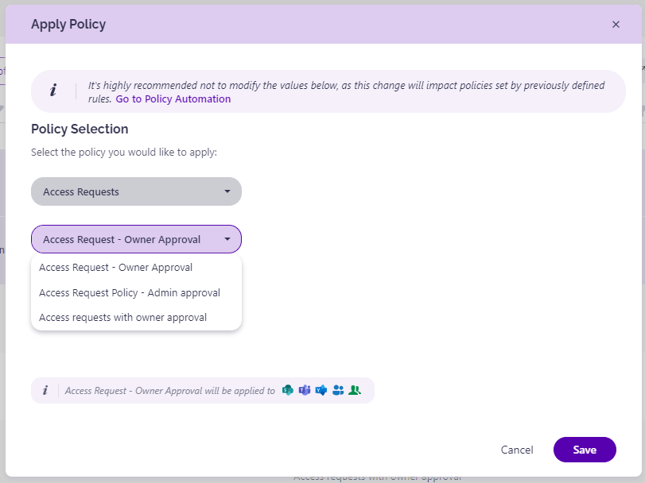

# Set Up Automated Workflows
## Prerequisites

To use the advantages of Automated Workflows in SysKit Point, you need to:

* [set up e-mail settings](../../configuration/set-up-email.md)
* [enable SysKit Point Collaborators role](../../configuration/configuration/enable-role-based-access.md)


**Please note!**
Only users with the **SysKit Point Admin** role assigned can access and configure Settings in SysKit Point.


## Automated Workflows and Policies

**Automated workflows in SysKit Point consist of e-mails and tasks created when a policy violation is detected.**
**Policies in SysKit Point contain rules to be followed when dealing with Microsoft Teams, Microsoft 365 Groups, and user access.** 

SysKit Point enables you to create policies that will make sure the following is set correctly and reviewed when needed:
* **ownership on Microsoft Teams and Microsoft 365 Groups**
* **Guest users expiration**
* **user's access**

When dealing with automated workflows, you can either:
* **adjust predefined policies and apply them to your resources**, or
* **create new policies from scratch and apply to your resources**


**For simple use cases** where the same policies are applied to all resources, you can **adjust the predefined policies to speed up the configuration**. 
**For a more complex setup**, you can **create multiple policies of the same policy type** and **apply them to a subset of your resources**.


## Ownership
SysKit Point enables you to create and apply 3 types of policies that will make sure your Microsoft Teams and Microsoft 365 Groups comply with your company's policy regarding ownership:
* **Minimum Number of Owners** - when enabled and applied to Microsoft Teams and Microsoft 365 Groups, **this policy triggers an automated workflow when the team/group has fewer owners than defined in the policy settings**
* **Maximum Number of Owners** - when enabled and applied to Microsoft Teams and Microsoft 365 Groups, **this policy triggers an automated workflow when the team/group has more owners than defined in the policy settings**
* **Orphaned Resources** - when enabled and applied to Microsoft Teams and Microsoft 365 Groups, **this policy triggers an automated workflow when the team/group has no active owners**

**In this article, you can find information on how to create, enable, and apply all mentioned policy types, along with explanations for all policy options.**

For more information on how **to resolve specific policy violations**, **navigate to the appropriate article given below**:
* [resolve Minimum Number of Owners policy violation](minimum-number-of-owners.md)
* [resolve Maximum Number of Owners policy violation](maximum-number-of-owners.md)
* [resolve Orphaned Resources policy violation](orphaned-resources.md)

## Guest Users Expiration
With SysKit Point, you can **enable a tenant-wide policy** that will **require Guest User Access validation periodically or when SysKit Point detects that a guest user is inactive**. 

**In this article, you can find information on how to enable the policy, along with detailed descriptions for all policy options.**

[To learn how to resolve the Guest Users Expiration policy violation, navigate to the following article](guest-users-expiration.md). 

## Automated Workflows Settings

To **open the Automated Workflows settings screen**, navigate to **Settings** &gt; **Governance** &gt; **Automated Workflows**.
Here, you can:
* **create a new policy (1)**
* **apply policies to Microsoft Teams, Microsoft 365 Groups, OneDrive, and sites (2)**
* **view all predefined policies (3)**; SysKit Point comes with a predefined policy for each policy type to help you get started
* **view additional information about each policy**; the following information is available **policy type (4)**, **to how many resources a policy is applied (5)**, and **whether a policy is active or inactive (6)**
* **manage policies (7)**; **Edit** and **Delete** actions are provided for each policy, **except the Guest Users Expiration policy**, which can not be deleted
* **define policies that SysKit Point will automatically apply to newly created Microsoft Teams, Microsoft 365 Groups, OneDrive, and sites (8)**

## Guest Users Expiration
SysKit Point provides you with a predefined **Guest Users Expiration policy** that is applied tenant-wide. 
To activate the policy, navigate to the Automated Workflows settings screen and **click the Edit Policy (1)** icon.

The **Edit Policy** dialog opens where you can:
* **enable the policy (1)** by clicking the toggle next to the policy name; by default, the policy is disabled
* **choose between two renewal options**:
    * **require guest users renewal when SysKit Point detects that a guest user is inactive (2)**; when selected, you can **define the number of days after which a guest user is considered inactive** if no sign-ins are detected; by default, this option is selected, and number of days set to 20
    * **validate all guest users periodically (3)**; when selected, you can configure how often the validation is required; by default, this is set to 3 months
* **select who will validate guest users:**
    * **Manager of Guest User (4)**; when the option is selected, you also need to **choose who is responsible for the validation in case the Guest User does not have a defined manager**
    * **SysKit Point Administrators (5)**; by default, this option is selected
    * **Custom Recipients (6)**; when selected, use the input field to select custom users that will be responsible for the validation of Guest Users
* **enable SysKit Point to automatically delete Guest Users (7)** if there is no answer from the defined users; by default, this option is disabled
* **enable SysKit Point to send a reminder 3 workdays before the due date (8)**; by default, this option is enabled

Click **Save (9)** once you are done with the policy configuration.  

Based on your configuration, **SysKit Point will start the automated workflow periodically or when an inactive Guest User is detected**. 


**Please note!**
**You should have at least 1 user in your tenant with the Azure AD Premium P1 license assigned to detect sign-in times for guest users accurately.**


## Maximum Number of Owners

You can find a predefined policy - **Maximum 5 Owners** - on the Automated Workflows screen. 
Click the **Edit (1)** icon to view all defined options for the policy. 

The **Edit Policy** dialog opens where you can:
* **enable or disable the policy (1)**; by default, this policy is enabled but not applied to any resources
* **define the policy name (2)**
* **define the maximum number of allowed owners (3)**; by default, this is set to 5
* **choose whether SysKit Point will send a reminder 3 workdays before the due date (4)**; by default, this option is enabled
* **choose what to do if owners don't resolve the policy violation until the due date**. The following options are available:
    * **Reassign Task (5)**; when selected, you can define who will get the task - **Manager of the Reviewer**, **SysKit Point Administrators**, or **custom recipients**; by default, this option is selected, and the tasks reassigned to Manager of Reviewer
    * **Automatically Remove Owners (6)**; if selected, **SysKit Point will remove existing owners starting from users with the oldest sign-in date** until the defined maximum number of owners is reached to comply with the policy

Click **Save (7)** once you are done with the policy configuration.  

## Minimum Number of Owners

You can find a predefined policy - **Minimum 2 Owners** - on the Automated Workflows screen. 
Click the **Edit (1)** icon to view all defined options for the policy. 

The **Edit Policy** dialog opens where you can:
* **enable or disable the policy (1)**; by default, this policy is enabled but not applied to any resources
* **define the policy name (2)**
* **define the minimum number of required owners (3)**; by default, this is set to 2
* **choose whether SysKit Point will send a reminder 3 workdays before the due date (4)**; by default, this option is enabled
* **choose what to do if owners don't resolve the policy violation until the due date**. The following options are available:
    * **Reassign Task (5)**; when selected, you can define who will get the task - **Manager of the Reviewer**, **SysKit Point Administrators**, or **custom recipients**; by default, this option is selected, and the tasks reassigned to Manager of Reviewer
    * **Automatically Archive (6)**; if selected, **SysKit Point will automatically archive the team/group** that has fewer owners than defined in the policy settings
    * **Automatically Delete (7)**; if selected, **SysKit Point will automatically delete the team/group** that has fewer owners than defined in the policy settings

Click **Save (8)** once you are done with the policy configuration.  

## Orphaned Resources

You can find a predefined policy - **Orphaned Groups & Teams** - on the Automated Workflows screen. 
Click the **Edit (1)** icon to view all defined options for the policy. 

The **Edit Policy** dialog opens where you can:
* **enable or disable the policy (1)**; by default, this policy is enabled but not applied to any resources
* **define the policy name (2)**
* **choose between 3 processes**:
    * **Ask Specific Users to Assign New Owners (3)**; this is a **1-stage process, where selected users - SysKit Point Administrators and/or custom recipients - get a task to assign new owners**
    * **Ask Members to Suggest New Owners (4)**; this is a **2-stage process, where members can suggest new owners, and afterward, the selected users - SysKit Point Administrators and/or custom recipients - get a task to resolve the task base on the suggestions from owners**; by default, this option is selected
    * **Automatically Assing New Owners (5)**; if selected, **SysKit Point will automatically assign the manager of the latest owner as a new owner**;**if the manager cannot be found, SysKit Point will escalate the task to the defined user**

Click **Save (8)** once you are done with the policy configuration.  

## Creating a Policy
If you want to create a new policy, navigate to the Automated Workflows settings screen, and click the **Create New Policy (1)** button.

The **Create New Policy** dialog opens where you can select the type of policy to create.
You can choose from the following:
* **Access Review**
* **Minimum Number of Owners**
* **Maximum Number of Owners**
* **Orphaned Resources**

**After you select the policy type**, you will be able to **define all policy settings**, described in more detail in the previous sections of this article. 

[You can find more information on Access Review policies in the following article.](../permissions-review/enable-permissions-review.md)

## Applying Policies

**When the policies are defined**, the last thing left to do is to **apply them to Microsoft Teams, Microsoft 365 Groups, OneDrive, and Sites**. 
To do so, navigate to the Automated Workflows settings screen, and click the **Apply Policy (1)** button.

The Apply Policy screen opens where you can:
* **find resources that don't have any policies applied (1)**; when the tile is clicked, the report only displays resources that have no policies applied
* **find the number of resources that have a specific policy type applied (2)**; when a tile is clicked, the report only displays resources with the selected policy applied
* **filter the report per policy or resource type (3)**; 
* **view all policies applied on a specific resource (4)**
* **select one or multiple resources (5)**
* **apply policies (6)**

After you click the **Apply Policies (6)** button, the **Apply Policy** dialog opens, where you can **apply** and **remove** policies on the selected resources grouped by the policy type.


**Once a policy is applied, SysKit Point will start an automated workflow if a policy violation is detected**. 
