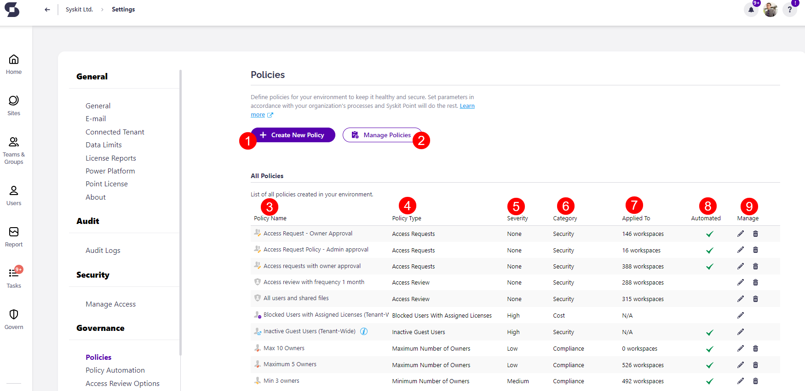

# Set Up Policies


**Policies** are available in the Governance plan and higher tiers. See the [pricing page](https://www.syskit.com/products/point/pricing/) for more details.


## Prerequisites

To use the advantages of Policies in Syskit Point, you need to:

* [set up e-mail settings](../../configuration/set-up-email.md)
* [enable Syskit Point Collaborators role](../../configuration/enable-role-based-access.md)

Additionally, you can also [set up policy automation](../../governance-and-automation/automated-workflows/policy-automation.md) to have policies automatically apply to current and all future workspaces without having to manually assign them. 


**Please note!**
Only users with the role of **Syskit Point Admin** assigned can access and configure Settings in Syskit Point.


## Syskit Point Policies

**Policies in Syskit Point consist of e-mails and tasks created when a policy violation is detected.**
  * Policies in Syskit Point contain rules to follow when dealing with Microsoft Teams, Microsoft 365 Groups, and user access.

Syskit Point enables creating policies that will make sure the following is set correctly and reviewed when needed:
* **Ownership on Microsoft Teams and Microsoft 365 Groups**
* **Guest users expiration**
* **User's access**

When dealing with policies, you can either:
* **Adjust predefined policies and apply them to your resources**, or
* **Create new policies from scratch and apply them to your resources**
* **Set up policy automation to have policies automatically applied to current and new workspaces**


**For simple use cases** where the same policies are applied to all resources, you can **adjust the predefined policies to speed up the configuration**. 
**For a more complex setup**, you can **create multiple policies of the same policy type** and **apply them to a subset of your resources**.


## Policies

Syskit Point enables you to create and apply three types of ownership policies that make sure your **Microsoft Teams and Microsoft 365 Groups comply with your company's policy regarding ownership** as well as a tenant-wide policy that **requires Guest User Access validation**. 

Take a look at the articles below to learn how to set up each governance policy:

* [**Blocked Users with Assigned Licenses**](blocked-users-with-licenses-admin.md) - detects which blocked users still have licenses assigned which helps you optimize cost
* [**Minimum Number of Owners**](minimum-number-of-owners-admin.md) - when enabled and applied to Microsoft Teams and Microsoft 365 Groups, this policy **triggers an automated workflow when the team/group has fewer owners** than defined in the policy settings
* [**Maximum Number of Owners**](maximum-number-of-owners-admin.md) - when enabled and applied to Microsoft Teams and Microsoft 365 Groups, this policy **triggers an automated workflow when the team/group has more owners** than defined in the policy settings
* [**Inactive Guest Users**](inactive-guest-users-admin.md) - detects when a **guest user is inactive** for a period of time and helps you remove access in a timely and efficient manner
* [**Orphaned Workspaces**](orphaned-resources-admin.md) - when enabled and applied to Microsoft Teams and Microsoft 365 Groups, this policy **triggers an automated workflow when the team/group has no active owners**
* [**Orphaned Users**](orphaned-users-admin.md) - periodically checks on **users that** don't have a direct manager and **could lead to security risks** or complications managing workspaces
* [**Access Request**](../access-requests/README.md) - provides end-users the **ability to search all existing Microsoft Teams & Groups, sites, distribution lists, and security groups and request access** to them
* [**Access Review**](../permissions-review/README.md) - setting this up will allow site owners to perform regular access reviews of their sites

By clicking on the names of each policy, you can **find an article with information on creating and enabling** all mentioned policy types. 
 
[For information on how to apply your created policies, take a look at this article.](manage-policies.md)

## Policy Settings

To **open the Policies settings screen**, navigate to **Settings** &gt; **Governance** &gt; **Policies**.

Here, you can:
* **Create a new policy (1)**
* **Manage and apply policies to Microsoft Teams, Microsoft 365 Groups, OneDrive, and sites (2)**
* **View all predefined policies by name (3)**; Syskit Point comes with a predefined policy for each policy type to help you get started
* **View additional information about each policy**; the following information is available **policy type (4)**, **severity of policy(5)**, **category policy fits under (6), **to how many resources a policy is applied (7)**, and **whether the policy is automated or not (8)**
* **Manage policies (9)**; **Edit** and **Delete** actions are provided for each policy, **except for those applied tenant-wide**

## Resolving Policy Tasks

For more information on how collaborators **can resolve specific policy violations**, navigate to the articles given below:
* [Resolve Minimum Number of Owners policy violation](../../point-collaborators/resolve-governance-tasks/minimum-number-of-owners.md)
* [Resolve Maximum Number of Owners policy violation](../../point-collaborators/resolve-governance-tasks/maximum-number-of-owners.md)
* [Resolve Orphaned Workspaces policy violation](../../point-collaborators/resolve-governance-tasks/orphaned-resources.md)
* [Resolve Guest User Expiration](../../point-collaborators/resolve-governance-tasks/guest-users-expiration.md)