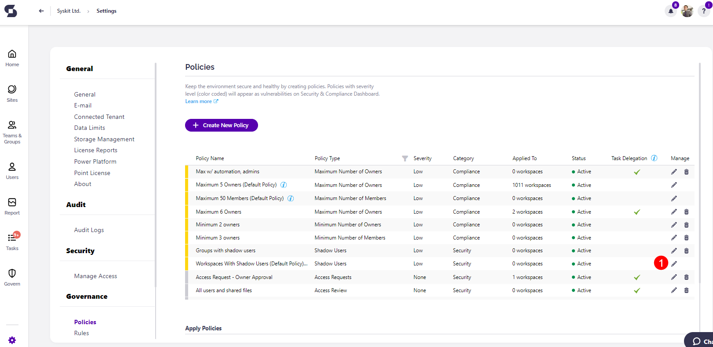
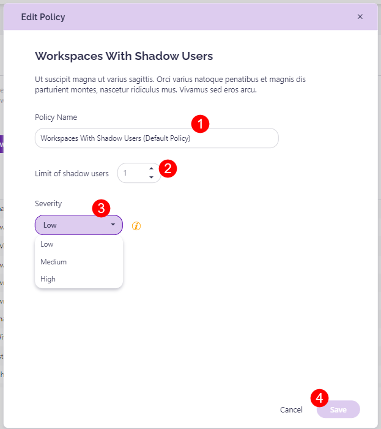

# Workspaces with Shadow Users 

Syskit Point provides a predefined **Workspaces with shadow users policy**. This policy helps you detect users with access to specific content but are not members of the Microsoft 365 Group or Team associated with it. 

To edit the policy, navigate to the Policies settings screen and **click the Edit Policy (1)** icon.

The **Edit Policy** dialog opens where you can select: 

* **The Policy Name (1)** - the name this policy shows as in your list of policies

* **The limit of shadow users (2)** - the number of shadow users that are the limit for the workspace 

**The Severity level (3)**.
  * The severity level set by default for this policy is **Low**
  
You can select between three levels of severity: 

  * High
  * Medium
  * Low

Once you've selected the one that best suits your needs for this policy, **click the Save button (4)** to store your preference. 

