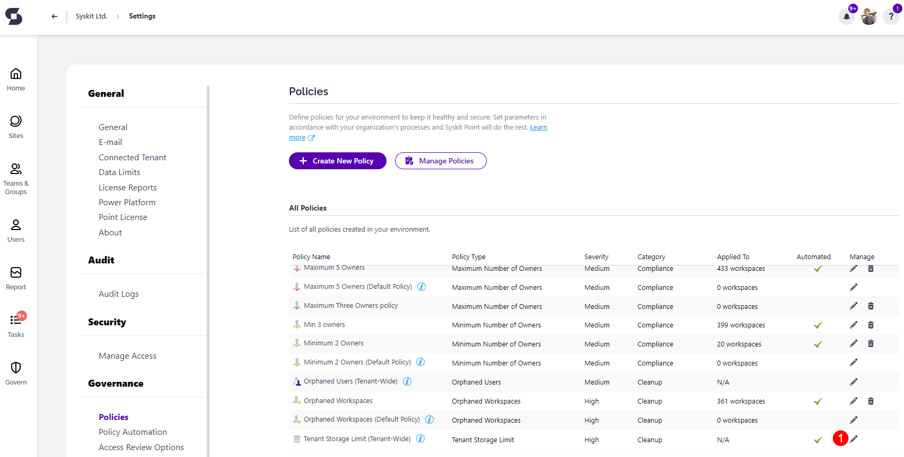

# Tenant Storage Limit

Syskit Point provides a predefined **Tenant Storage Limit** that is applied tenant-wide and cannot be deleted. 

The Tenant Storage policy monitors your storage usage within your tenant and proactively notifies you when you approach a critical limit. This helps mitigate the risk of running out of storage. 

To edit the policy, navigate to the Policies settings screen and **click the Edit Policy (1)** icon.

The **Edit Policy** pop-up dialog opens where you can:
* **Set the percentage limit (1)** for your storage consumption
  * When you reach the limit, Syskit Point provides a notification informing you of that
* **Select the Severity level (2)**
  * The severity level set by default for this policy is High
  * You can select between three levels of severity: **High, Medium, or Low**

Once the policy is set to your preference, **click the Save button (3)** to finalize. 

