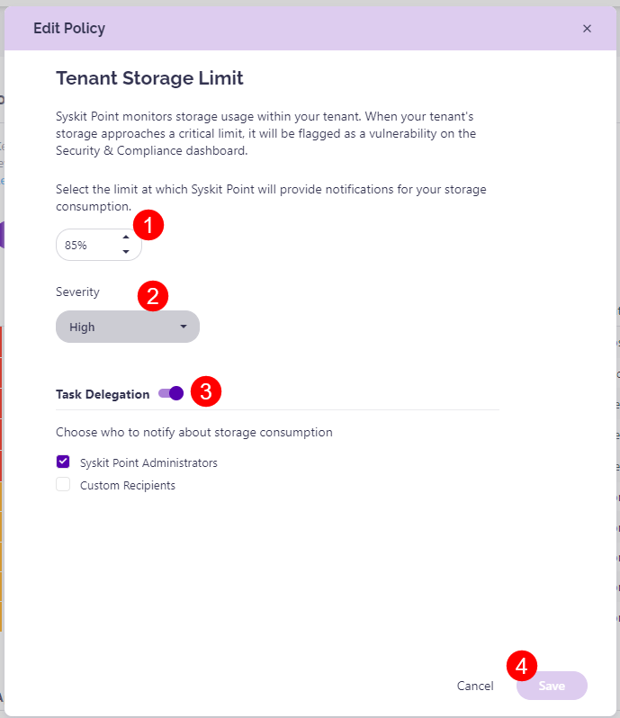

# Tenant Storage Limit

Syskit Point provides a predefined **Tenant Storage Limit** that is applied tenant-wide and cannot be deleted. 

The Tenant Storage policy monitors your storage usage within your tenant and proactively notifies you when you approach a critical limit. This helps mitigate the risk of running out of storage. 

To edit the policy, navigate to the Policies settings screen and **click the Edit Policy (1)** icon.

The **Edit Policy** pop-up dialog opens where you can:
* **Set the percentage limit (1)** for your storage consumption
  * When you reach the limit, Syskit Point provides a notification informing you of that
  * By default, the storage limit percentage is set at 85%
* **Select the Severity level (2)**
  * The severity level set by default for this policy is High
  * You can select between three levels of severity: **High, Medium, or Low**
* By default, **task delegation for this policy is turned on** but it can be turned off by **clicking the toggle (3)**
  * By default, Syskit Point admins are notified about storage usage, but you can also select Custom Recipients 

Once the policy is set to your preference, **click the Save button (4)** to finalize. 

## Related Articles

* [Storage Management](../../storage-management/storage-management.md)
* [Tenant Storage Security & Compliance Check](../../governance-and-automation/security-compliance-checks/tenant-storage.md)
* [Resolve Tenant Storage Limit Task](../../point-collaborators/resolve-governance-tasks/tenant-storage-limit.md)
* [Storage Reports](../../storage-management/storage-reports.md)
