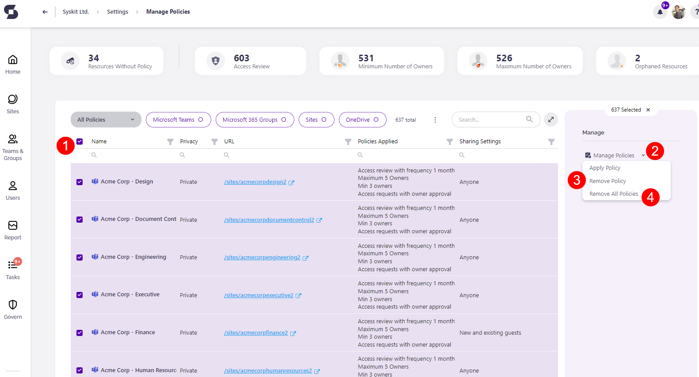

# Upgrade to Policy Rules

Syskit Point's feature, Rules, provides an easy way to automatically apply policies to all existing and newly created workspaces in order to ensure security and compliance.

You can read more about this feature and how to create rules for auto-applying policies in the [Rules article](../../.gitbook/assets/policy-automation-settings.png).

One aspect of this feature is that it does not automatically apply policies when a policy has already been manually applied to a workspace. 

That means that if your workspaces already have manually assigned policies, the rules you create with the same policy type won't be applied to them. 
  * Manually applied policies are the ones you applied to workspaces by running the Manage Policies action in Policies settings, Sites Overview screen, or Microsoft Teams & Groups Overview screen, or by assigning policies within Provisioning templates.  

To ensure that the rules you create apply policies to all of your workspaces in the same manner, you need to remove the current policies associated with them.

For details on how to remove the policies from your workspaces, take a look at the instructions below. 

## Manage and Remove Policies

To manage all the policies assigned to your workspaces and remove them, take the following steps:

* Open your Syskit Point and **navigate to Settings** and under **Governance** select **Policies**
* Once there, **click the Manually Apply Policies button**
  * This opens the Manage Policies screen, where you can see a list of all the workspaces in your environment with policies assigned to them
* **Select one or more workspaces (1)** by using the checkbox
   * Clicking the checkbox next to the **Name column** will **bulk select all the workspaces**
* **Click the arrow symbol (2) next to the Manage Policies button**, located on the right side of the screen under the Manage section
   * Clicking the arrow provides the option to Apply Policy, Remove Policy, or Remove All Policies
* **Click Remove Policy (3)** if there is a specific policy you want to remove
   * This opens the Remove Policy pop-up 
   * From the drop-down menu, **select the policy you want to remove** from your workspaces and **click Save**
* **Click Remove All Policies (4)** if you want to remove all of the manually assigned policies from your workspaces
  * This opens the Remove All Policies pop-up
  * To confirm the removal of all policies **click the Save button**



You can also **access your workspaces by clicking Sites** on the homepage of Syskit Point and following the rest of the **steps listed above to remove the policies** assigned to your workspaces.


