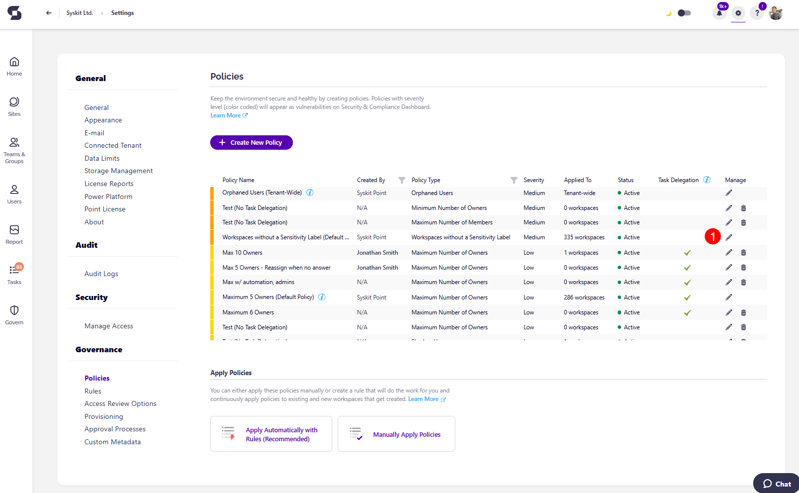
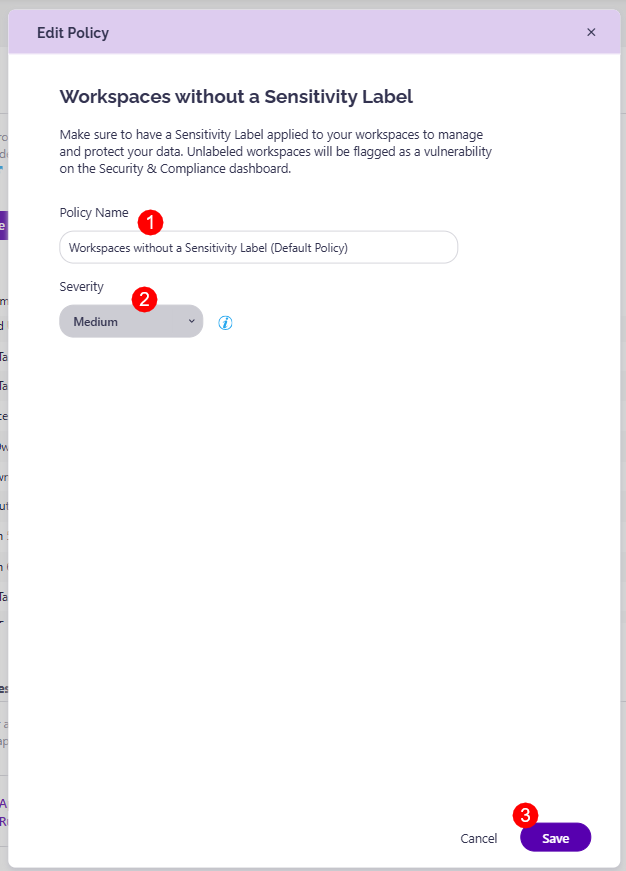

# Workspaces Without a Sensitivity Label

Syskit Point provides a predefined **Workspaces Without a Sensitivity Label** that is applied tenant-wide. This policy helps you detect workspaces without a sensitivity label assigned in order to ensure all data is properly classified and protected. 

To edit the policy, navigate to the Policies settings screen and **click the Edit Policy (1)** icon.

The **Edit Policy** dialog opens where you can: 
* Change the **Policy Name (1)**
* Select the **Severity level (2)**.
  * The severity level set by default for this policy is **Medium**
  
You can select between three levels of severity: 

  * High
  * Medium
  * Low

Once you've selected the one that best suits your needs for this policy, **click the Save button (3)** to store your preference. 


**Please note**, this policy can be applied to the following workspaces:
* **Microsoft Teams**
* **Microsoft 365 Group**
* **Yammer Community**
* **SharePoint Site**

