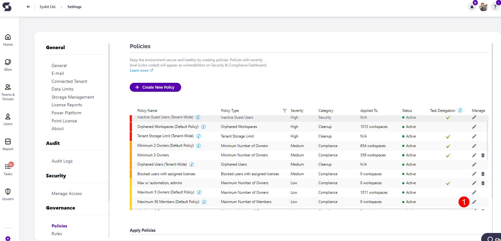
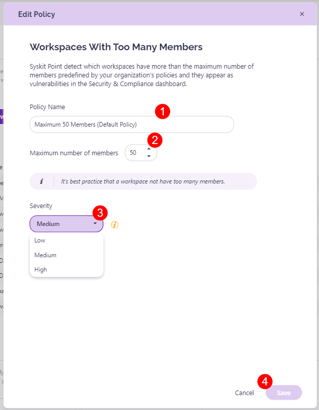

# Workspaces with Too Many Members

Syskit Point provides a predefined **Workspaces with too many members policy**. This policy helps you detect which workspaces have more than the maximum number of members predefined by your organization's policies. 

To edit the policy, navigate to the Policies settings screen and **click the Edit Policy (1)** icon.

The **Edit Policy** dialog opens where you can select: 

* **The Policy Name (1)** - the name this policy shows as in your list of policies

* **The maximum number of members (2)** - the number of members that is the maximum for a workspace; this number is set at 50 as the default

**The Severity level (3)**.
  * The severity level set by default for this policy is **Medium**
  
You can select between three levels of severity: 

  * High
  * Medium
  * Low

Once you've selected the one that best suits your needs for this policy, **click the Save button (4)** to store your preference. 


**Please note**, this policy can be applied to the following workspaces:
* **Microsoft Teams**
* **Microsoft 365 Group**
* **Yammer Community**
* **SharePoint Site**

