# Configure Alerts

**Alerts** feature in SysKit Point **allows you to monitor events** that are collected within **Microsoft 365 audit logs**.

**SysKit Point Admins** and **SysKit Point Collaborators** \(site admins, Microsoft Teams and Microsoft 365 Group owners, and full control users\) can configure alerts. Point Admins can manage all created alerts regardless of who created them.

You can **enable alerts on the following screens**:

* **Sites overview screen** 
* **Microsoft Teams & Groups overview screen** 
* **Users overview screen** 

You can **enable alerts on the following scopes and objects**:

* **Tenant-wide**; to monitor events regardless of which site they come from or who caused them
* **Specific SharePoint site**; to monitor events that occurred on the selected site; additionally, when exploring site content, you can define alerts on the following objects:
  * **Subsite**
  * **Document library**
  * **Folder**
  * **Document**
* **Specific user**; to monitor events caused by a specific user

## Alert Types and Categories

This section describes all alert types and lists all available alerts for each type.

### Tenant-Wide Alerts

You can enable and configure tenant-wide alerts on the following overview screens:

* **Sites**
* **Microsoft Teams & Groups**
* **Users**

The **Configure Tenant Wide Alerts action \(1\)** is available in the right-side panel on all of the listed screens.

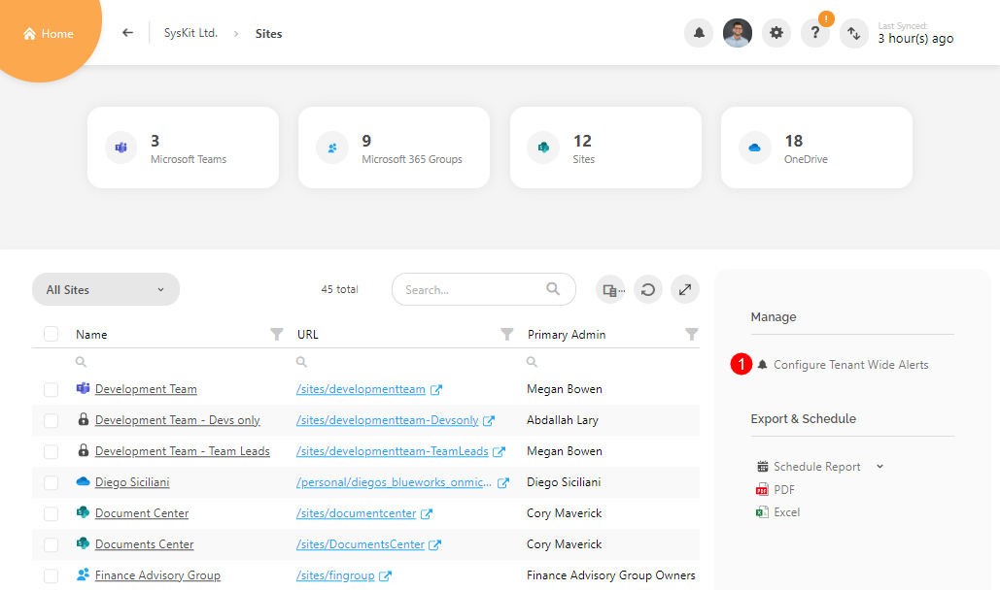


**Please note!**  
Tenant-wide alerts available on the **Sites overview screen** and **Microsoft Teams & Groups overview screen** are identical because they monitor the same SharePoint events; therefore, changes on one screen will also be visible on the other.


The following **tenant wide alert categories and alerts are available** for Microsoft Teams, Microsoft 365 Groups, OneDrive, and sites:

| Alert Category | Alerts | Overview screen |
| :--- | :--- | :--- |
| External Collaboration | Shared File or Folder Externally | Sites, Microsoft Teams & Groups |
| Sharing Activities | Shared File or Folder, Shared With Everyone | Sites, Microsoft Teams & Groups |
| Site Administration Activities | Site Administrators Changed, Changed Sharing Policy, Created Site Collection, Deleted Site, Renamed Site | Sites, Microsoft Teams & Groups |
| Microsoft Teams Activities | Created Team, Deleted Team | Sites, Microsoft Teams & Groups |
| Privacy Changes| Changed Private Group to Public, Changed Private Team to Public | Sites, Microsoft Teams & Groups |
| Sensitivity Labels Changes | Changed Sensitivity Label on Site | Sites, Microsoft Teams & Groups |
| User Activities | User Logged in, User Login Failed, External User Logged in, External User Login Failed | Users |
| User & Role Administration Activities | Added User, Deleted User, Added User to Role, Removed User from Role | Users |

### Site-Specific Alerts

Site-specific alerts can be enabled from the following screens:

* **Sites overview screen** by selecting a site
* **Microsoft Teams & Groups overview screen** by selecting a Microsoft Team or a Microsoft 365 Group 
* **Site details screen**; as mentioned, you can configure alerts for specific SharePoint objects:
  * **Subsite**
  * **Document library**
  * **Folder**
  * **Document**
* **Microsoft Teams and Microsoft 365 Group details screen**

The **Configure Alerts action \(1\)** is available in the right-side panel.

The following table shows the **availability of alerts per scope**:

| Alert Category | Alerts | Resource / Scope |
| :--- | :--- | :--- |
| External Collaboration | Shared File or Folder Externally, External User File Activity | Microsoft Teams, Microsoft 365 Groups, OneDrive, sites |
| Sharing Activities | Shared File or Folder, Shared With Everyone | Microsoft Teams, Microsoft 365 Groups, OneDrive, sites |
| Site Administration Activities | Site Administrators Changed, Added User or Group to SharePoint Group, Changed Sharing Policy, Deleted Site, Renamed Site, Created SharePoint Group, Deleted SharePoint Group, Updated SharePoint Group | Microsoft Teams, Microsoft 365 Groups, OneDrive, sites |
| File & Folder Activities | Accessed File, Checked In File, Checked Out File, Copied File, Detected Malware in File, Downloaded File, Moved File, Uploaded File, Created Folder, Changed File or Folder | Microsoft Teams, Microsoft 365 Groups, OneDrive, sites |
| SharePoint List Activities | Created List, Deleted List | Microsoft Teams, Microsoft 365 Groups, OneDrive, sites |
| Sensitivity Labels Changes | Changed Sensitivity Label on Site | Microsoft Teams, Microsoft 365 Groups, OneDrive, sites  |
| Microsoft Teams & Groups Membership Changes | Added Member, Removed Member | Microsoft Teams, Microsoft 365 Groups |
| Privacy Changes | Changed Private Team/Group to Public | Microsoft Teams/Microsoft 365 Groups |
| Microsoft Teams Activities | Added Bot to Team, Removed Bot from Team, Added Channel, Deleted Channel, Added Connector, Updated Connector, Removed Connector, Added Tab, Updated Tab, Removed Tab, Deleted Team, Changed Team Settings, Changed Channel Settings | Microsoft Teams |

### User-Specific Alerts

User-specific alerts can be enabled on the following screens:

* **Users overview screen** by selecting a user
* **User details screen**

The **Configure Alerts action \(1\)** is available in the right-side panel.

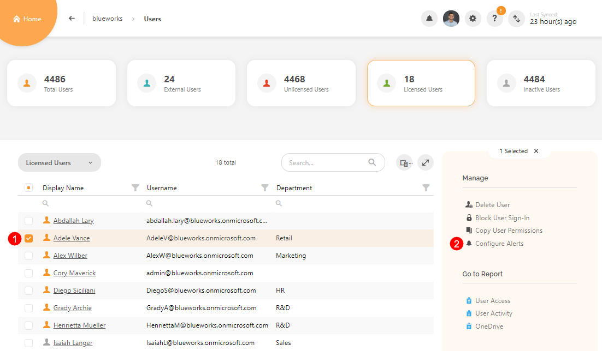

The following **alert categories and alerts are available for a specific user**:

| Alert Category | Alerts |
| :--- | :--- |
| User Activities | User Logged in, User Login Failed |

## Enabling and Customizing Alerts


**Please note!**  
The following section explains how to enable and customize an alert on a specific site. The same principles from this example also apply when dealing with alerts for other types of resources - Microsoft Teams, Microsoft 365 Groups, OneDrive, users, or SharePoint objects such as document libraries or folders.


To enable alerts for a specific site:

* **Navigate to the Sites overview screen**
* **Select a site \(1\)**
* **Click the Configure Alerts \(2\) link**

  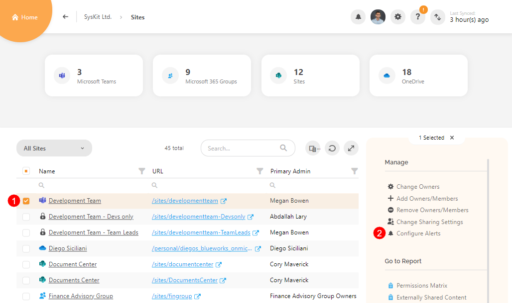

The **Configure Alerts** dialog opens. Here, the following is available:

* **Alert categories \(1\)**
* **Alerts \(2\)** grouped by categories
   * Click the arrowhead next to the alert category to expand
* **Search \(3\)**
* **Alert state toggle \(4\)** 
  * The toggle should turn orange when an alert is active
* **Alert options section \(5\)**
  * This section is inactive until the alert is enabled

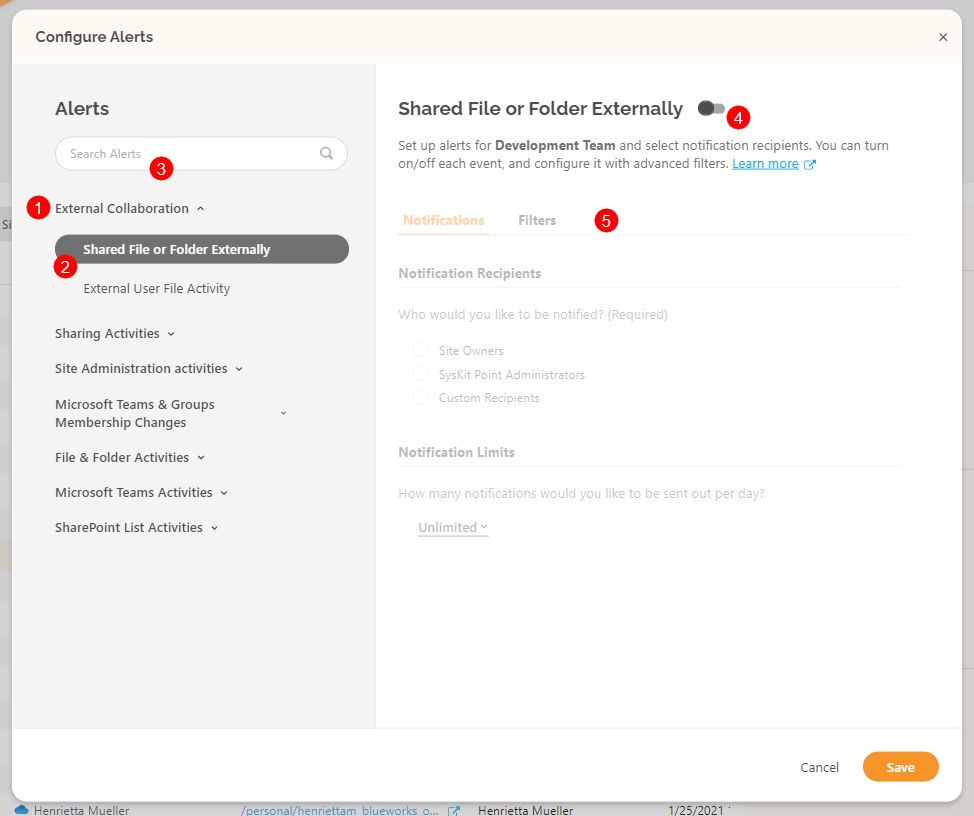

To enable and start editing an alert, switch the **toggle next to the alert title \(4\)**.

After you enable the alert, the alert options section is activated. Here you can customize the alert options, which are separated into the following tabs:

* **Notifications \(1\)**
* **Filters \(2\)**
* **Event Type \(3\)**

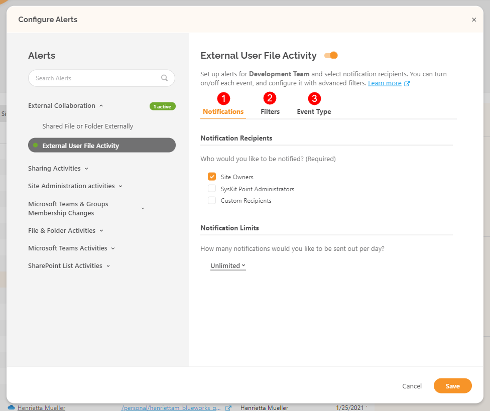


**Please note!**  
Tabs and filters are displayed depending on the selected alert. For example, the **Event Type** tab is only available on alerts that monitor multiple events.


Let's examine options on each tab separately.

On the **Notifications** tab, you can:

* **Define email notification recipients \(1\)**; one or multiple options can be selected:
  * **Site Owners**
  * **SysKit Point Administrators**
  * **Custom Recipients**
    * Select a user from your Azure AD
* **Define notification limits \(2\)**  
  * **Unlimited**
    *  Emails are sent regardless of how many alerts are triggered daily
  * **Selected number**
    *  Emails are no longer sent after the alert is triggered more than a selected number of times

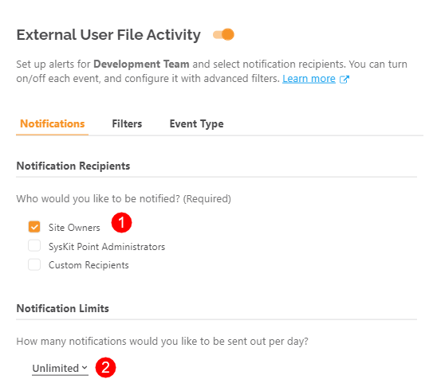

In the **Filters** tab, you can limit the alerts to be triggered only when:

* **Selected user\(s\) caused an event \(1\)**; the following filter options are available:
  * **All Users**
    * This is selected by default
  * **External Users**
  * **Internal Users**
  * **Any of These**
    * Additional selection of users is required
  * **None of These**
    * Additional selection of users is required
* **The action was performed on the selected user\(s\) \(2\)**;  the following filter options are available:
  * **All Users**
    * This is selected by default
  * **External Users**
  * **Internal Users**
  * **Any of These**
    * Additional selection of users is required
  * **None of These**
    * Additional selection of users is required
* **Event has come from the selected IP or IP range \(3\)**; the following filter options are available:
  * **Any IP Range**
    * This is selected by default
  * **Like Any of**
    * Additional input of IPs / IP ranges is required
  * **Equals None of**
    * Additional input of IPs / IP ranges is required

In the **Events** tab, you can choose events for which SysKit Point will raise an alert. By default, all events are selected. Click the checkbox to ignore the event.

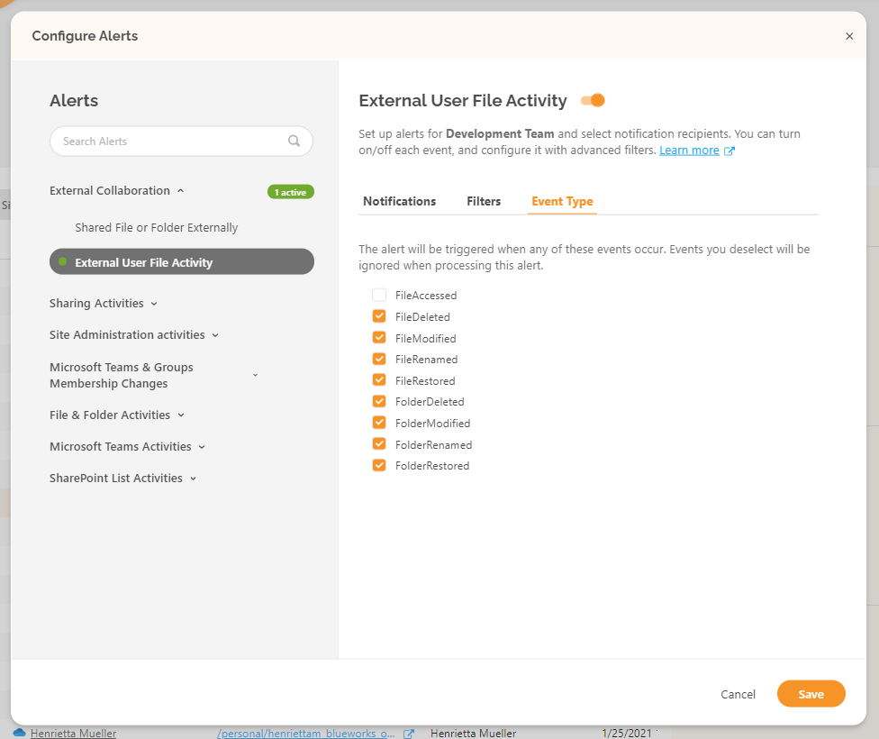

## Alert E-mail

When SysKit Point collects audit logs, if there is an event you decided to monitor by enabling an alert, an **e-mail** is sent to defined recipients.

The picture below is an example of such an e-mail. Click the **View Alerts Details** link to access the Alert details screen in SysKit Point.

## Editing Alerts

The **Edit Alert** action is available on two screens - **Alerts overview screen** and **Alert Details**.


**You can edit all alerts on overview screens where you initially enabled them** - both tenant-wide and site- or user-specific alerts.


## Alert Reports

When you login into SysKit Point as Point admin, you will see the **Alerts** tile in the lower part of the Home screen.

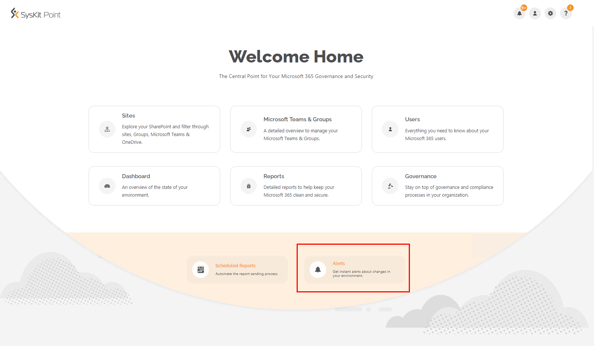

Click the tile to open the **Alerts** report. Here you can see all alerts that are currently enabled.


You can also access the **Alerts** screen from the **user profile menu** in the upper right corner.


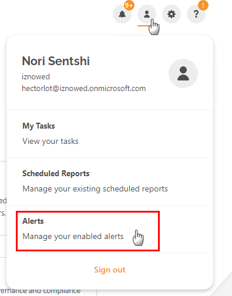

On the **Alerts** overview screen, you can:

* Switch the view between **alert and scope \(1\)** 
* Select additional columns in the **column chooser \(2\)** 
* Find two actions - **Disable Alert** and **Edit Alert \(3\)** when you select a single row 

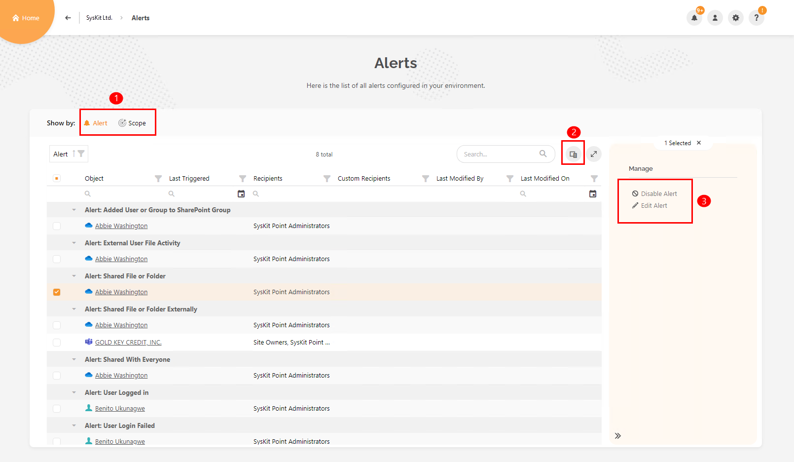


**Disable alert** action allows selecting multiple rows.


When you haven't selected anything on the screen, an **Add Alert \(2\)** action is visible in the side panel. With this, you can define tenant-wide alerts for sites.

Here is also a link to the **Alerts History \(1\)** screen, which shows all triggered alerts in your environment.

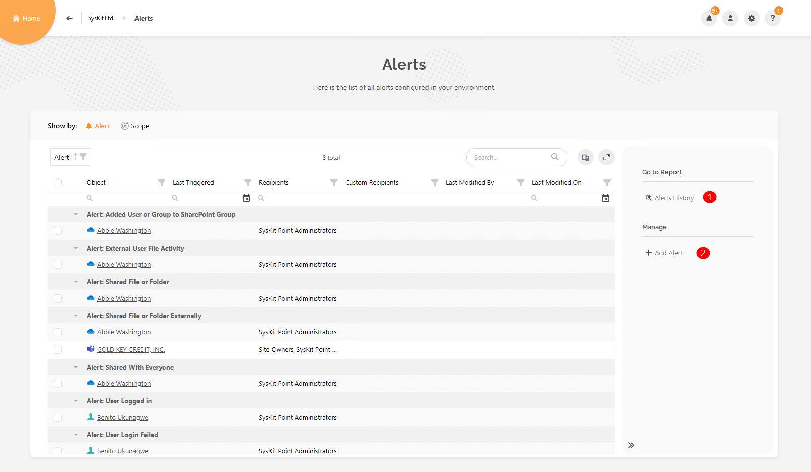

On the **Alerts History** screen, you can:

* Select one or multiple rows and **mark alerts as resolved, and write a comment \(1\)** 
* Open **details screen for a single alert** **\(2\)** 

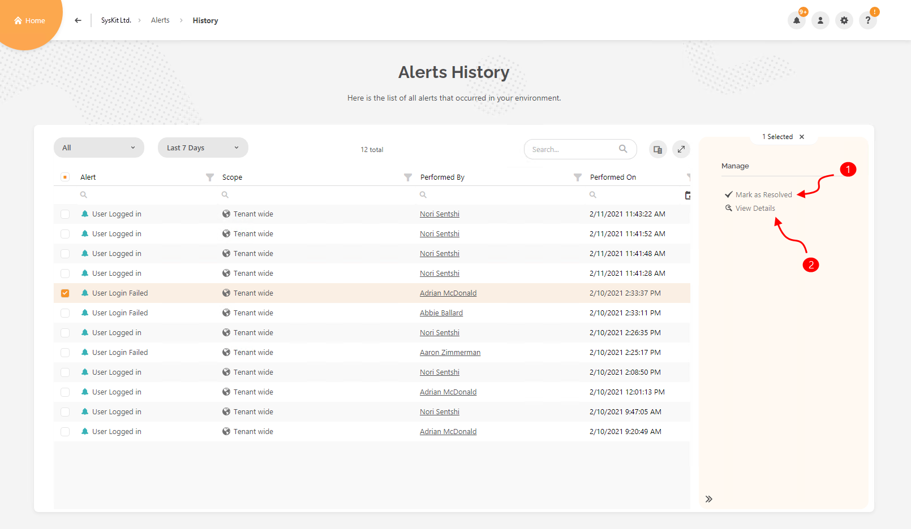

**Alert Details** screen allows you to see additional information about the alert. Here you can:

* **Mark alert as resolved \(1\)** 
* **Edit settings for the alert \(2\)** 
* **Expand the More Details \(3\)** section - here, all audit logs related to this alert are listed
* **Export** both sections - **triggered alerts and alert audit details \(4\)** 

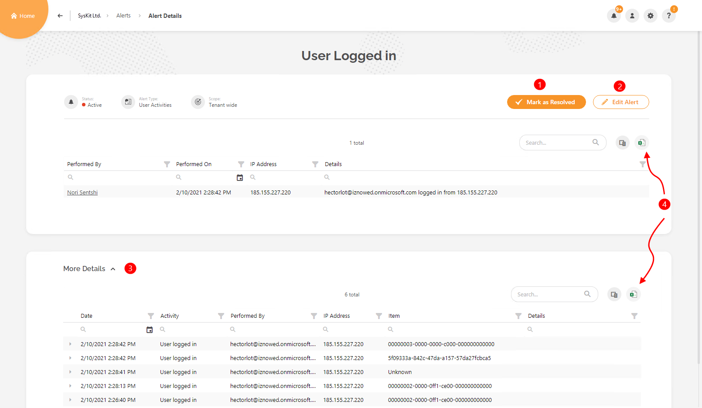


**Hint!** When you open the **Notifications dropdown** from the user profile menu, you can:

* Click the **View Details link \(1\)** to open the **Alert Details** screen for a specific alert 
* Click the **View All Alerts link \(2\)** to open the **Alerts History** screen 


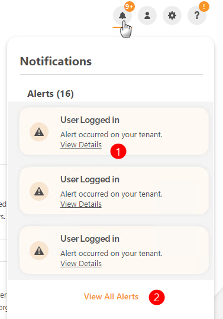