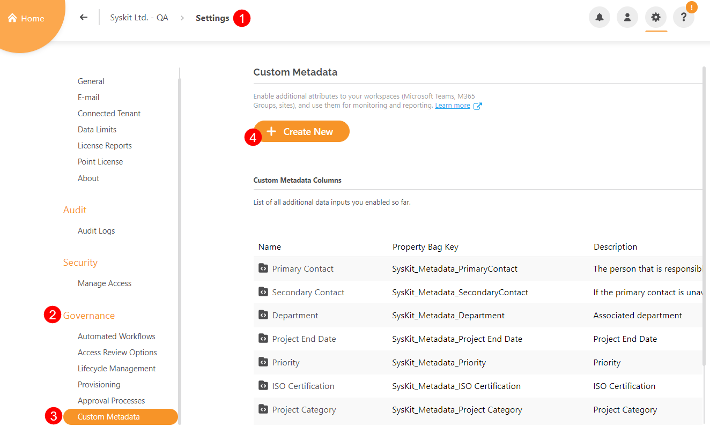
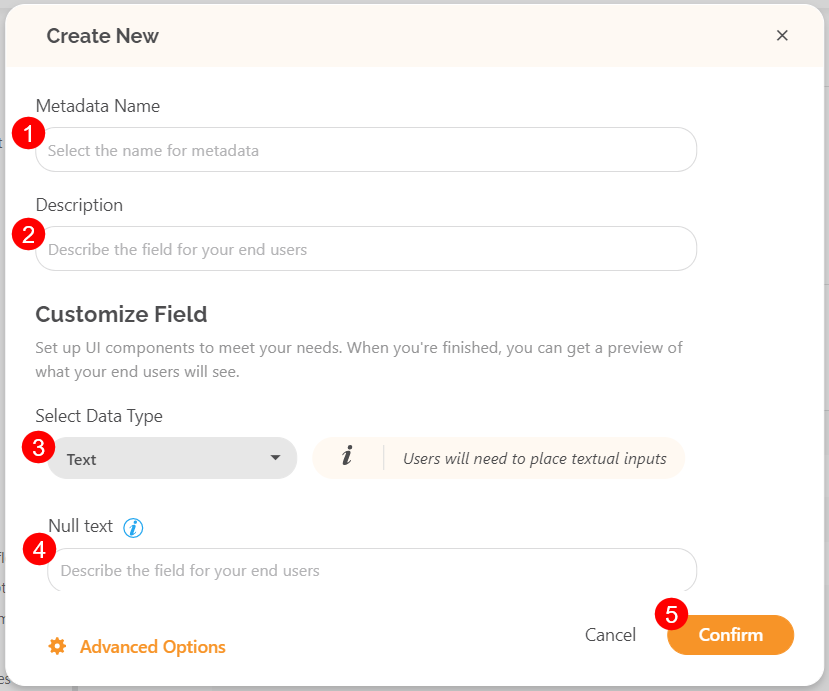

# Custom Metadata
SysKit Point uses **metadata** to provide detailed information about all the collected data found in reports.

The metadata usually collected includes but is not limited to:

 * Names and descriptions
 * Tags, dates, and categories
 * The admin assigned to the items
 * When the item was created
 * When the item was last modified
 * The storage used by the file
 * Who the file was shared with
 * And other useful information

In SysKit Point, these details can be located divided into columns when generating reports. They help **organize, find, and gain insight into data** from Sites, Microsoft Teams & Groups, and OneDrive.

Setting up custom metadata enables choosing personalized parameters for data that should be collected and is not already available within SysKit Point. It provides the ability to **generate reports** based on specific custom metadata set by the admin. 

## Create Custom Metadata
This section will explain how to set up custom metadata in SysKit Point. 

To start, take the following steps:
* On the Home page, click on **Settings(1)**; located in the top right corner of the screen.
* Select **Governance (2)** from the menu, and the page will redirect to the Governance section within Settings.
   * Alternatively, this screen can also be accessed by clicking **View All Settings** and scrolling to the Governance section of the screen.
* Select the **Custom Metadata(3)** option; found at the bottom of the Governance list.
   * This screen provides insight into what **custom metadata has already been set up**, along with the option to create new custom metadata.  
* Click the **Create New (4)** button to create new custom metadata.

Once the create new metadata screen opens, fill in the following information.
* **Metadata Name (1)**; the name of the metadata.
* **Description (2)**; the description of the metadata for end users.
* Select the **data type (3)** of the new metadata under the Customize Field.
  * In the dropdown menu, there are several data types to choose from
    * **Text**
    * **People**
    * **Date**
    * **Dropdown**
    * **Yes/No**
    * **Number**
* Use the **null text (4)** area to add a short hint that will describe the input field for end users.
* When satisfied, click Confirm to apply the new metadata.

 
**Hint!** To connect to metadata from your environment, when creating custom metadata, click on Advanced Options and insert the property bag key in the designated space.


## Change Custom Metadata

After setting up custom metadata, the information can be changed directly from a specific resource.

To change the custom metadata that has been set up on workspaces, select Sites or Microsoft Teams & Groups from the Home page.

* On the **Sites (1)** overview screen, select one or multiple workspaces to edit their metadata.
* Select **Change Metadata (2)**; this option is available on the right side of the screen.

* Select the **type of metadata (1)** that should be changed from the dropdown menu.
  * In the field below, choose or input the required information.
* Click the **Save (2)** button to store the change.
   * There will then be the option to Change Another Column.
* Click **Complete (3)** when satisfied with the changes.
  * This will start the process of changing the custom metadata, and once completed, the information input will be displayed under the selected workspaces.

## Filter Workspaces by Metadata

When generating a report, it can now include and be filtered by the specific custom metadata that was set up.

To generate a report with custom metadata, take the following steps:

* Go to Reports and select the type of report to generate.
* Use the **Column Chooser (1)** to select the metadata.
* Once the custom metadata column was added, use the **filter dropdown menu (2)** to select the details for the report. 

This will filter the report to show the items that the chosen metadata applies to.
* **Select (1)** one or more files to include in the report.
  * Set the values for the report on the pop-up that appears.
* Click **Run Report (2)** to generate the report. 

This can be applied to any reports from the Report section that include **Sites, Microsoft Teams & Groups, and OneDrive**.