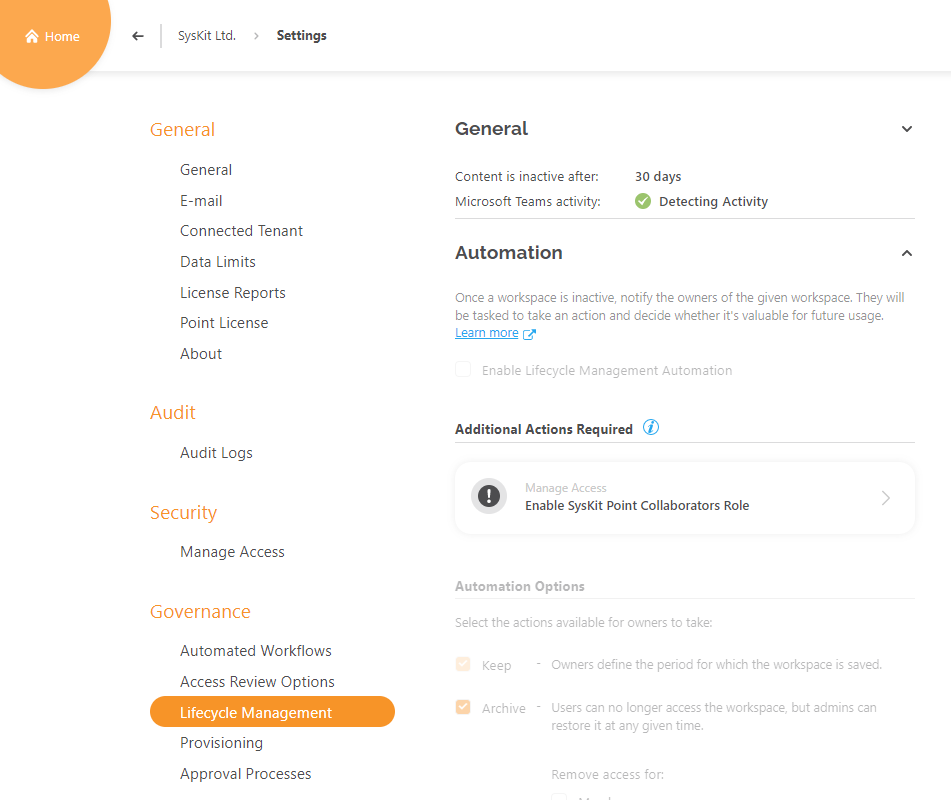
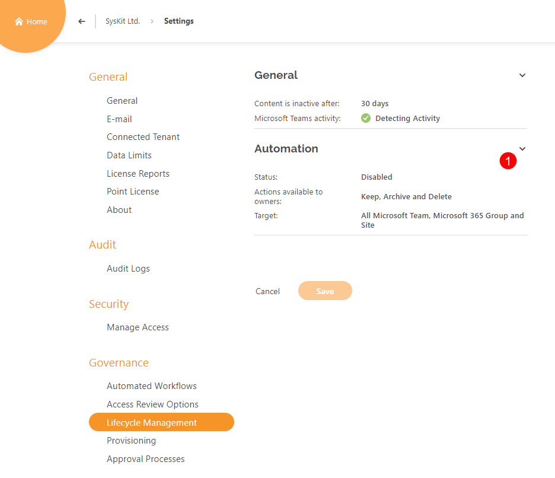
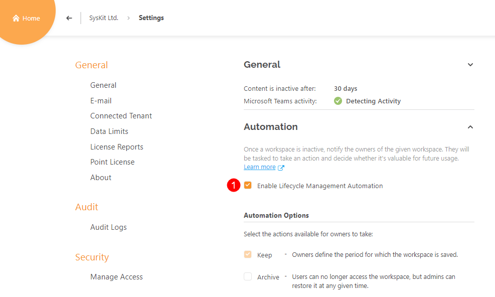
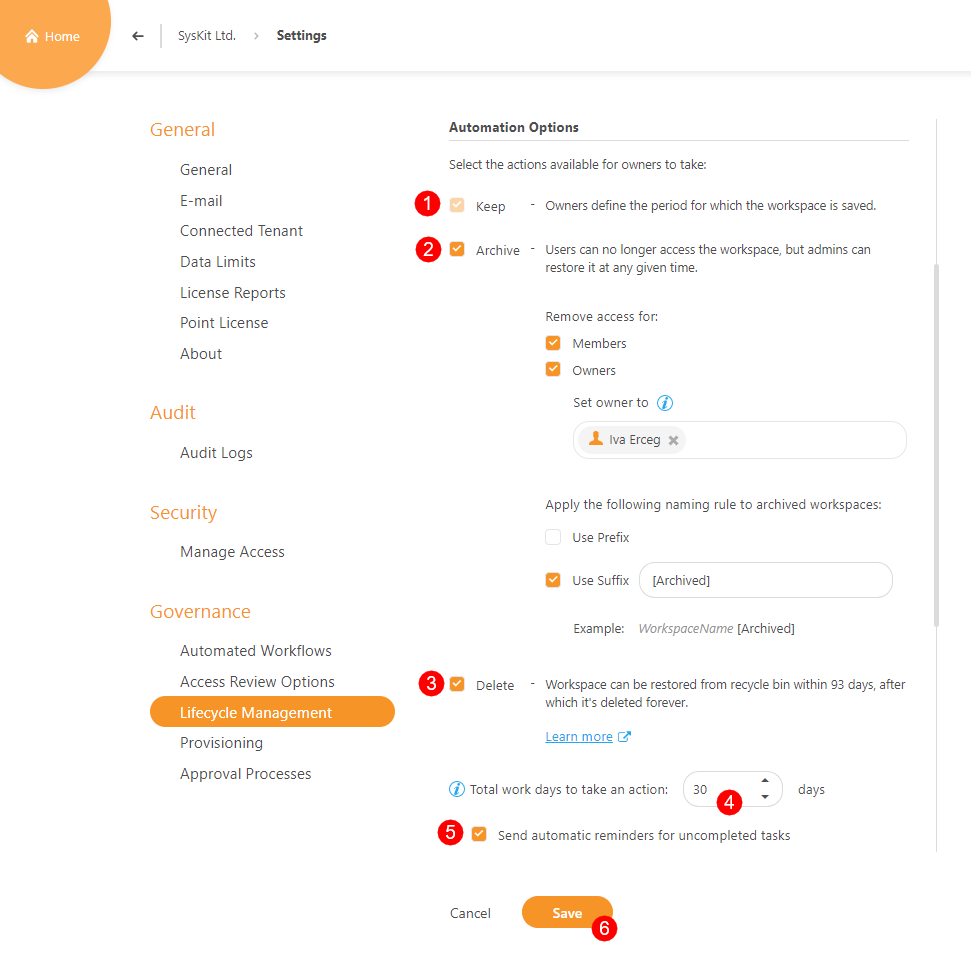
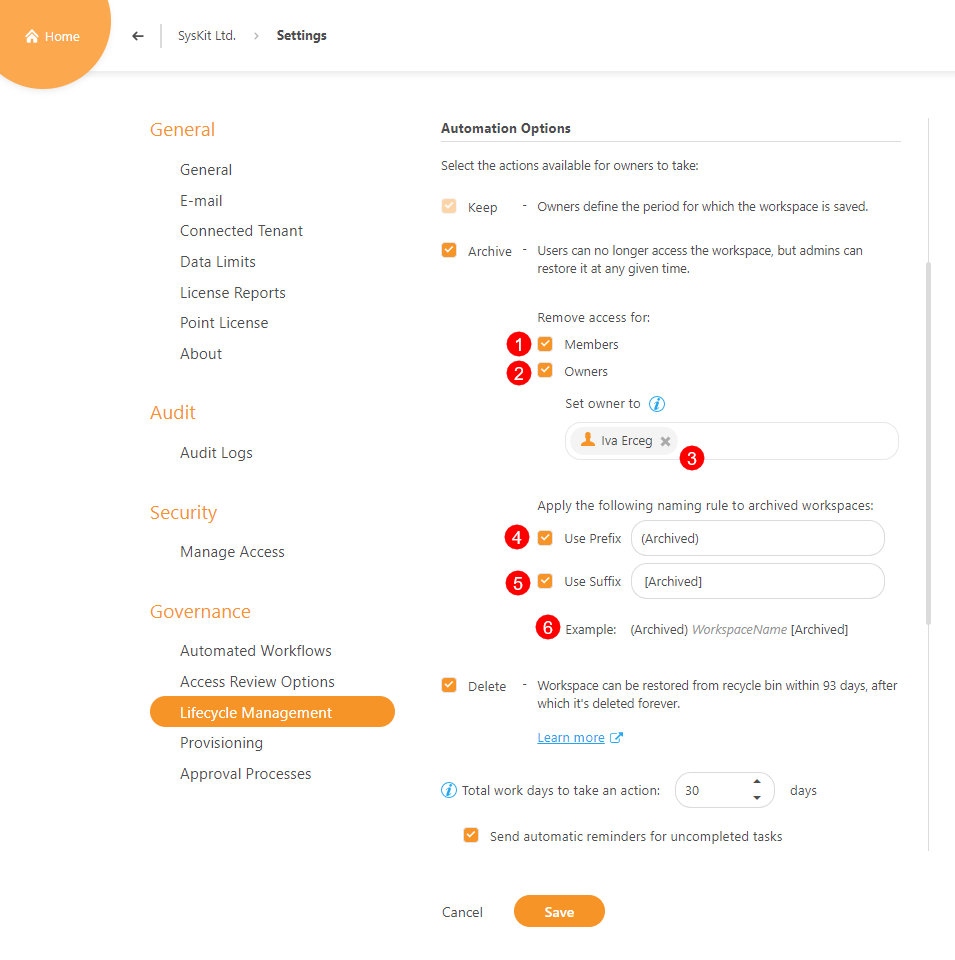
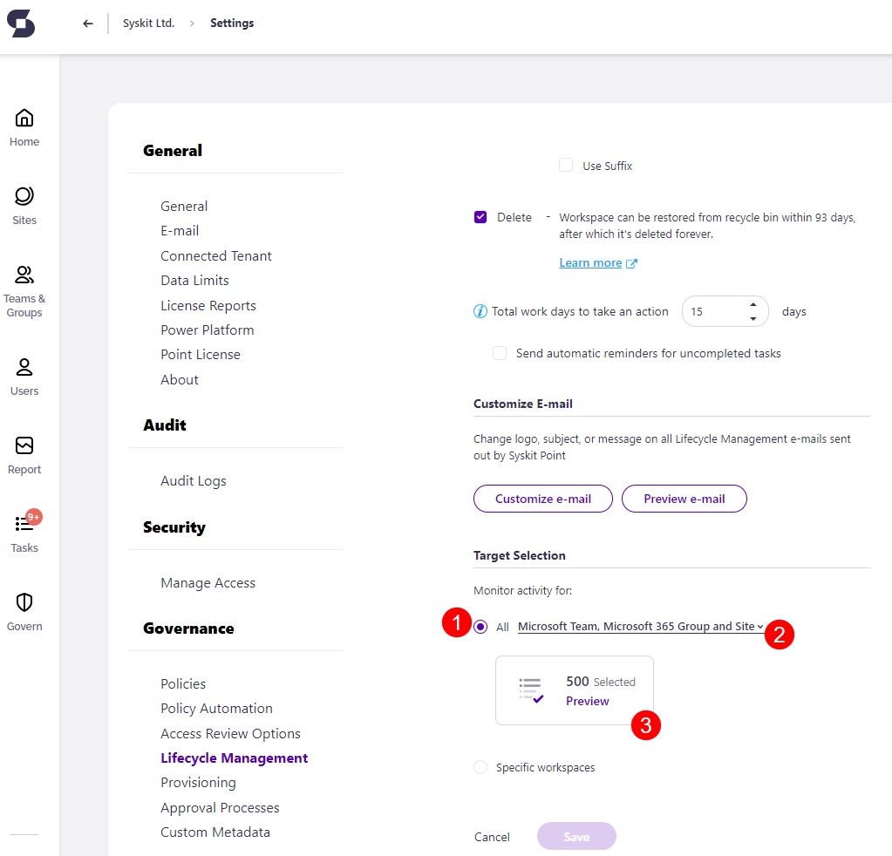
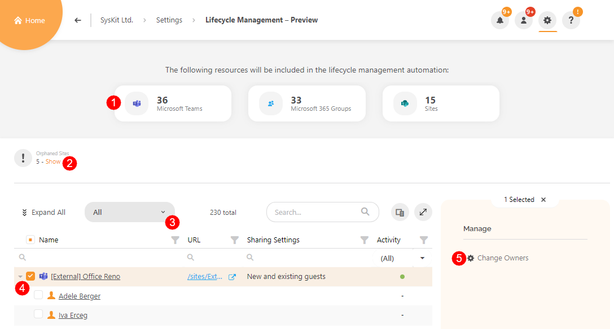
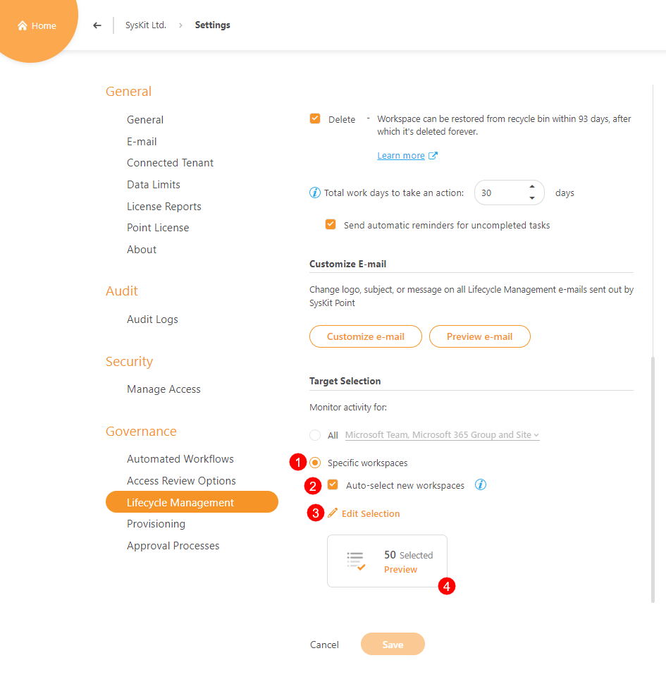

# Enable Lifecycle Management Automation


**Lifecycle Management Automation** is available in the Governance plan and higher tiers. See the [pricing page](https://www.syskit.com/products/point/pricing/) for more details.


To use the advantages of **Lifecycle Management Automation** in **SysKit Point**, you need to:

* **Set up e-mail settings**
* **Enable the SysKit Point Collaborators role**
* **Configure Lifecycle Management Automation in settings**


**Please note!** Only users assigned to the **SysKit Point Admin** role can access and configure Settings in SysKit Point.


## Enable Lifecycle Management

To start with the configuration, open the **Settings** &gt; **Governance** &gt; **Lifecycle Management** screen. 

The screen shows **additional actions** required before enabling the Lifecycle Management automation feature. For example, if you have not enabled the **SysKit Point Collaborators** role.


Use the following links and learn how to [set up e-mail](../../configuration/set-up-email.md) and enable [SysKit Point Collaborators](../../configuration/enable-role-based-access.md#syskit-point-collaborators-1).


Once all requirements are met, on the Lifecycle Management settings screen, you can:
* **See the 2 main groups (accordions)** named **General** and **Automation**
* **Click the Automation accordion \(1\)** to access  **Lifecycle Management Automation** settings

To enable Lifecycle Management automation:
* **Check the Enable Lifecycle Management Automation (1)** option
* **Click Save** at the bottom of the screen

## Automation Options

In the **Automation Options** section, you can:
* **Select between 3 available actions for your workspace owners to take when an inactive workspace is detected**:
    * **Keep (1)**
    * **Archive (2)**
    * **Delete (3)**
* **Define the number of days owners have to complete the assigned Lifecycle Management task (4)**
* **Choose whether to send automatic reminders to owners (5)** in case they don't complete the assigned tasks
* **Click Save (6)** when finished with the configuration


**Please note!**
The **Keep** action cannot be disabled. A minimum of **2** selected actions is required.


The **Archive** action has additional options available:
* **Remove access for**:
    * **Members (1)**; all members are removed when a workspace is archived
    * **Owners (2)**; all owners are removed when a workspace is archived; if the option is selected, at least 1 owner should still exist for all workspaces:
        * **Choose who will be set as an owner (3) on archived workspaces**
* **Use Prefix (4)**
* **Use Suffix (5)**
* **Check the Example (6)** to preview workspace name after archival

## E-Mail Customization

In the **Customize E-mail section**, you can adjust the look and feel of the e-mail sent out by SysKit Point when an inactive workspace is detected.
[Navigate to the Customize E-mails article, to find all available options regarding e-mail customization](../../configuration/customize-emails.md).

## Lifecycle Management Targeting

In the **Target Selection** section, you can **define which workspaces to include in the Lifecycle Management**.

By default, all workspace types - **Microsoft Teams**, **Microsoft 365 Groups** and **sites** \(1\)** - are selected. 
Additionally, you can:
* **Modify the workspace types monitored** by clicking the **workspace filter \(2\)**; here, you have the following options:
    * **Microsoft Teams**
    * **Microsoft 365 groups**
    * **Sites**
* **Preview selected sites based on your configuration by clicking the Preview tile \(3\)**; first, you need to save your changes to enable the Preview tile


**Please note!** 
If you haven't received approval from **Microsoft** for detecting the activity of **Microsoft Teams**, Microsoft Teams **will not be monitored** with **Lifecycle Management Automation**.
[Find out how to enable Microsoft Teams activity tracking here](../../configuration/microsoft-teams-activity.md). 


When you click the **Preview tile**, the **Lifecycle Management - Preview** report opens, showing detailed information about workspaces that will be included in the lifecycle management automation. Here, you can:
* **Click the tiles \(1\)** to show only a certain site type; the tiles show the number of sites included in the Lifecycle Management automation, grouped by type
* **Click the Show link \(2\) that activates the** Orphaned Sites view \(3\)
* **View all site owners that will receive a Lifecycle Management e-mail** for each Microsoft Team, Microsoft 365 Group, or a site included in the Lifecycle Management automation
* **Change admins** by **selecting a row \(4\)** and clicking the **Change Admins action \(5\)** available in the side panel

Instead of choosing workspace types that are monitored, you can select the **specific workspaces \(1\)** option. This option enables you to manually select specific Microsoft Teams, Microsoft 365 Groups, and sites monitored in the Lifecycle Management automation. 
You can also:
* **Select the Auto-select new workspaces (2)** option if you want to start monitoring newly created workspaces when SysKit Point detects them
* **Edit selected workspaces (3)**
* **Preview selected workspaces (4)**

When done with the selection, save your changes.

## Next Steps

Now that everything is defined, the Lifecycle Management will start automatically. 

For information on SysKit Point Collaborators completing Lifecycle Management tasks, take a look at the [Perform Lifecycle Management Tasks article](../../point-collaborators/resolve-governance-tasks/lifecycle-management.md).