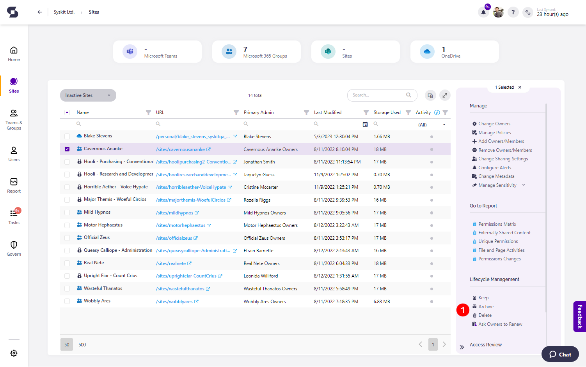
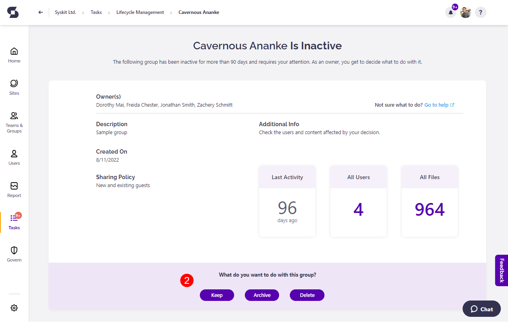
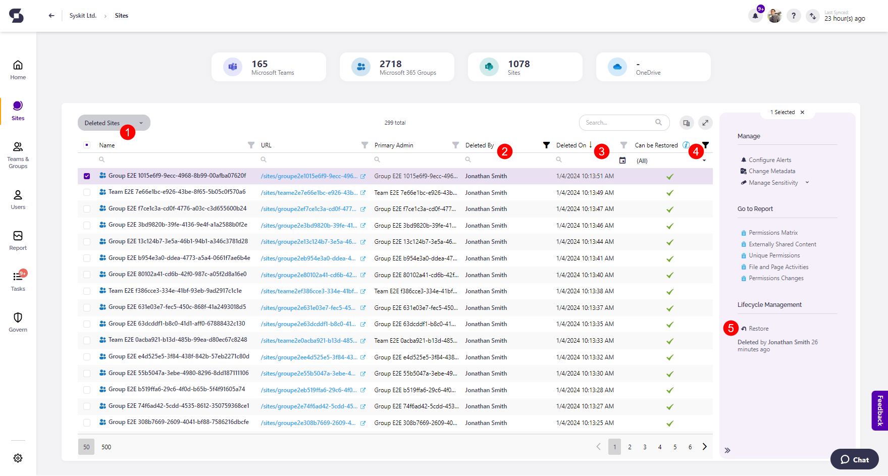
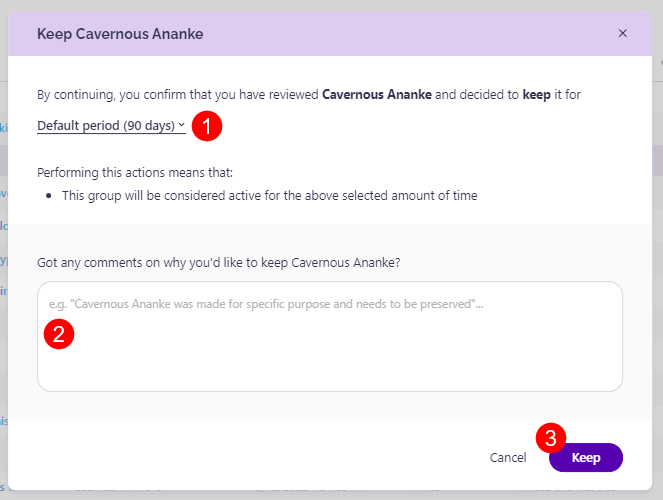
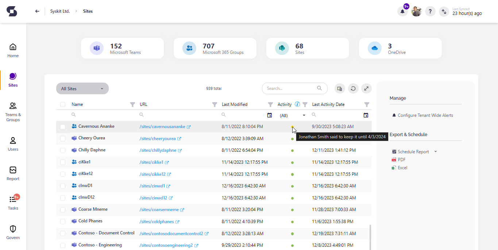
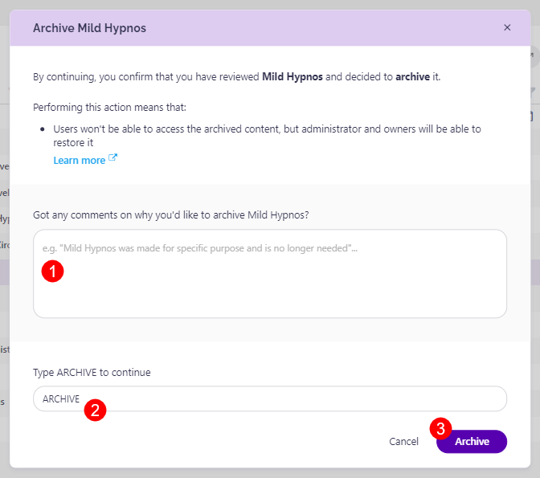
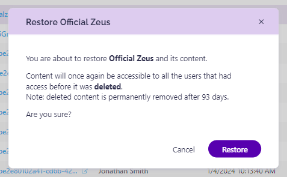
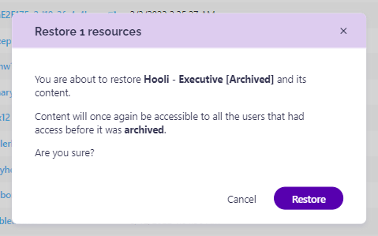

# Run Lifecycle Management Actions in Syskit Point

## Lifecycle Management Actions in Syskit Point


**Lifecycle Management Automation** will be deprecared and replaced by the [Inactive Workspaces policy](../automated-workflows/inactive-workspaces-admin.md). After approximately two months, the feature will be fully removed from Syskit Point.


Syskit Point includes a set of **Lifecycle Management actions** that can be executed on Microsoft 365 workspaces - Microsoft Teams, Microsoft 365 Groups, and sites. The following actions are available:

* **Keep**
* **Archive**
* **Delete**
* **Restore**


**Please note!**  
The Keep action is available for inactive workspaces only.


Each action can be executed by **Syskit Point Admin** and **Syskit Point Collaborator** users.  
**Lifecycle Management actions** – **Keep, Archive, and Delete –** are available on the following screens in Syskit Point:

* **Sites overview**
* **Microsoft Teams & Groups overview**
* **Details of a selected workspace**
* **Lifecycle Management task details**

You can find the actions in the side panel, under the **Lifecycle Management category** **\(1\)**. 

When resolving the **Lifecycle Management task**, actions are **displayed in a ribbon \(2\)**.

The **Restore** action is **available for deleted and archived workspaces only.** You can find these workspaces on the overview screens by selecting the **Deleted/Archived Sites/Groups view \(1\)**. On the view, additional columns are available:

* **Deleted By \(2\)**
* **Deleted On \(3\)**
* **Can be Restored \(4\)** – A green checkmark is displayed for workspaces currently in the Recycle Bin and can be restored
* **Restore action \(5\)** is available in the side panel, as already described.


**Please note!**  
When the Lifecycle Management flow is enabled, **executing an action** \(except Restore\) from any of the mentioned screens **will resolve existing unresolved Lifecycle Management tasks** for the workspace.



**Hint!**  
On the Sites overview screen and the Microsoft Teams & Groups overview screen, you **run actions on workspaces in bulk** by selecting multiple workspaces and clicking the wanted action from the side panel.


Lifecycle Management actions are also available in emails that Syskit Point sends to site owners and admins as a part of the Lifecycle Management Automation. Still, **actions can be executed in Syskit Point only**. Follow [this link](../../point-collaborators/resolve-governance-tasks/lifecycle-management.md) to learn more about Lifecycle Management emails and tasks.

Next, all actions are described in greater detail.

### Keep

The **Keep** action is run to **mark that the selected workspace is being used**. As a result, the **kept workspace** will be:

* **considered active** for a selected amount of time
* **exempt** when inactive workspaces are calculated by the Lifecycle Management Automation

When executing this action, you can:

* **Select the period \(1\)** for which the workspace should be kept
   * By default, the selected period equals the defined number of days after which a workspace will be considered inactive, which can be changed in the Lifecycle Management settings.
   * Available options: 6 months, 1 year, 2 years, Custom
   * The **Custom** option opens a date picker where you can choose a specific date in the future to keep a workspace and consider it active.
* **Leave a comment \(2\)** on why you want to keep this workspace
* **Confirm the action** by clicking the **Keep button \(3\)**

As a result of this action, you can see the workspace getting a new activity state – **Kept** – visible in the **Activity column \(1\)** on overview screens. Kept workspaces are depicted with a yellow circle. **On hover \(2\)**, the circle provides additional information on who said to keep the workspace and how long.


**Please note!**  
The Keep action can be executed on inactive workspaces only!


### Archive

The **Archive action** has additional options available that are set up according to the administrator’s preference. More information on that can be found in the [Enable Lifecycle Management Automation article](enable-lifecycle-management.md).

Archiving a workspace within Syskit Point results in the following:
* **The workspace gets into a read-only state**
* **Based on the parameters set by the admin, access to the workspace is removed for**:
   * **Members**; all members are removed when a workspace is archived
   * **Owners**; all owners are removed when a workspace is archived; when this option is set up, **at least 1 owner will still exist for all workspaces** as set by the admin.
* **The permissions inheritance is restored on all objects**
* **All memberships on the workspace are removed in Microsoft 365**
* **All memberships are saved in the Syskit Point database to support the Restore action**
* **The workspace is renamed to include the Prefix and/or Suffix that was set by the admin**

After selecting the Archive option for a workspace, it opens the Archive action dialog where you can:

* **Enter a comment \(1\)**
* **Confirm the action by typing ARCHIVE \(2\)**
* **Execute the action by clicking the Archive button \(3\)**


**Please note!**  
This action can be executed only on workspaces that are not archived or deleted.



**Hint!**  
As described in the introduction, you can find the archived workspaces by switching to the Archived view on the overview screens.


### Delete

With this action, you can easily delete a workspace inside Microsoft 365.


**Please note!**  
This action **does not delete** a workspace **permanently**.  
**The deleted workspace is moved to the Recycle Bin**, and **you can restore it within the period defined by Microsoft**. Microsoft 365 keeps your sites for **93 days**, and after that, they are deleted permanently. Microsoft 365 Groups are kept in the Recycle Bin for **30 days**.



**Please note!**  
You can find more about Microsoft’s retention policies on the following links:

* [Microsoft 365 Groups](https://docs.microsoft.com/en-us/microsoft-365/admin/create-groups/restore-deleted-group?view=o365-worldwide)
* [SharePoint Online](https://support.microsoft.com/en-us/office/restore-items-in-the-recycle-bin-that-were-deleted-from-sharepoint-or-teams-6df466b6-55f2-4898-8d6e-c0dff851a0be?ui=en-us&rs=en-us&ad=us#ID0EAADAAA=Online)


When running the delete action, do the following:

* **Enter a comment \(1\)**
* **Confirm the action by typing DELETE \(2\)**
* **Execute the action by clicking the Delete button \(3\)**


**Please note!**  
This action can be executed on workspaces that are not deleted or archived.


### Restore

The **Restore action** can be executed on archived and deleted workspaces.

* **When restoring a deleted workspace**, the action results in the following:
* **The workspace is removed from the Recycle Bin**
* **The workspace is considered active**
* **When restoring an archived workspace**, the action results in the following:
* **All memberships are be restored**
* **The suffix \[Archive\] is removed from the workspace name**
* **The workspace is considered active**

When running the Restore action, a confirmation dialog appears. To execute the action, click the **Restore button**.


**Hint!**  
There is no time limit for **performing the Restore action on Archived workspace**. 


