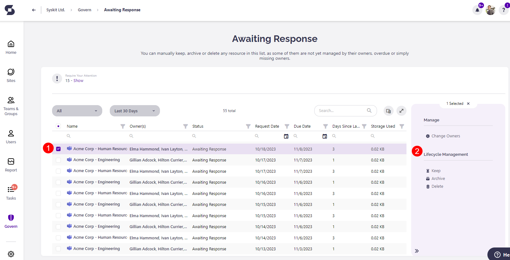
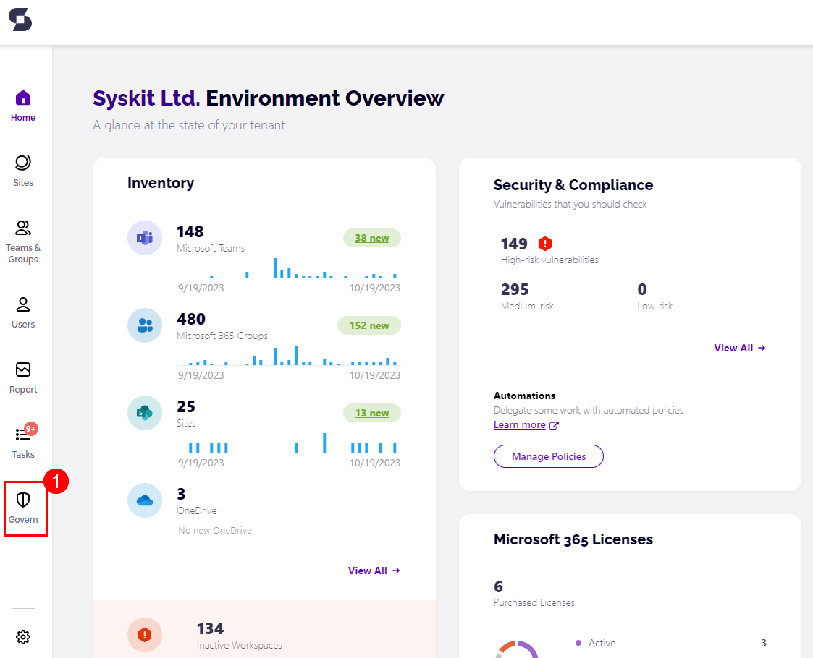
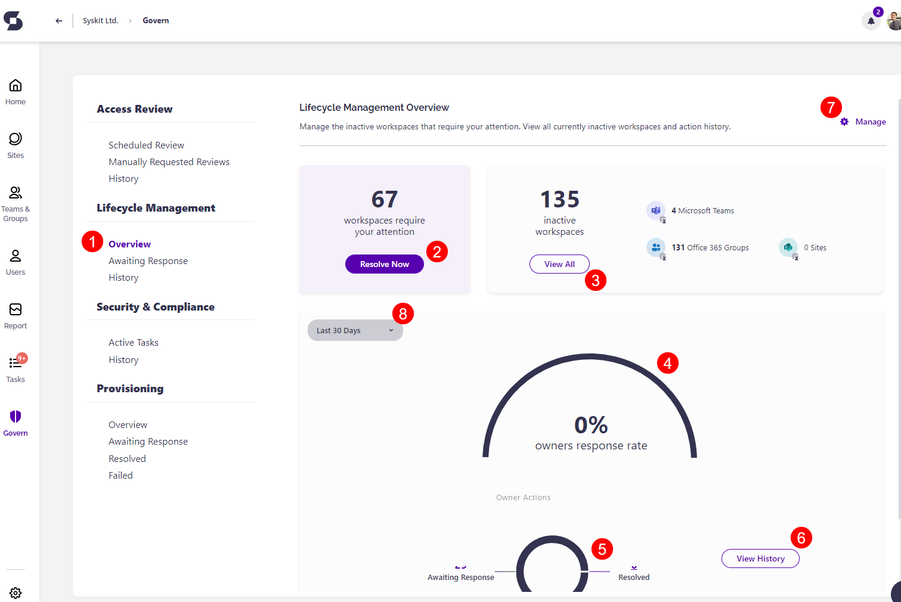
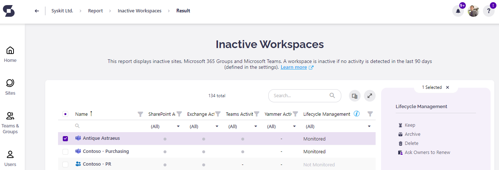
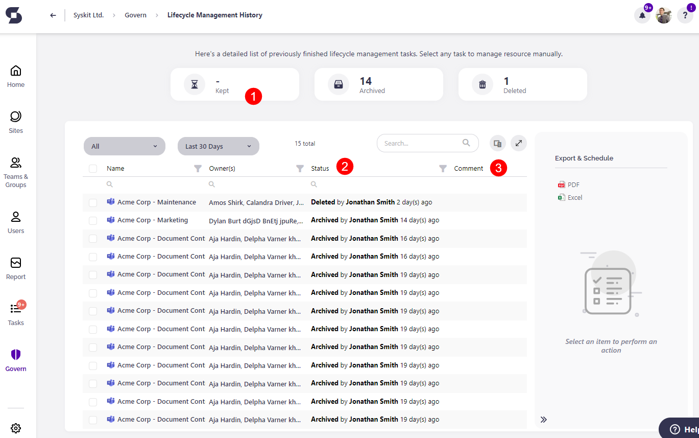

# Monitor Lifecycle Management Tasks in Syskit Point


**Please note!**  
First, make sure to check how to [enable and configure Lifecycle Management Automation in Syskit Point.](enable-lifecycle-management.md)


All **content** and **workspaces** in your **Microsoft 365** Environment have a certain **lifecycle**, be it the **creation** of the **new** workspace, that workspace being **used** for collaboration, file sharing, chat, or when a product is retired and when the previously used workspace becomes **stale**, **inactive** and **no longer needed**.

That last moment is where **Syskit Point Lifecycle Management** comes to shine. It empowers your **Site Owners** to choose whether they want to **Keep**, **Delete,** or **Archive** their inactive workspaces.

The lifecycle management in **Syskit Point** can be viewed from **two** different **roles**:

* **Syskit Point Admin user**, as described in this article
* Syskit Point Collaborator user

When working with lifecycle management, Syskit Point Admin users can:

* **define lifecycle management settings**
* **decide which workspaces are going to be monitored**
* **monitor the progress of lifecycle management tasks**
* **receive a weekly e-mail that summarizes inactive content on their environment**
* **resolve the overdue tasks from Site Owners**
* **send reminders to Site Owners to resolve the task**

On the other hand, Syskit Point Collaborators can perform lifecycle management actions on workspaces where they are an owner or admin.

Here, we will describe how a Syskit Point Admin can monitor the progress of ongoing lifecycle management tasks.

## Weekly summary of inactive content

Let’s say that lifecycle management automation was enabled for your Microsoft 365 environment in SysKit Point; every Site Owner received their e-mails and is taking care of their inactive resources. A week has passed, and the SysKit Point Admin receives a Weekly summary of inactive content via e-mail with the following information:

* newly detected **inactive workspaces** \(1\)
* workspaces that **require** the Syskit Point Admins **attention** \(workspaces still awaiting a response or ones that might be without owners\) \(2\)

Click the **Discover More** if you wish to see which new workspaces are now inactive. When logged in to Syskit Point, this link opens the Lifecycle Management Overview screen.

Clicking on **Resolve now** opens the lifecycle management **Awaiting Response** report, where you can select the problematic workspace \(1\) and decide which action you are going to take with it. \(2\)


**Hint**!  
To ensure that every workspace has an owner responsible for lifecycle management, always set an active user as an owner for the orphaned workspace.


## Governance – Lifecycle Management

To **track the progress** of the ongoing Lifecycle Management, Syskit Point Admins can **use the Governance screen.** To access it, **click the Governance button (1)** located on the left side of the screen.

You will be redirected to the **Governance screen**. Under the lifecycle management tab, click the **Overview** \(1\). 

A **Lifecycle Management Overview** screen appears where you can check:

* **Workspaces that require your attention** \(orphaned workspaces\)\(2\)
* See all **inactive workspaces** in your environment\(3\)
* Check out the graphic overview of the **owners response rate** to their lifecycle management tasks\(4\)
* Graphic overview of **actions performed by owners**\(5\)
* Check the **history** of lifecycle management tasks\(6\)
* Manage **Lifecycle Management settings** for your environment in Syskit Point\(7\)
* Change the **time frame filter** for lifecycle management\(8\)

## Workspaces that require your attention

When you click to resolve the task for workspaces that require your attention, you will be redirected to the **Awaiting Response** report, where you will find all the workspaces that require some sort of action. Workspaces that you find there can be **Orphaned** workspaces or workspaces that have **Overdue** tasks.

On that screen, you can choose a workspace and perform lifecycle management actions \(**keep**, **archive**, **delete**\) or add **owners or members** to the workspace.

If the Lifecycle Management task is Overdue, the following actions can be completed: 
  * **Owners can still resolve tasks** by deciding to Keep or Archive the workspace
  * **Collaborators** can find the task under Active tasks in their My Tasks section, but it will show as Overdue
  * **When Administrators access the Governance screen**, the Lifecycle Management task is shown as active instead of completed when clicking on History, and they will have the ability to complete the task themselves
  * **Administrators can send reminders** to workspace owners to complete the task

## See all inactive workspaces in your environment

When you click the **View All** inactive resources, SysKit Point generates an **Inactive Content** report showing you all the inactive resources in your environment, regardless of whether they are being monitored by Lifecycle Management or not. 

On the said report, you get an option to **Keep, Archive, or Delete** any workspace there. You can also **Ask Owners to Review**, which sends a reminder to the workspace owners to resolve the task. 

## View Lifecycle Management History

If you click the **View History**, **Syskit Point** redirects you to the **Lifecycle Management History** report, where you can see all the lifecycle management tasks that were performed in your environment. 
You can also:

* **Filter** the report by clicking on the action tiles\(1\)
* See the **status** of a workspace and who performed an action on it\(2\)
* Read the **comment** of a user who performed said action on the workspace\(3\)

You can also perform the **Restore** action on workspaces that were **deleted** \(if they haven’t been permanently deleted\) or **archived.**


**Hint**!  
To learn more, visit the articles for running [lifecycle management actions](lifecycle-management-actions.md) and [resolving lifecycle management tasks](../../point-collaborators/resolve-governance-tasks/lifecycle-management.md).

