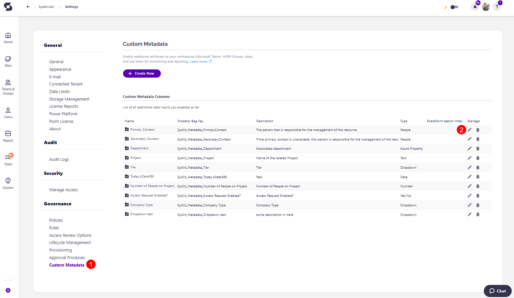
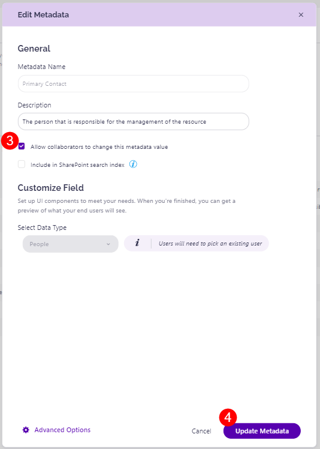

# Metadata Review 

Metadata, explained in simple terms as data that describes other data, is often the easiest way to **structure, categorize, and manage** all of the content within your organization. 

In the context of Microsoft 365, **metadata helps classify, search, and retrieve** documents more efficiently which makes it a great management tool. However, outdated, incorrect or missing metadata can also lead to misfiled information, inefficient sorting, and make it difficult to successfully manage your environment. 

That’s why it’s **important for collaborators to regularly review and update metadata**. Regularly performing Metadata Reviews ensures the accuracy and relevance of your content, and, ultimately, improves productivity and governance.

With the Metadata Review feature, you can select metadata that you want collaborators to maintain and update. 

## Manage Metadata Review

To select the metadata you want to enable collaborators to review, go to the Settings of your Syskit Point and complete the following:

* In the Governance section, click the **Custom Metadata (1)** option. 
* Click the **Edit button (2)** for the metadata you want to enable the review for
  * This opens the Edit Metadata screen
* **Click the Allow collaborators to change this metadata value checkbox (3)** to enable the feature for this metadata
* **Click the Update Metadata button (4)** to finalize your selection 

Once your preferences have been saved, you can start requesting a metadata review from collaborators.

To learn how to [request a Metadata Review, take a look at this article.](../metadata-review/request-metadata-review.md)


To enable collaborators to review your metadata, the Collaborator role must be enabled. For more details on this, take a look at the [Assign and Manage Access to Syskit Point article](../../configuration/enable-role-based-access.md#syskit-point-collaborators-1).

