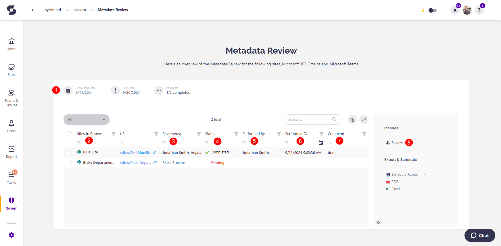

# Metadata Review 

Metadata, explained in simple terms as data that describes other data, is often the easiest way to structure, categorize, and manage your organization's content. 

In the context of Microsoft 365 and Syskit Point, metadata helps classify, search, and retrieve workspaces more efficiently, making it a great management tool. However, outdated, incorrect, or missing metadata can also lead to misfiled information and inefficient sorting and make it difficult to manage your environment successfully. 

That’s why it’s important for collaborators to review and update metadata regularly. Regularly performing Metadata Reviews ensures that your workspace metadata is accurate and relevant, ultimately improving productivity and governance.

With the Metadata Review feature, you can select metadata you want collaborators to review and update. 



**Please note:** To be able to request a review from workspace owners in Syskit Point, ensure the following:
* The Collaborator role is enabled. 
    * For more details, read the [Assign and Manage Access to Syskit Point article](../../configuration/enable-role-based-access.md#syskit-point-collaborators-1).
*  Metadata needs to be editable by collaborators. 
    * Continue reading this article and discover how to allow collaborators to manage custom metadata.



## Enable Collaborators to Manage Metadata

To select the metadata you want collaborators to manage, go to Syskit Point settings and complete the following:

* In the Governance section, click the **Custom Metadata (1)** option. 
* Click the **Edit button (2)** for the metadata you want to edit
    * This opens the Edit Metadata screen
* **Click the Allow collaborators to change this metadata value checkbox (3)**
* **Click the Update Metadata button (4)** to finalize your selection 

Once your preferences have been saved, you can request Metadata Reviews from collaborators.

To learn how to [request a Metadata Review, take a look at this article.](../metadata-review/request-metadata-review.md)

## Manage Metadata Reviews as an Admin

**You can find active and completed Metadata Reviews on the Govern screen** in Syskit Point.

The **Requested Reviews** screen shows all the currently requested Metadata Review tasks. 
Open the Metadata Review by clicking the **View Details** button.
Here you can find:
* **Basic Metadata Review information (1)**
    * Date when the Metadata Review was requested
    * Due date
    * Progress - number of workspaces where the review was completed next to the total number of workspaces included in the review
* **All workspaces included in the review (2)**
* **Reviewers for each workspace (3)**
* **Status of the review for each workspace (4)** 
* **Who performed the review (5)** if completed
* **When the review was completed (6)**
* **Comment provided by the reviewer (7)**
* **Review action (8)**
    * Click this action to perform the Metadata Review
    * For more information about the reviewer experience, read the [Metadata Review article](../../point-collaborators/resolve-governance-tasks/metadata-review.md)

**Clicking the name of a workspace where the review is already completed, opens the Summary screen that lists all changes done by the reviewer during the Metadata Review.**
* The Summary screen can also be accessed by selecting a workspace and clicking the View Details action in the side panel.

Navigating to the **Govern > Metadata Review > History** screen and clicking **View Details** for a Metadata Review, shows past **Metadata Review tasks**. Here, you can find the list of performed changes, as described for the active Metadata Review tasks.