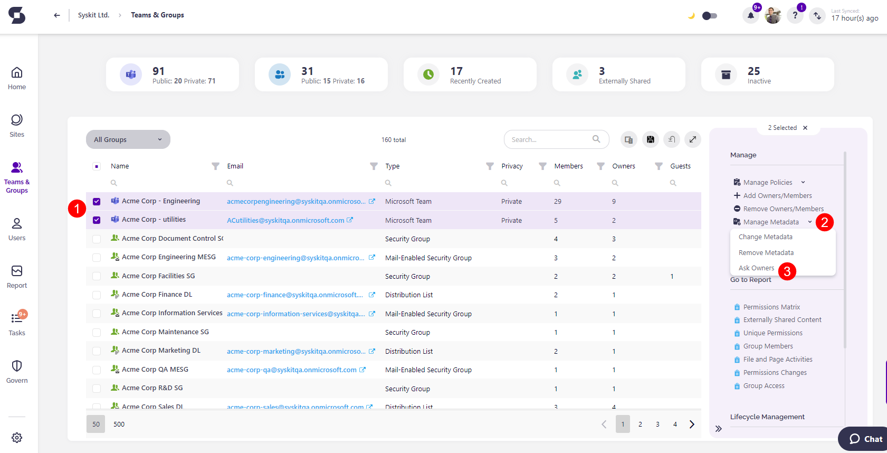
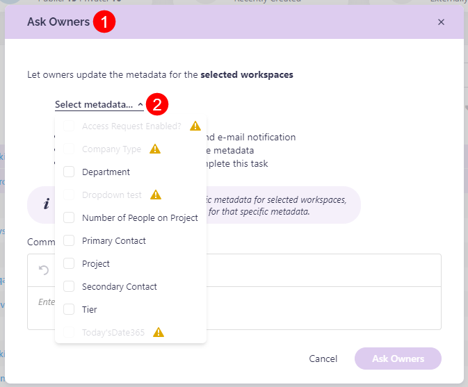
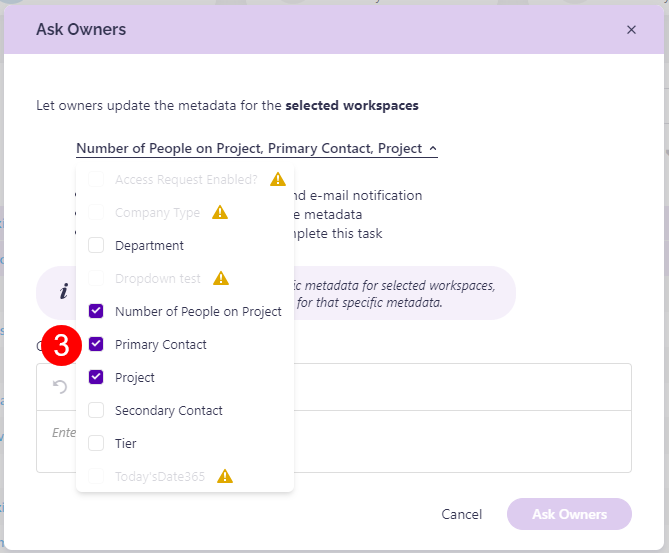
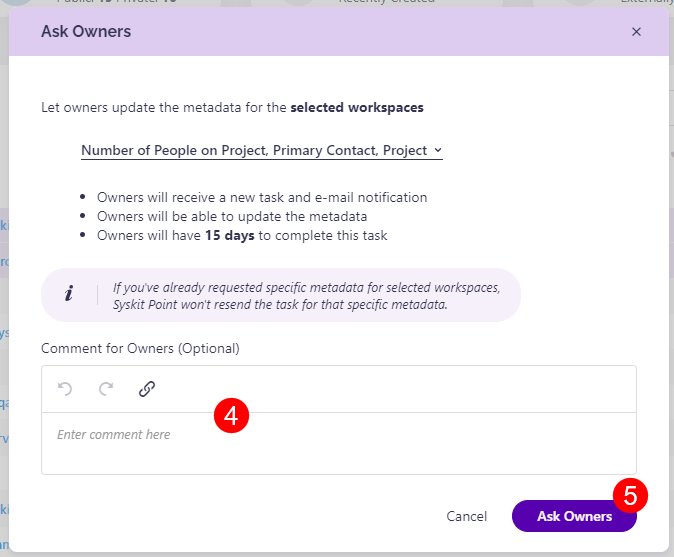

## Request Metadata Review

Once you've [defined which metadata can be managed by collaborators through Syskit Point](manage-metadata-review.md), you can request a review by going to the **Sites Overview or Teams & Groups Overview**. 


**Please note:** You cannot request a review for the metadata that was not approved for owner review. [Take a look at the Manage Metadata Review article for details on how to select which metadata should be available for review by the workspace owners.](manage-metadata-review.md)


In this article, we are using the **Teams & Groups Overview** screen. To request a review, complete the following:

* **Select one or more workspaces (1)** where you want the metadata review to be performed
* On the right side of the screen, **click the arrow next to the Manage Metadata action (2)** and **select the Ask Owners (3)** option

The **Ask Owners (1)** pop-up appears, where you can:

* **Click the Select metadata (2)** action, and a dropdown list of all metadata in your environment opens
* **Select the metadata (3)** you want the review performed for
  * If the metadata is a faded gray color and cannot be selected, it means that the administrator did not enable metadata management for collaborators on that specific metadata, or a review for that metadata is already in progress.
  * [Take a look at the Manage Metadata Review article for details on how to select the metadata that can be reviewed by workspace owners.](manage-metadata-review.md)
* Once you've selected the metadata, you can **leave a comment (4)** for the owners 
* **Click the Ask Owners (5)** button to finalize the selection and send the task to the workspace owners

After that, a pop-up confirms that the task has been sent and lets you know that you can **check the newly created tasks by going to the Governance screen, selecting Metadata Review, and clicking Requested Reviews**. 


**Please note the following:**
* Owners will receive a new task and e-mail notification.
* Owners will be able to update the metadata.
* Owners will have **15 days** to complete this task.
* After a **Metadata Review is completed or if it is overdue, administrators receive an e-mail** informing them of that 1 day after completion.
* If you've already requested a review for **specific metadata for selected workspaces**, you are not able to select that metadata until the pending review for that metadata is completed.
