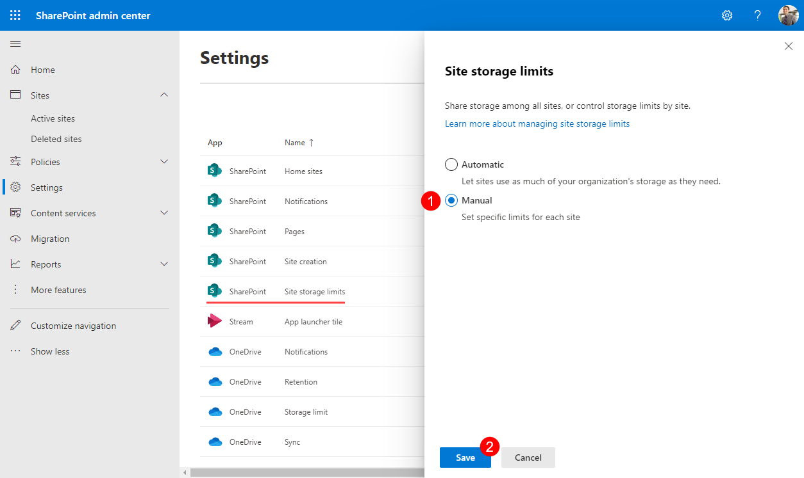
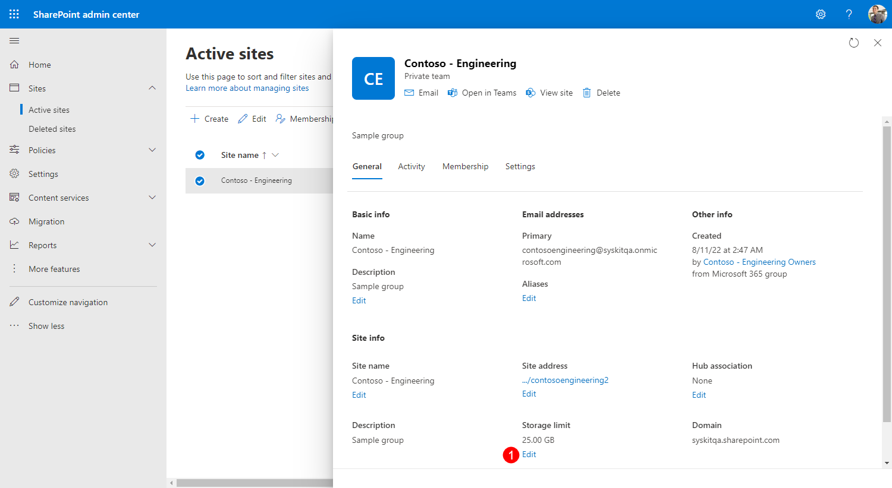
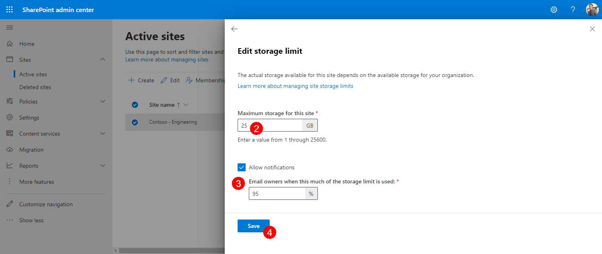

# Optimize Storage

## Storage Management in Microsoft 365

**Storage management in Microsoft 365 is an important task, as it directly impacts your monthly expenses**. 
When talking about storage in Microsoft 365, we usually refer to the SharePoint space an organization has at its disposal, which depends on the number of purchased licenses.
[Read this article provided by Microsoft to learn more about SharePoint storage limits](https://learn.microsoft.com/en-us/office365/servicedescriptions/sharepoint-online-service-description/sharepoint-online-limits).

After you run out of storage for your SharePoint sites, depending on your plan, you can use the Office 365 Extra File Storage add-on to buy more storage in 1GB increments.
The best thing you can do to avoid additional costs is to proactively clean up your storage and use tools that are available to manage your storage.
In the sections below, you can find ways to utilize Microsoft 365 built-in options, as well as Syskit Point, to stay on top of your storage management tasks.

[To find more information and see if your plan is eligible to buy extra storage, explore the following Microsoft article](https://learn.microsoft.com/en-us/microsoft-365/commerce/add-storage-space?view=o365-worldwide).

## Site Storage Limits in Microsoft 365


Steps described in this section can be performed with SharePoint Admin or Global Admin permissions only.


By default, all SharePoint sites use a pool of SharePoint storage without any limits until the pool runs out of all available storage. 
To fine-tune how much total storage is available for each site, you can modify the default behavior by changing the settings in the SharePoint admin center.
To do so, follow these steps: 
* **Navigate to [SharePoint settings](https://go.microsoft.com/fwlink/?linkid=2185220)**
* **Select the Manual option (1)**
* **Click Save (2)**

Afterward, you can define the storage limit for each site:
* **Open SharePoint admin center > [Active Sites](https://go.microsoft.com/fwlink/?linkid=2185220)**
* **Select a site** - settings open on the right side
* **On the General tab**, **find the Storage limit option**, and **click Edit (1)** - Edit storage limit dialog opens
* **On the Edit storage limit dialog**, you can:
    * **Define maximum storage for the site (2)** - by default, it is set to 25TB, even though your available storage could be less than that
    * **Enable email notifications (3)** for site owners that are sent when a defined percentage of storage limit is used
    * **Save (4)** your changes


Defined site storage limit and percentage of used storage defined for email notifications are synced and visible in Syskit Point.


[Read this article to find all details on storage settings available in the SharePoint admin center](https://learn.microsoft.com/en-us/sharepoint/manage-site-collection-storage-limits). 

## Storage Metrics Report in Syskit Point


**Storage Metrics report** is available in the Governance plan and higher tiers. See the [pricing page](https://www.syskit.com/products/point/pricing/) for more details.
**The report is available to Syskit Point administrators only**.


The new Storage Metrics report is available in the latest Syskit Point version, and helps you:
* **Discover the percentage of used storage in your tenant (1)**
* **See a trend of your storage usage over time (2)**
* **Find the largest sites in your tenant (3)**

You can also find the most important storage-related information for the largest sites:
* **Size (4)** - storage used up by the SharePoint site
* **Storage Limit (5)**
    * Storage limit defined per site
    * By default, set to 25TB, which represents the entirety of available storage in your Microsoft 365 environment
    * Storage Limit for soft deleted sites is set to = KB
* **% of Limit (6)** - shows the percentage of the site's size in the defined site storage limit
* **Alert on % of Limit (7)** - shows the site's defined percentage limit when email notifications are sent to owners

Once you detect the largest sites with the help of the Storage Metrics report, use the **link in the Storage Metrics URL column (8)** to open the site-specific Storage Metrics report. From there, you can start to clean up versions and files on your site.

PLACEHOLDER IMAGE ALERT


The Storage Metrics report provides the storage trend and storage information on a tenant level, with plans to add site and file-level reports in upcoming releases.


## Free Up Storage

TODO - describe how to remove duplicates, file versions, large files that are not needed..
