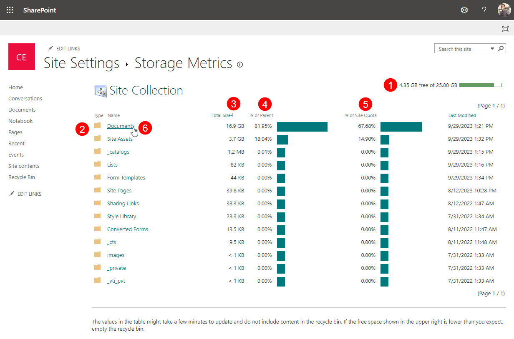
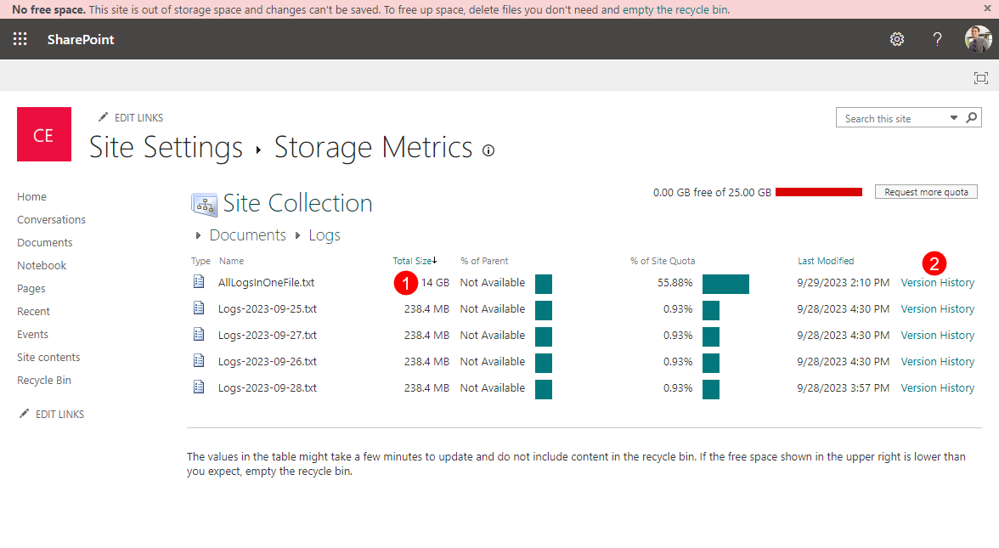
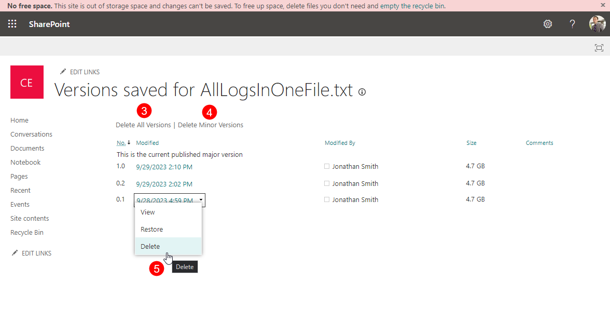

# Optimize Storage

## Storage Management in Microsoft 365

**Storage management in Microsoft 365 is an important task, as it directly impacts your monthly expenses**. 
When talking about storage in Microsoft 365, we usually refer to the SharePoint space an organization has at its disposal, which depends on the number of purchased licenses.
[Read this article provided by Microsoft to learn more about SharePoint storage limits](https://learn.microsoft.com/en-us/office365/servicedescriptions/sharepoint-online-service-description/sharepoint-online-limits).

After you run out of storage for your SharePoint sites, depending on your plan, you can use the Office 365 Extra File Storage add-on to buy more storage in 1GB increments.
The best thing you can do to avoid additional costs is to proactively clean up your storage and use tools that are available to manage your storage.
In the sections below, you can find ways to utilize Microsoft 365 built-in options, as well as Syskit Point, to stay on top of your storage management tasks.

[To find more information and see if your plan is eligible to buy extra storage, explore the following Microsoft article](https://learn.microsoft.com/en-us/microsoft-365/commerce/add-storage-space?view=o365-worldwide).

## Site Storage Limits in Microsoft 365


Steps described in this section can be performed with SharePoint Admin or Global Admin permissions only.


By default, all SharePoint sites use a pool of SharePoint storage without any limits until the pool runs out of all available storage. 
To fine-tune how much total storage is available for each site, you can modify the default behavior by changing the settings in the SharePoint admin center.
To do so, follow these steps: 
* **Navigate to [SharePoint settings](https://go.microsoft.com/fwlink/?linkid=2185220)**
* **Select the Manual option (1)**
* **Click Save (2)**

Afterward, you can define the storage limit for each site:
* **Open SharePoint admin center > [Active Sites](https://go.microsoft.com/fwlink/?linkid=2185220)**
* **Select a site** - settings open on the right side
* **On the General tab**, **find the Storage limit option**, and **click Edit (1)** - Edit storage limit dialog opens
* **On the Edit storage limit dialog**, you can:
    * **Define maximum storage for the site (2)** - by default, it is set to 25TB, even though your available storage could be less than that
    * **Enable email notifications (3)** for site owners that are sent when a defined percentage of storage limit is used
    * **Save (4)** your changes


Defined site storage limit and percentage of used storage defined for email notifications are synced and visible in Syskit Point.


[Read this article to find all details on storage settings available in the SharePoint admin center](https://learn.microsoft.com/en-us/sharepoint/manage-site-collection-storage-limits). 

## Storage Metrics Report in Syskit Point


**Storage Metrics report** is available in the Governance plan and higher tiers. See the [pricing page](https://www.syskit.com/products/point/pricing/) for more details.
**The report is available to Syskit Point administrators only**.


The new [Storage Metrics report](../reporting/cleanup-and-health-reports.md#storage-metrics) is available in the latest Syskit Point version and helps you:
* **Discover the percentage of used storage in your tenant (1)**
* **See a trend of your storage usage over time (2)**
* **Find the largest sites in your tenant (3)**

You can also find the most important storage-related information for the largest sites:
* **Size (4)** - storage used up by the SharePoint site
* **Storage Limit (5)**
    * Storage limit defined per site
    * By default, set in SharePoint to 25TB if not otherwise defined manually for the observed site; 25TB represents the pool of total available storage, although the actual size of available storage can be smaller, depending on the number of purchased licenses
    * Storage Limit for soft deleted sites is set to = KB
* **% of Limit (6)** - shows the percentage of the site's size in the defined site storage limit
* **Alert on % of Limit (7)** - shows the site's defined percentage limit when email notifications are sent to owners

Once you detect the largest sites with the help of the Storage Metrics report, use the **link in the Storage Metrics URL column (8)** to open the site-specific Storage Metrics report. From there, you can start to clean up versions and files on your site.

From the Storage Metrics Report, you can also access the [Site Storage](../../docs-point/reporting/cleanup-and-health-reports.md#site-storage-metrics) and the [File Storage](../../docs-point/reporting/cleanup-and-health-reports.md#file-storage-details) reports.

With the help of these reports you can:

 * Gain deeper **insight into how your storage is used by specific file types**, such as videos, photos, office documents, and others. 

 * See how much **storage you can save per site** if you delete file versions older than a certain number of months or every file version except for the most recent one. 

 * **Complete the Clean Up File Versions action and free up space**. 

## Free Up Storage

There are two ways you can free up storage for your tenant, by using:

  * [Syskit Point](../governance-and-automation/optimize-storage.md#syskit-point) 
  * [SharePoint](../governance-and-automation/optimize-storage.md#sharepoint) 

Below, you can find instructions on both options. 

### Syskit Point

To **free up storage directly in Syskit Point**, generate the tenant-wide **Storage Metrics Report** in the following way:
 
 * **Click the View All** button on the Storage tile located on the dashboard.
   * Alternatively, **click the Reports button** located on the left side of the screen, **select Cleanup & Health Check** in the filter, and **click the Storage Metrics report**.

Once the Storage Metrics Report is generated, under the Largest Sites section, **click the name of the site** you want to remove storage from. This opens the **Site Storage Metrics report (1)**. 

  * **Selecting the site (2)**, or the files included in the site, provides the **action to Clean Up File Versions (3)**, located on the right side of the screen under the **Manage section**. 

You can complete this action on the File Storage details screen as well. To navigate there, repeat the above steps until you reach the Site Storage Metrics report. 

From there:

 * Under the Largest Files & Folders section, **click the arrow next to the folders** to expand them until you reach the list of files within the folder.
 * **Click the name of the file** you want to generate the report for.
 * Once the report is generated, **select one or more of the file versions (1)**, and the **action to Delete Version (2)** is then available on the right side of the screen under the **Manage section**. 

### SharePoint

To remove storage directly from the SharePoint site, return back to the Storage Metrics report and click the **link in the Storage Metrics URL column**. 
  * The SharePoint site-specific Storage Metrics report opens in your browser.

Here, you can find a detailed view of the content size of your SharePoint site and the percentage of storage it uses.
The following information is available:
* **Available storage out of defined storage limit for the site collection (1)**
* **List of contents in your SharePoint site (2)** ordered by size from largest descending
* **Total size (3)** for each object
* **% of Parent (4)** percentage of used storage within the total used storage of the parent object
* **% of Site Quota(5)** percentage of used storage within the defined storage limit for the site collection
**To reveal more details about a specific object - list, document library, folder, or file - click the Name (6)**. 

By observing the Total Size column, you can easily **find large files (1)**.
**Click the Version History link (2)** to see if several versions of the same file take up the site's storage.
On the next screen, you can:
* **Delete All Versions (3)**; deletes all versions, except the latest one
* **Delete Minor Versions (4)**
* **Delete a specific version (5)** in the version drop-down menu


**Please note!** After you delete unwanted files, empty the site's recycle bin to free up storage.


## Related Articles

* [Configure Storage Management](../configuration/configure-storage-management.md)
* [Configure Tenant Storage Limit Policy](../governance-and-automation/automated-workflows/tenant-storage-admin.md)
* [Tenant Storage Security & Compliance Check](../../governance-and-automation/security-compliance-checks/tenant-storage.md)
* [Resolve Tenant Storage Limit Task](../../point-collaborators/resolve-governance-tasks/tenant-storage-limit.md)
* [Storage Metrics Report](../reporting/cleanup-and-health-reports.md#storage-metrics)
* [Site Storage Metrics Report](../reporting/cleanup-and-health-reports.md#site-storage-metrics)
* [File Storage Details Report](../reporting/cleanup-and-health-reports.md#file-storage-details)