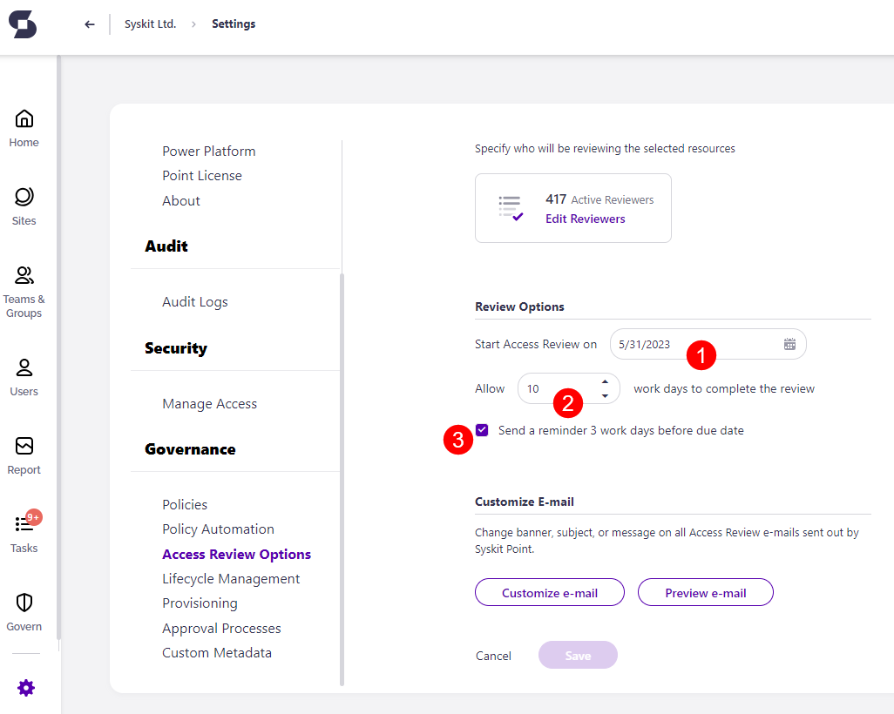

# Modify Access Review Options


 
With the introduction of the [Workspace Review](../workspace-review/setup-workspace-review.md) **we will slowly begin fading out our Access Review**. The Syskit Point Workspace Review **lets workspace owners complete more than just an access review** on their workspace; depending on the configuration, you can **have owners check over the ownership, privacy, sensitivity and overall security of their workspaces as part of a Workspace Review**.
 
**Access Review will be fully removed from Syskit Point by January 2027.** Make sure you've finished all your Access Reviews by that point and created at least one Workspace Review policy. 
 



**Access Review options** are available in the Governance plan and higher tiers. See the [pricing page](https://www.syskit.com/products/point/pricing/) for more details.


To start with the configuration, navigate to **Settings** > **Governance** > **Access Review Options**
Here, you can find 3 sections:
* **Manage Reviewers**
* **Review Options**
* **Customize E-mail**

Access Review e-mail customization is described in the [following article](../../configuration/customize-emails.md#access-review-settings).

## Manage Reviewers

The **Manage Reviewers report** enables you to define users responsible for the Access Review of a **Microsoft Team**, **Microsoft 365 Group**, **OneDrive**, or a **site**. To open the report, click the **Edit Reviewers (1)** tile.

The **Manage Reviewers report** opens, where you can:

* **Select one or multiple users \(1\)**
* **Remove one or multiple users from reviewers \(2\)**
* **Manage Admins or Owners \(3\)**
* **Filter out workspaces without reviewers \(4\)** or otherwise filter the grid with the help of top tiles
* **Switch the view \(5\)** - Choose between two options:
  * **Show by Content** - The root node is a workspace with all reviewers shown as child nodes
  * **Show by Users** - The root node is a user, with all workspaces where he is a reviewer shown as child nodes
* **Find the number of active reviewers \(6\)** on all **Microsoft Teams**, **Microsoft 365 Groups**, **OneDrive**, and **sites**
* **See the Review Status of users \(7\)** - Users removed from reviewers are shown as **Not Reviewing** status

## Review Options


**Please note!** Review options will apply to all workspaces included in the Automated Access Review process, regardless of the applied policy.


Here you can:

* **Define the starting date for the Automated Access Review process\(1\)**
* **Set the number of workdays \(2\)** a reviewer has to complete the Access Review task
* **Enable or disable \(3\)** sending of e-mail reminders to reviewers three workdays before the Access Review task's due date

## Next Steps

Now that everything is defined, the **Access Review will start automatically**. 
To learn how to perform an Access Review in Syskit Point, visit the [following article](../../point-collaborators/resolve-governance-tasks/access-review.md).

