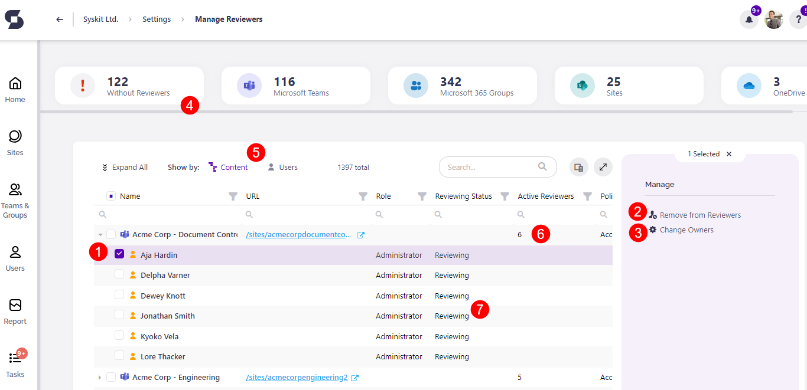

# Access Review Options

To start with the configuration, navigate to **Settings** > **Governance** > **Access Review Options**
Here, you can find 3 sections:
* **Manage Reviewers**
* **Review Options**
* **Customize E-mail**

Access Review e-mail customization is described in the [following article](../../configuration/customize-emails.md#access-review-settings).

## Manage Reviewers

The **Manage Reviewers report** enables you to define users responsible for the Access Review of a **Microsoft Team**, **Microsoft 365 Group**, **OneDrive**, or a **site**. To open the report, click the **Edit Reviewers (1)** tile.

The **Manage Reviewers report** opens, where you can:

* **Select one or multiple users \(1\)**
* **Remove one or multiple users from reviewers \(2\)**
* **Manage Admins or Owners \(3\)**
* **Filter out resources without reviewers \(4\)** or otherwise filter the grid with the help of top tiles
* **Switch the view \(5\)** - choose between two options:
  * **Show by Content** - root node is a resource with all reviewers shown as child nodes
  * **Show by Users** - root node is a user, with all resources where he is a reviewer shown as child nodes
* **Find the number of active reviewers \(6\)** on all **Microsoft Teams**, **Microsoft 365 Groups**, **OneDrive**, and **sites**
* **View users removed from reviewers \(7\)** - you can recognize them by the **Not Reviewing** status

## Review Options


**Please note!** Review options will apply to all resources included in the Automated Access Review process, regardless of the applied policy.


Here you can:

* **Define the starting date for the Automated Access Review process\(1\)**
* **Set the number of workdays \(2\)** a reviewer has to complete the Access Review task
* **Enable or disable \(3\)** sending of e-mail reminders to reviewers three workdays before the Access Review task's due date

## Next Steps

Now that everything is defined, the **Access Review will start automatically**. 
To learn how to perform an Access Review in SysKit Point, visit the [following article](../../point-collaborators/access-review.md).

