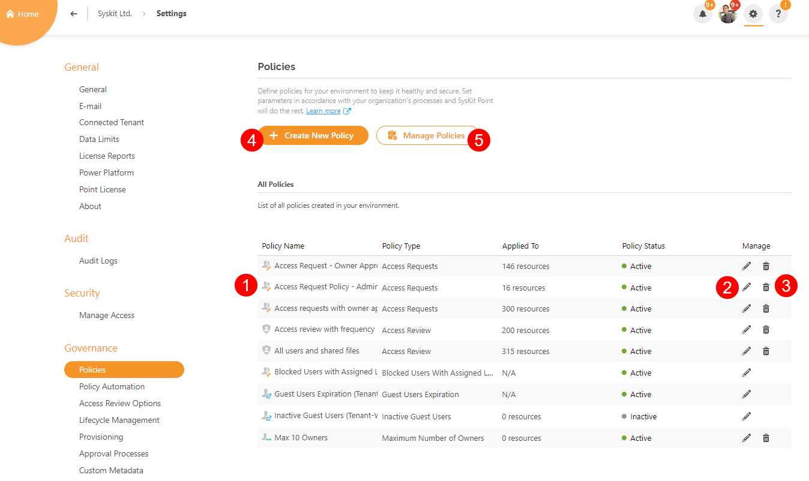
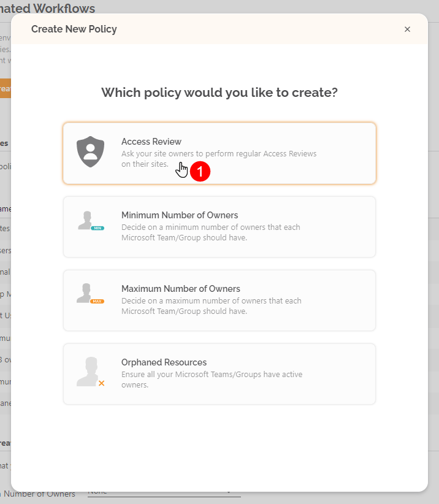
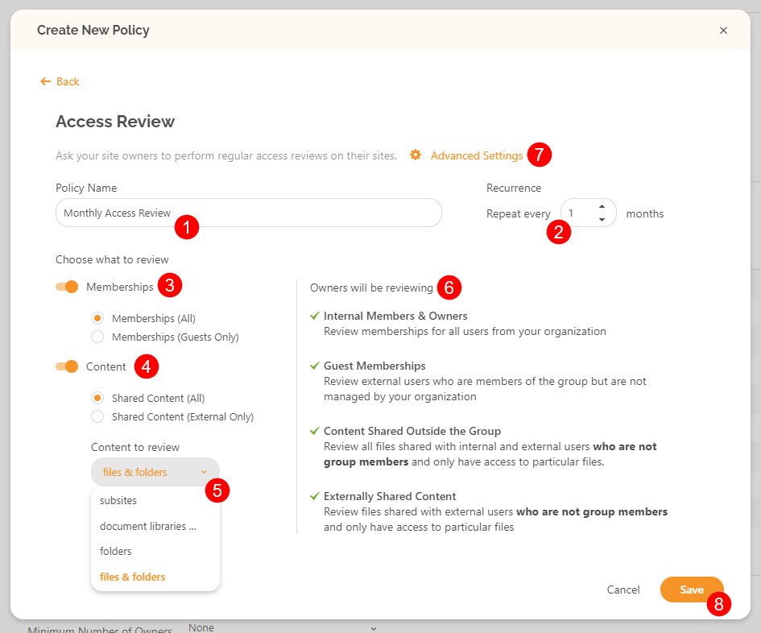
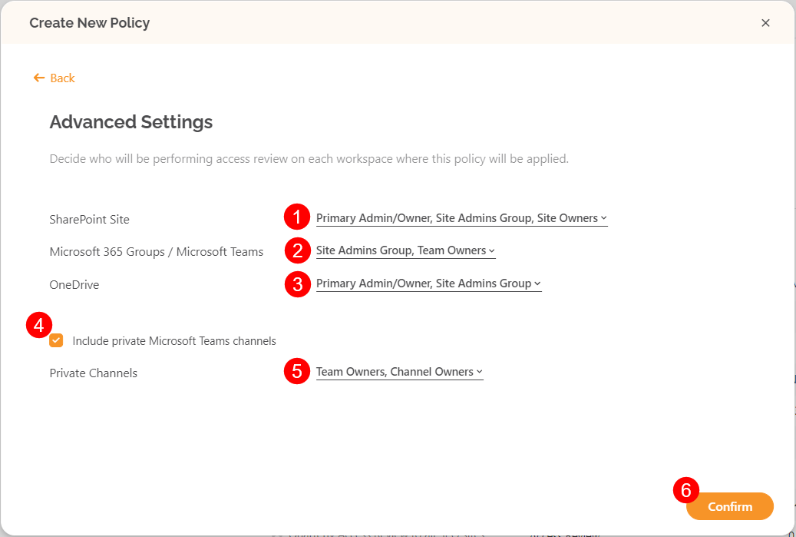
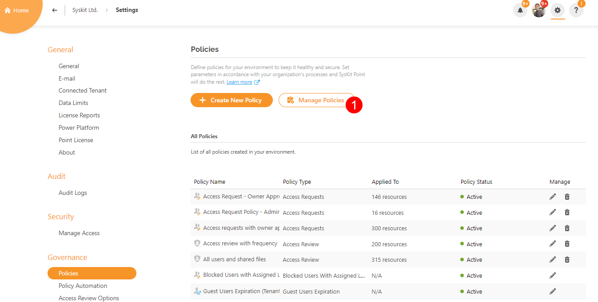
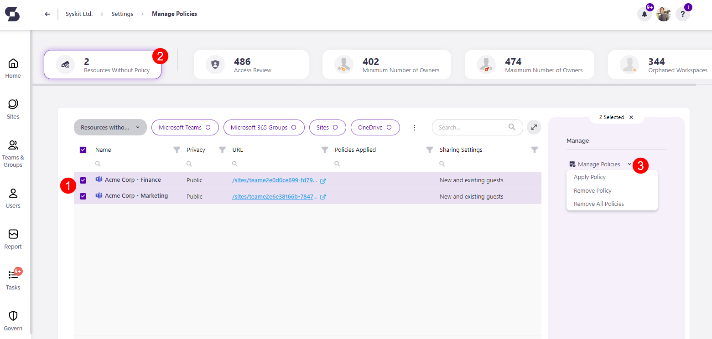
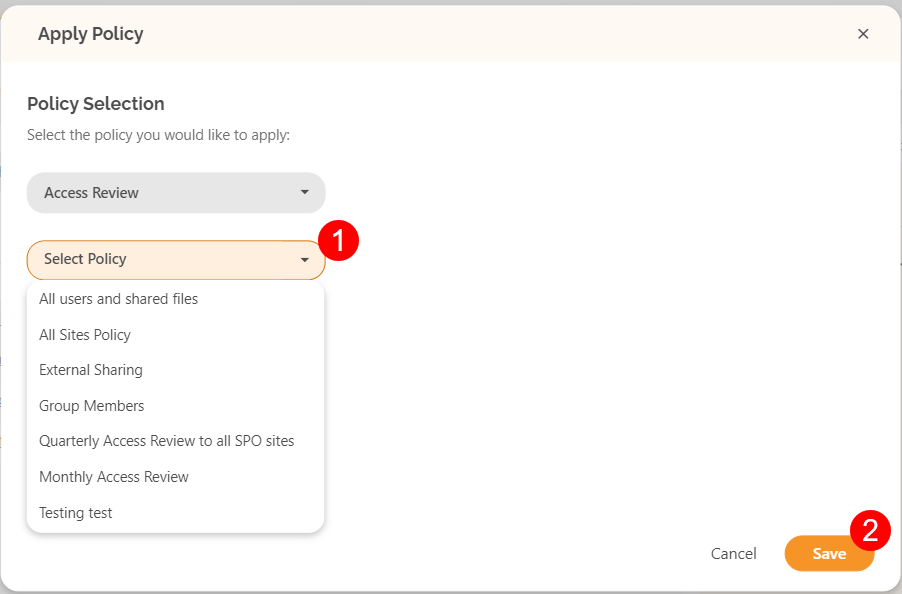

# Create and Apply Access Review Policies

Access Review in Syskit Point is enabled through Access Review policies applied to Microsoft Teams, Microsoft 365 Groups, sites, and OneDrive in Syskit Point.

Access Review policies in Syskit Point enable you to define the following settings of an Access Review:
* **The scope of the Access Review** - you can choose to review content or membership, or both, decide if you're only interested in shared content and guest users, or maybe want only to see the content down to the folder level
* **Who should perform the review** - depending on the workspace type, you can select between various groups of users with privileged access, such as team owners, site admins, primary administrators, etc.
* **The Access Review recurrence frequency** - not all workspaces in a Microsoft 365 environment are equally important; therefore, you can choose to repeat the Access Review process once for the most important workspaces, or up to once in a year for the workspaces that are not frequently changed or used or don't contain sensitive data

Once created, **policies need to be applied to Microsoft Teams**, **Microsoft 365 Groups**, **sites**, and **OneDrive** in order **to start the automated Access Review process in Syskit Point**.

In the sections below, you can find detailed instructions on creating and applying the Access Review policies in Syskit Point.

## Create Access Review Policy

**To start creating Access Review policies**, navigate to **Settings** > **Governance** > **Policies**.

By default, Syskit Point offers a predefined Access Review policy - **All users and shared files (1)**. 

Here you can choose to:
* **Edit an existing policy \(2\)** or
* **Delete an existing policy \(3\)** 
* **Create a new policy \(4\)**
 **Manage existing policies (5)**


**Please note!** The predefined Access Review policy is not applied to any resources and will not trigger an automated Access Review.


Create a new Access Review policy by clicking the **Create New Policy button (4)**. 

The following dialog opens, providing the ability to **choose the policy type**. 

**Click Access Review \(1\)** to continue. 

The **Create New Policy** dialog opens where the following Access Review options can be defined: 
* **Policy Name (1)**
* **Access Review Recurrence Frequency (2)** - increments of 1 month are available, up to 12 months
* **Memberships (3)** - when enabled, you can choose to review:
  * **All Memberships** - Access Review shows all users from your organization as well as guest users
  * **Guest User Membership** - Access Review shows Guest users only
* **Content (4)** - when enabled, you can choose to review:
  * **All Content** - Access Review shows all content shared with internal and external users
  * **Externally Shared Content** - Access Review shows only the content shared with external users
  * **Content Level (5)** - choose content level to review:
    * **Subsites**
    * **Document libraries**
    * **Folders**
    * **Files & folders**
* **Description (6)** - shows summary info depending on selected options regarding memeberships (3) and content (4)
* **Advanced Settings (7)** - define who will perform the access review 
* **Save (8)** - click to Save the Access Review Policy when finished with the configuration

**Advanced Settings option (7)** enables you to define which groups of users are responsible for the Access Review. 

Here, the following groups can be defined and set up based on the workspace type:
* **SharePoint Site (1)**
  * **Primary Admin/Owner**
  * **Site Admins Group**
  * **Site Owners** SharePoint Group
* **Microsoft 365 Groups/Microsoft Teams (2)**
  * **Team/Group Owners**
  * **Site Admins Group**
* **OneDrive (3)**
  * **Primary Admin/Owner**
  * **Site Admins Group**
  
Select the checkbox to **Include private Microsoft Teams channels(4)**; the following can then be defined:
* **Microsoft Teams Private Channels (5)** 
  * **Team/Group Owners**
  * **Channel Owners**

Clicking the groups of users for each workspace shows **a checkbox next to each group**. 
  * The groups of users can be **selected or deselected** depending on what the Access Report policy being set up should include.

When finished, **click Confirm (6)** to store the preferences. 

## Apply Policies

To apply created Access Review Policies, navigate to **Settings** > **Governance** > **Policies** and click the **Manage Policies button (1)**.

The **Apply Policy report opens**, enabling you to apply created policies to your **Microsoft Teams**, **Microsoft 365 Groups**, **OneDrive**, and **sites**. 

To do so:
* **Select \(1\)** one or multiple resources; you can easily filter them by applied policies with the help of **top tiles \(2\)**
* **Click the Manage Policies action \(3\)**
  * When multiple resources are selected, clicking the **arrowhead next to Manage Policies** provides a selection of the following actions to choose from: 
    * **Apply Policy**
    * **Remove Policy**
    * **Remove All Policies**

The **Apply Access Review Policy** dialog opens where you can:

* **Choose one of your review policies \(1\)**
* **Confirm your selection by clicking the Save button (2)**

## Next Steps

Once you're done assigning policies to **Microsoft Teams**, **Microsoft 365 Groups**, **OneDrive**, and **sites,** you can:
* [Define who will perform the Access Review in greater detail](access-review-options.md#manage-reviewers) by removing specific users from reviewers
* [Configure general Access Review options](access-review-options.md#review-options) applied to all Access Review Policies
* [Customize Access Review e-mail](../../configuration/customize-emails.md#access-review-settings)