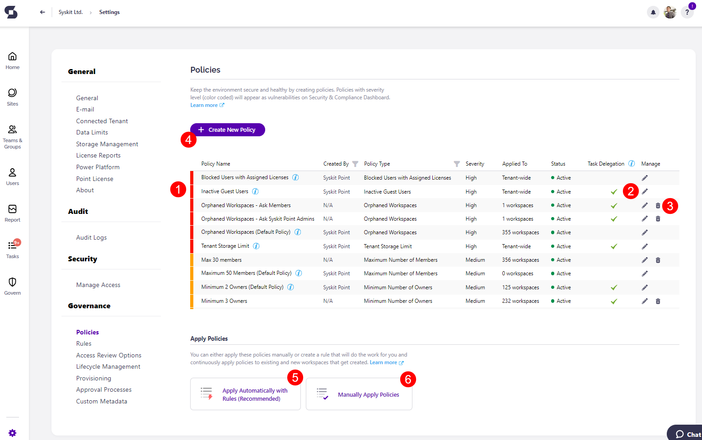
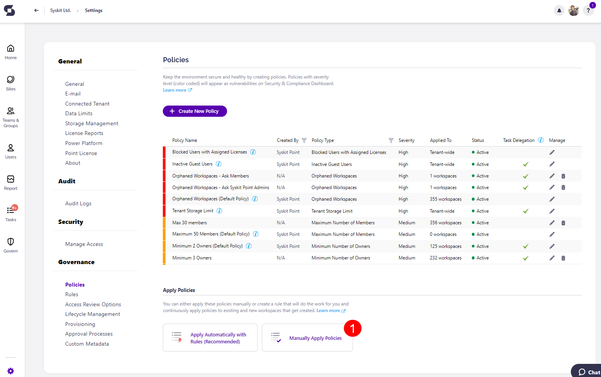
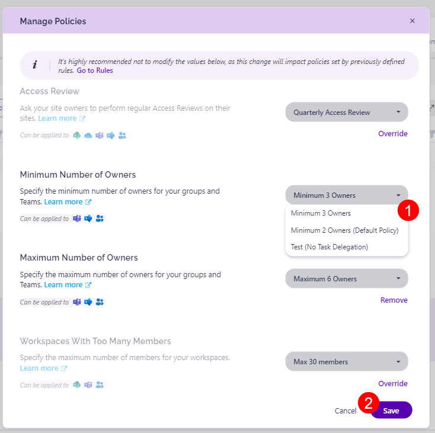

# Create and Apply Access Review Policies

Access Review in Syskit Point is enabled through Access Review policies applied to Microsoft Teams, Microsoft 365 Groups, sites, and OneDrive in Syskit Point.

Access Review policies in Syskit Point enable you to define the following settings of an Access Review:
* **The scope of the Access Review** - you can choose to review content or membership, or both, decide if you're only interested in shared content and guest users, or maybe want only to see the content down to the folder level
* **Who should perform the review** - depending on the workspace type, you can select between various groups of users with privileged access, such as team owners, site admins, primary administrators, etc.
* **The Access Review recurrence frequency** - not all workspaces in a Microsoft 365 environment are equally important; therefore, you can choose to repeat the Access Review process once for the most important workspaces or up to once a year for the workspaces that are not frequently changed or used or don't contain sensitive data

Once created, **policies need to be applied to Microsoft Teams**, **Microsoft 365 Groups**, **sites**, and **OneDrive** in order **to start the automated Access Review process in Syskit Point**.

In the sections below, you can find detailed instructions on creating and applying the Access Review policies in Syskit Point.

## Create Access Review Policy

**To start creating Access Review policies**, navigate to **Settings** > **Governance** > **Policies**.

By default, Syskit Point offers a predefined Access Review policy - **All users and shared files (1)**. 

Here, you can choose to:
* **Edit an existing policy \(2\)** or
* **Delete an existing policy \(3\)** 
* **Create a new policy \(4\)**
 **Apply automatically with rules (5)**
 **Manually apply policies (5)**


**Please note!** The predefined Access Review policy is not applied to any workspaces and will not trigger an automated Access Review.


Create a new Access Review policy by clicking the **Create New Policy button (4)**. 

The following dialog opens, providing the ability to **choose the policy type**. 

**Click Access Review \(1\)** to continue. 

The **Create New Policy** dialog opens where the following Access Review options can be defined: 
* **Policy Name (1)**
* **Access Review Recurrence Frequency (2)** - increments of 1 month are available, up to 12 months
* **Memberships (3)** - when enabled, you can choose to review:
  * **All Memberships** - Access Review shows all users from your organization as well as guest users
  * **Guest User Membership** - Access Review shows Guest users only
* **Content (4)** - when enabled, you can choose to review:
  * **All Content** - Access Review shows all content shared with internal and external users
  * **Externally Shared Content** - Access Review shows only the content shared with external users
  * **Content Level (5)** - choose content level to review:
    * **Subsites**
    * **Document libraries**
    * **Folders**
    * **Files & folders**
* **Description (6)** - shows summary info depending on selected options regarding memberships (3) and content (4)
* **Advanced Settings (7)** - define who will perform the access review 
* **Save (8)** - click to Save the Access Review Policy when finished with the configuration

**Advanced Settings option (7)** enables you to define which groups of users are responsible for the Access Review. 

Here, the following groups can be defined and set up based on the workspace type:
* **SharePoint Site (1)**
  * **Primary Admin/Owner**
  * **Site Admins Group**
  * **Site Owners** SharePoint Group
* **Microsoft 365 Groups/Microsoft Teams (2)**
  * **Team/Group Owners**
  * **Site Admins Group**
* **OneDrive (3)**
  * **Primary Admin/Owner**
  * **Site Admins Group**
  
Select the checkbox to **Include private Microsoft Teams channels(4)**; the following can then be defined:
* **Microsoft Teams Private Channels (5)** 
  * **Team/Group Owners**
  * **Channel Owners**

Clicking the groups of users for each workspace shows **a checkbox next to each group**. 
  * The groups of users can be **selected or deselected** depending on what the Access Report policy being set up should include.

When finished, **click Confirm (6)** to store the preferences. 


**Please note!** 
If you added [users with Full Control access to the Collaborator role](../../setup/configuration/configure/enable-role-based-access.md#syskit-point-collaborators-1), depending on advanced settings, they will receive an Access Review task.
Keep the following in mind:
* Users with Full Control access given via the default Site Owners SharePoint group and the Site Admins group on a SharePoint site will get an Access Review task.
* Users who have Full Control access given in any other way - be it directly given Full Control access or via membership in any other non-default SharePoint group with Full Control access - will not get an Access Review task
* For Microsoft Teams, Microsoft 365 Groups, and OneDrive, there is no option to include the Site Owners group members; only the Site Admins group can be included in the Access Review, meaning that Site Admins group members will receive Access Review tasks.


## Apply Policies

To apply created Access Review Policies, navigate to **Settings** > **Governance** > **Policies** and click the **Manually Apply Policies button (1)**.

The **Manually Apply Policy report opens**, enabling you to apply created policies to your **Microsoft Teams**, **Microsoft 365 Groups**, **OneDrive**, and **sites**. 

To do so:
* **Select \(1\)** one or multiple workspaces; you can also easily filter through workspaces with the help of **top tiles \(2\)**
* **Click the Manage Policies action \(3\)**
  * When multiple workspaces are selected, clicking the **arrowhead next to Manage Policies** provides a selection of the following actions to choose from: 
    * **Apply Policy**
    * **Remove Policy**
    * **Remove All Policies**

The **Apply Access Review Policy** dialog opens where you can:

* **Choose which policy you want to add or change \(1\)**
* **Confirm your selection by clicking the Save button (2)**



**You will receive a warning** when trying to change or apply policies that state you will override selected policies. [Rules](../automated-workflows/policy-automation.md) automatically apply policies to your workspaces. 

The warning serves as a reminder that **if you have rules set up**, manually changing or adding policies will replace the ones applied by the rules you have set up. Manually applied policies will take precedence over those applied with rules. An example of the warning can be seen below.




**Please note!** 

Only **one Access Review policy can be active at a time** on a workspace.
When a new Access Review policy is created and applied to workspaces, **it will be triggered depending on the date set in the Settings of the Access Review Options**.
 * **If the date** in the Settings > Access Review Options **has not changed**, it will be triggered on the set date in the future and then occur depending on the period set for the individual policy.
   * Let's say your Access Review is set to occur every 2 months, and the date in the Settings was set sometime in the past; the policy will be triggered in approximately 2 months on the date stated in Settings. For this example, if the date in the Settings is the 24th of February 2024, the policy would be triggered on the 24th of April 2024.   
 * **If the date** in the Settings > Access Review Options **is set in the future**, it will be triggered on the set date in the future and then occur depending on the recurrence set for the individual policy.
   * Let's say your Access Review is set to occur every 2 months; it will be triggered on the date specified in Settings and then every 2 months on that date. For this example, if the date in the Settings is the 24th of August 2024, the policy would be triggered on the 24th of August 2024, and then again on the 24th of October, and so on.   
 * **If the date** in the Settings > Access Review Options **is set in the past**, the policy will be triggered based on the recurrence set for the policy.
   * Let's say your Access Review is set to occur every 2 months; it will be triggered approximately 2 months after the policy was created and applied to the workspace(s). For this example, if the date in the Settings is the 24th of February 2024, the policy would be triggered on the 24th of April 2024.   



## Next Steps

Once you're done assigning policies to **Microsoft Teams**, **Microsoft 365 Groups**, **OneDrive**, and **sites,** you can:
* [Define who will perform the Access Review in greater detail](access-review-options.md#manage-reviewers) by removing specific users from reviewers
* [Configure general Access Review options](access-review-options.md#review-options) applied to all Access Review Policies
* [Customize Access Review e-mail](../../setup/configuration/customize/customize-emails.md#access-review-settings)