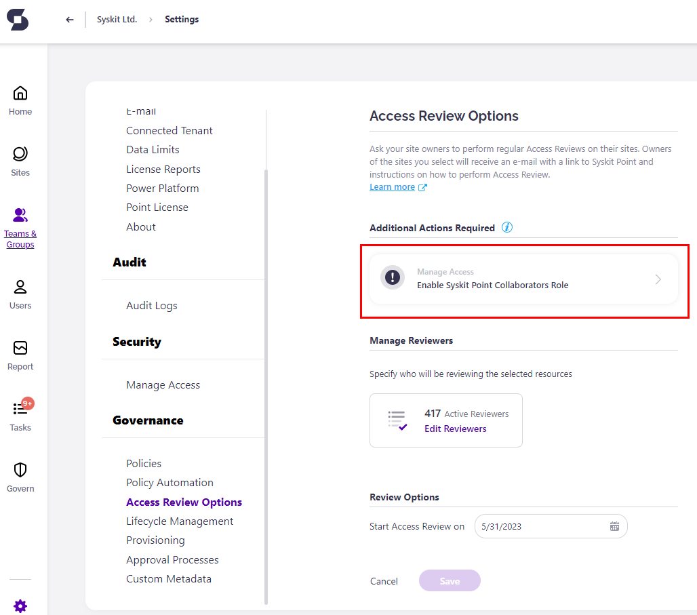
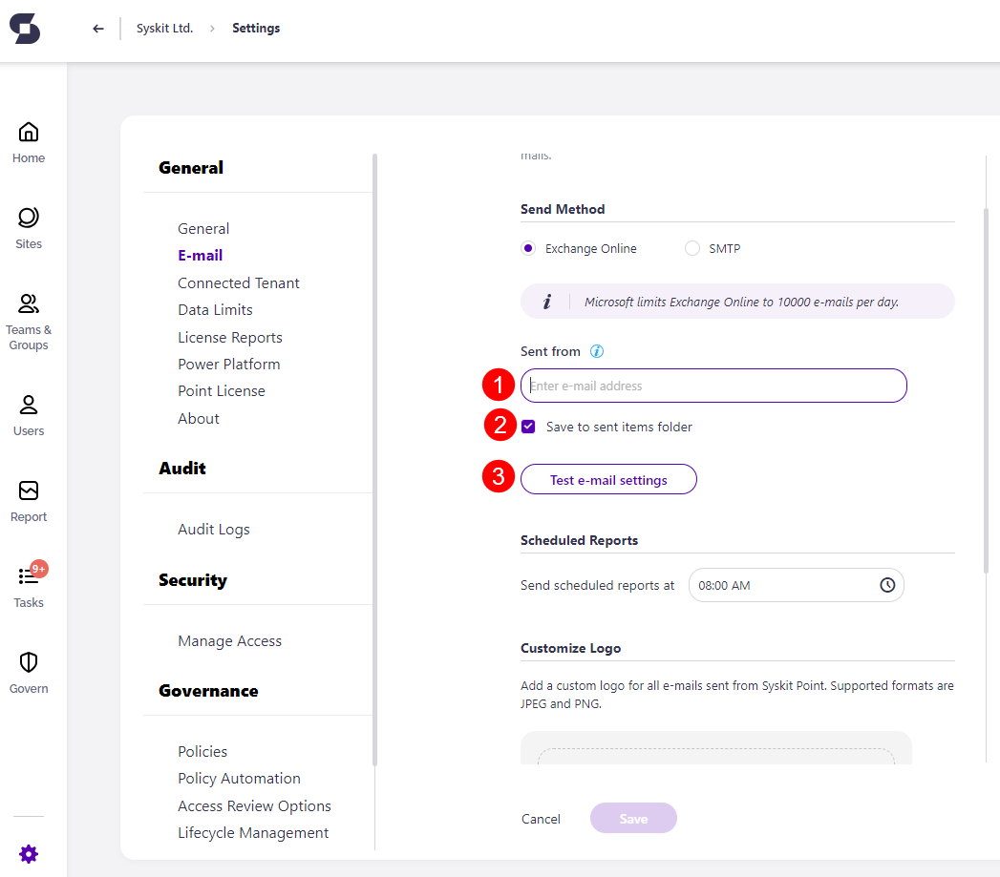
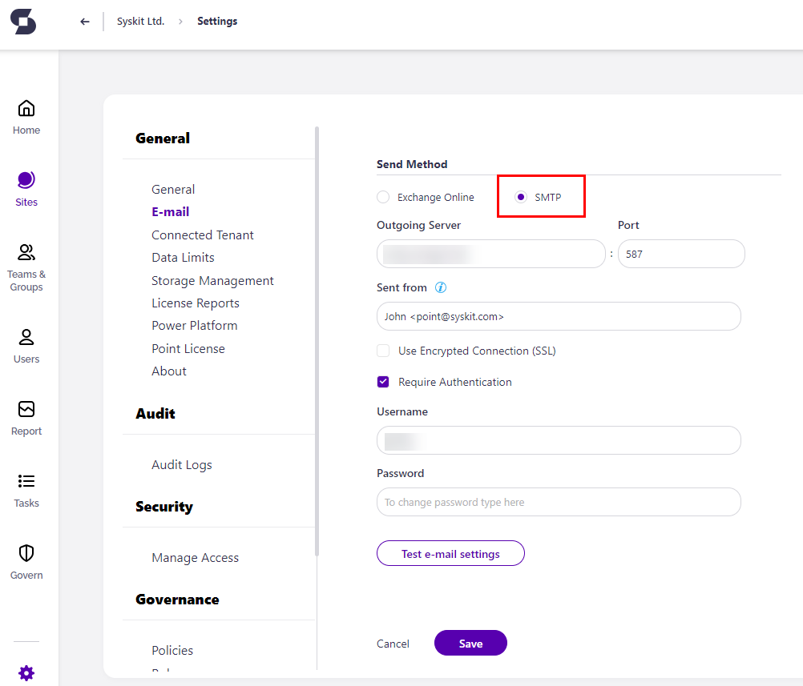
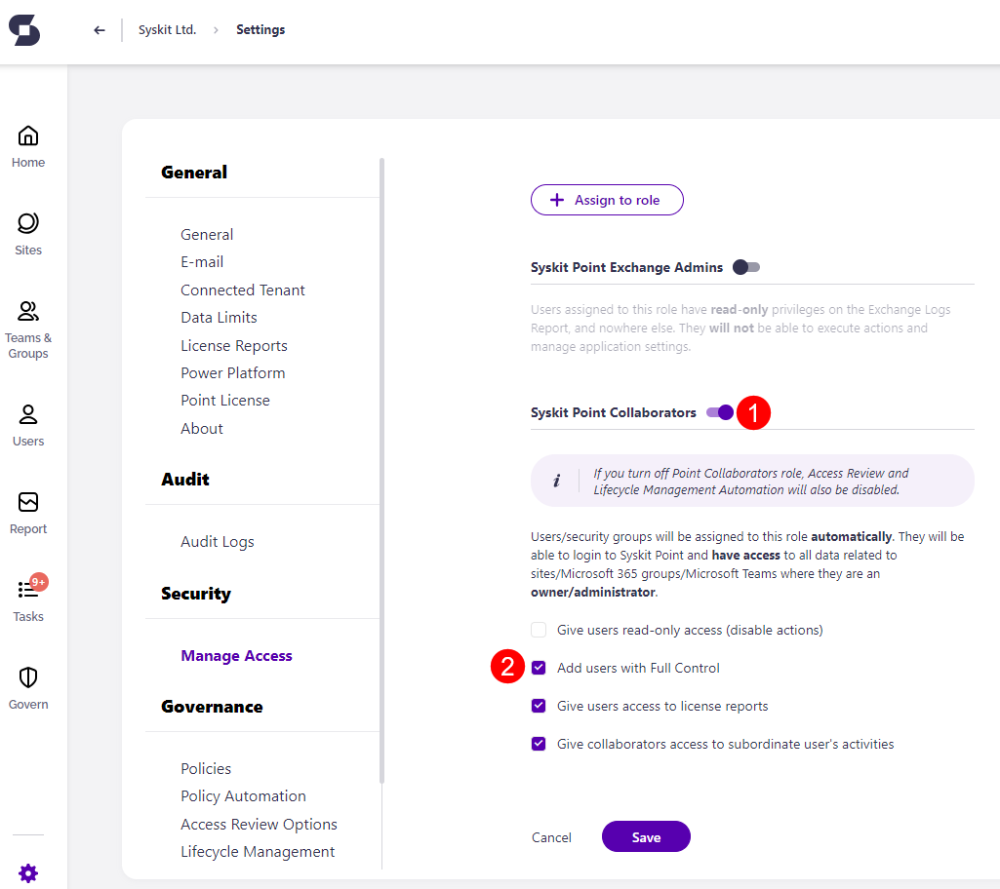

# Enable Automated Access Review


 
With the introduction of the [Workspace Review](../workspace-review/setup-workspace-review.md) **we slowly begin fading out our Access Review**. The Syskit Point Workspace Review **lets workspace owners complete more than just an access review** on their workspace; depending on the configuration, you can **have owners check over the ownership, privacy, sensitivity and overall security of their workspaces as part of a Workspace Review**.
 
**Access Review will be fully removed from Syskit Point by January 2027.** Make sure you've finished all your Access Reviews by that point and created at least one Workspace Review policy. 
 


To use the advantages of Automated Access Review in Syskit Point, first, you need to:

* **Set up e-mail settings**
* **Enable Syskit Point Collaborators role**


**Please note!**\
Only users assigned to the **Syskit Point Admin** role can access and configure Settings in Syskit Point.


To start with the configuration, open the **Settings** > **Governance** > **Access Review** screen. Initially, you may find the Access Review settings screen displaying the following warnings:

Clicking the tiles in the **Additional Actions Required** section redirects to the appropriate settings screen.

## Set Up E-Mail

As a part of the Automated Access Review process, e-mails are sent to Syskit Point Admin and Syskit Point Collaborator users. For Syskit Point to be able to send e-mails, you need to configure the sending method. Two options are available:

* **Exchange Online**
* **SMTP** - Simple Mail Transfer Protocol


**Please Note!**\
The e-mail address set up in this section will appear in the **Sent from** field in all e-mails sent from Syskit Point.


### Exchange Online Settings


**Please Note!**\
Exchange Online has a sending limit of 10000 e-mails per day.


The Exchange Online method enables you to use an existing Exchange account in your Microsoft 365 tenant to send e-mails from Syskit Point. Here, you can:

* **Enter a valid e-mail address in the Sent from field (1)**
* **Choose whether to save e-mails sent by Syskit Point to the Sent Items folder (2)**; by default, this option is turned on, meaning that all e-mails sent from Syskit Point will be stored in the **Sent** mailbox folder of the entered Exchange account
* **Send a test e-mail (3)** to check if the entered e-mail address is working properly

After clicking the **Send test e-mail** button, the **Sent test e-mail** dialog opens. Here, **enter the e-mail address to which you want to send** the test e-mail. 

Click the **Save** button to store your e-mail settings.

### SMTP Settings

Select the **SMTP method** if you are using an **SMTP** server in your environment. Here, you can enter the SMTP properties:

* **Outgoing Server**
* **Port**
* **Sent from** e-mail
*   **Username** and **Password**; in case the **Require Authentication** option is enabled

    You can also choose whether to **Use Encrypted Connection (SSL)**.

You can check if the entered data is correct by **sending a test e-mail**.

Click the **Save** button once you confirm you received the test e-mail.

## Enable Syskit Point Collaborators


**Managing Access for Collaborators** is available in the Governance plan and higher tiers. See the [pricing page](https://www.syskit.com/products/point/pricing/) for more details.


To enable Teams and Groups owners and site administrators to perform the Access Review on their sites, you need to enable them to access Syskit Point. To do so, navigate to the **Settings** > **Security** > **Manage Access** screen. Here you should:

* **Click the toggle to enable the Syskit Point Collaborators role (1)** - this will allow Teams owners, Group owners, and site administrators to access Syskit Point and manage their workspaces
* **Check the Add users with Full Control option (2)** if you want to enable users with full control privileges to access Syskit Point; **this is needed in case you want to enable users in the Site Owners SharePoint group to perform access reviews**

For more information about role-based access in Syskit Point, go to the [following article](../../configuration/enable-role-based-access.md).


**Please note!** If a user, security group, or mail-enabled security group is added to the Governance-Excluded Users list, they do not receive any Access Review related tasks or task-related emails. [For more details on setting up Governance-Excluded Users, take a look at this article.](../../configuration/exclude-users-tasks.md)


## Next Steps

Once you are finished with the e-mail and Collaborators role configuration, continue to the [Create and Apply Access Review Policies](create-apply-access-review-policies.md) article.

For information on Syskit Point Collaborators completing Access Review tasks, take a look at the [Perform Access Review Tasks article](../../point-collaborators/resolve-governance-tasks/access-review.md).
