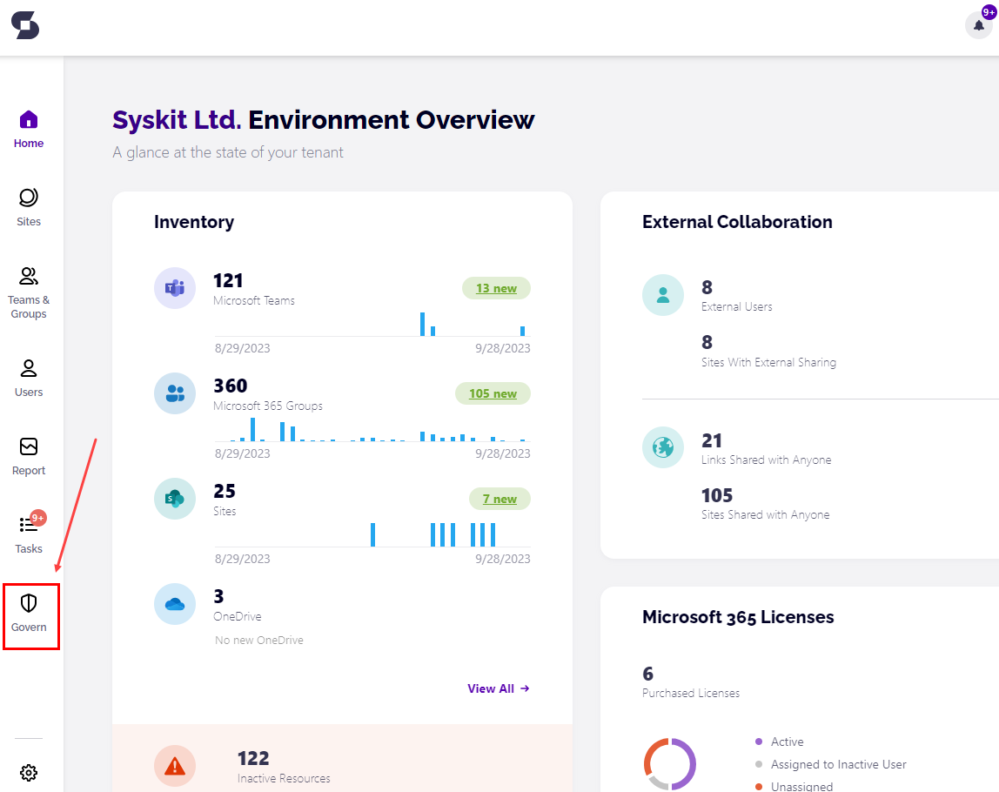

# Monitor Access Review in SysKit Point


**Please note!**  
First, make sure to check how to [enable and configure the Automated Access Review in SysKit Point](enable-permissions-review.md).


**Access review**, in the context of the Microsoft 365 environment, is an activity where a person responsible for an Microsoft 365 workspace - be it Communication site, Microsoft Team, Microsoft 365 Group, or OneDrive - checks whether permissions, given to users inside \(internal\) and outside \(external\) of company, comply with the organizational rules and guidelines. The **Access Review task is usually performed by a site owner** and includes:

* **checking if all users - internal and external - have access to the right workspaces, be it through directly given permissions, or group memberships**
* **identify unwanted permissions changes** by checking the audit logs 
* **checking if only necessary content is externally shared**
* **performing correcting actions** to mitigate errors discovered in previous steps

**SysKit Point** provides the tools the site owners need to perform these tasks.

The Access Review in SysKit Point can be viewed from two different roles:

* **SysKit Point Admin user**, as described in this article
* [SysKit Point Collaborator user](../../point-collaborators/access-review.md)

When working with Access Review, SysKit Point Admin users can:

* **define Access Review settings**
* **decide what workspaces are reviewed**
* **monitor Access Review progress**

On the other hand, SysKit Point Collaborators can **perform the Access Review on workspaces where they are an owner or admin**.

These two roles will have **different reports and actions available** before and during the Access Review and receive different emails.

Here, we will describe how **SysKit Point Admin** can monitor the progress of an active Access Review.

## Admin Reminder for the Upcoming Access Review

Three workdays before the start of automated Access Review, SysKit Point Admin users will receive a reminder email with the most important information about the upcoming Access Review:

* **start date** of the Access Review
* **number of site owners** that will be asked to perform an Access Review
* **the number of workspaces** - Microsoft Teams, Microsoft 365 Groups, sites, and OneDrive - included in the upcoming Access Review
* **modify \(1\)** link
* **Resolve Now \(2\)** button

Click the **Modify** link if you need to change the settings for the Access Review. When logged in to SysKit Point, this link opens the Access Review Settings screen.

If you are already signed in to SysKit Point, clicking the **Resolve Now** button opens the **Access Review – Preview** report with the preselected **Orphaned Sites view \(2\)**. Here, you can **select a site \(3\)** and add active users as site owners with the **Change Owners action \(4\)**.

!Access Review — Preview - Orphaned Sites](../../.gitbook/assets/monitor-permissions-review_preview-orphaned.png)


**Please note!**  
To ensure that all sites have an owner responsible for the upcoming Access Review, set active users as site owners for all orphaned sites.


## Governance - Access Review

On the start date of the automated Access Review, **Access Review tasks are created in SysKit Point**, and **email requests are sent to site owners**. **Each site owner gets one Access Review task**, and **that task includes all sites where the said user is the site owner**.

To **track the currently active Access Review** **progress**, SysKit Point Admins can **use the Governance screen**. To access it, **click the Governance tile** on the Home screen.

When clicked, the Governance screen opens, giving a summary for the active automated Access Review. Here, the following is displayed:

* **Review categories \(1\)**
  * **Scheduled \(automated\) Access Review** - selected by default
  * **Manually Requested Reviews**
  * **History** - overview of all completed reviews \(automated and manually requested\)
* **visual representation and the percentage of Access Review tasks completed \(2\)**
* **start and end date of the Access Review \(3\)**
* **number of completed Access Review tasks \(4\)**
* **number of completed Access Reviews by site type \(5\)**
* **See Review Details** **button \(6\)**, which opens the **Access Review** report

The Access Review report gives SysKit Point Admins the following information:

* **request date**, **due date**, **progress**, and **date when the automatic reminder will be sent to site owners \(1\)**
* **review status \(2\)** for each site included in the Access Review; can be **Pending** or **Completed**
* **comments \(3\)** provided by site owners when completing the review
* **all site owners**; blocked or deleted owners are displayed in **gray color \(4\)**
* **Remind Owners action \(5\)** to send the reminder email to site owners manually 
* **when a workspace is selected \(6\)**, two actions are available in the side panel:
  * **Review \(7\)** - only available if SysKit Point Admin is also the owner of the selected workspace
  * **View Details \(8\)** - available when one or multiple workspaces are selected; opens the [**Access Review - Summary**](monitor-permissions-review.md#permissions-review-summary) report

Use the **Remind Owners action** to send a reminder email to site owners regarding the ongoing Access Review. You can use this action **once a day**, whenever you think appropriate, **as long as the Access Review is active**. **Only site owners with pending tasks will receive an email**.


**Please note!**  
Access Review has, by default, duration of **ten days**. In this time frame, site owners should be able to complete the Access Review on their sites. By default, **three days before the Access Review end date**, SysKit Point sends an automatic **email reminder to all site owners with pending tasks**.


## Access Review Completion

Ten days after the start, the Access Review is automatically marked as completed. SysKit Point also sends summary emails regarding the completed review to all SysKit Point Admin users. The email contains the following information:

* **number of sites where the Access Review was completed \(1\)**; grouped by site type
* **total number of sites where the Access Review was not completed \(2\)**
* **View Uncompleted Tasks \(3\)** button

To view sites where the Access Review was not completed, click the **View Uncompleted Tasks** button. If already signed in to SysKit Point, you will be redirected to the **Access Review** report. Here, you can:

* **see that all tasks where the Access Review was not completed have the status set to Overdue \(1\)** 
* **select one or multiple workspaces \(2\)**
* **generate the** [**Access Review - Summary report**](monitor-permissions-review.md#permissions-review---summary) **\(3\)**

SysKit Point changes the status automatically when the Access Review ends.

If you take a step back and look at the Governance screen, you can see the following:

* **Scheduled Review \(1\)** category is displaying the **No active Access Review \(2\)** message
* **History \(3\)** category has a new entry - **the completed Access review \(4\)**
* **See Details \(5\)** button is visible on the completed Access Review tile

The **See Details** button opens the **Access Review** report, already described in this section.

For more information on the **Manually Requested Reviews category**, [read the following article](manually-request-permissions-review.md).

## Access Review - Summary

The Access Review - Summary report offers a complete overview of actions performed during an Access Review. To generate the report:

* **open the Access Review screen**; you can open this screen for an active Access Review, or a completed one
* **select one or more workspaces \(1\)** for which you want to see what was done during the Access Review
* **click the View Details link \(2\)** 

The generated **Access Review - Summary** report shows the following information:

* **Workspace Name \(1\)**
* **Action \(2\)**
* **URL - external link to the said workspace \(3\)**
* **who performed the action \(4\)** 
* **when the action was performed \(5\)**
* **action details \(6\)** that provides all information about performed actions 
* **Export button \(7\)** that generates an XLSX file with all data visible in the SysKit Point interface

With that, we finish the Access Review overview for SysKit Point Admin users.

