# Perform Access Review in SysKit Point

**Access review**, in the context of the Microsoft 365 environment, is an activity where a person responsible for an Microsoft 365 resource - be it Communication site, Microsoft Team, Microsoft 365 Group, or OneDrive - checks whether permissions, given to users inside \(internal\) and outside \(external\) of company, comply with the organizational rules and guidelines. The **Access Review task is usually performed by a site owner** and includes:

* **checking if all users - internal and external - have access to the right resources, be it through directly given permissions, or group memberships**
* **identify unwanted permissions changes** by checking the audit logs 
* **checking if only necessary content is externally shared**
* **performing correcting actions** to mitigate errors discovered in previous steps

**SysKit Point** provides the tools the site owners need to perform these tasks.

The Access Review in SysKit Point can be viewed from two different roles:

* **SysKit Point Collaborator user**, as described in this article
* [SysKit Point Admin user](monitor-permissions-review.md)

When working with Access Review, SysKit Point Collaborators can **perform the Access Review on resources where they are an owner or admin**.

For a site owner or admin assigned to the SysKit Point Collaborators role, the Access Review process begins with an email.

## Access Review Email Request

When the Automated Access Review starts, site owners receive an email request to review permissions on their site\(s\). The email contains the following important data:

* **number of sites an owner needs to review \(1\)**; grouped by site type
* **due date of the Access Review \(2\)**
* **Review Now button \(3\)**

The **Review Now** button opens the **Access Review Task** screen once clicked. On this screen, you can find:

* **sites you are the owner of and need to review**; displayed in the grid
* **information regarding the Access Review task \(1\)** 

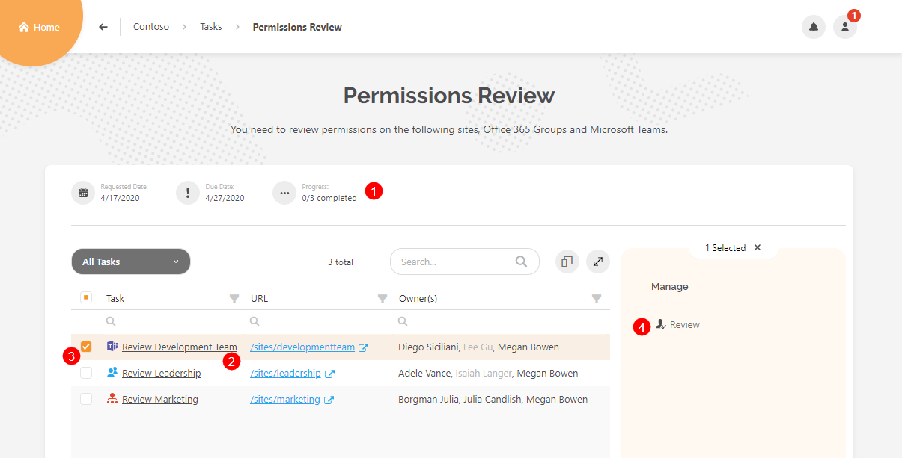

From here, you can continue and review a site by clicking the **link in the Task column \(2\)**, or **selecting a row \(3\)** and clicking the **Review action \(4\)**. You can access the same screen from within SysKit Point from the **My Tasks** screen.

## My Tasks

On the Home screen, you can notice the **My Tasks** tile and a notification bubble displaying the number of tasks you need to address. It is set to one because a single Access Review task was created by SysKit Point and assigned to you. The **user profile** button shows the same notification bubble. To view your tasks, click the **My Tasks tile** on the Home screen, or the **My Tasks section** in the user profile menu.

**My Tasks** screen displays the active Access Review task with the most important information:

* **requested date \(1\)**
* **due date \(2\)**
* **completion progress \(3\)**
* **Review button \(4\)**
* **Task categories \(5\)**
* **Completed tasks categories \(6\)**

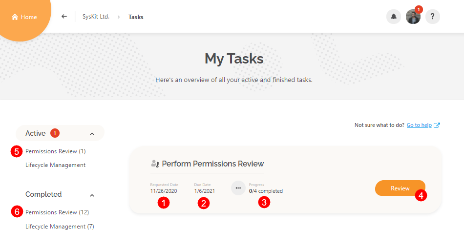

Click **Review** to continue. The **Access Review Task** screen opens - the same screen that you accessed from email in the previous section where we stopped. From here, you can continue and review a site by clicking the **link in the Task column**. The **Access Review Wizard** opens that will guide you through the Access Review process.

## Access Review Wizard

The **Access Review Wizard** has three steps when reviewing OneDrive, and four steps when reviewing Microsoft 365 Groups, Microsoft Teams, or sites. The following steps are available:

* **Overview**
* **Members** \(for Microsoft 365 Groups and Microsoft Teams\), or **Users** \(for sites\); this step is not available for OneDrive 
* **Sharing**
* **Summary**

Let's take a closer look at every step.

### Overview Step

This step provides general information about the resource that you are about to review. The following is displayed:

* **List of owners, along with the Change Owners action \(1\)**
* **General resource information \(2\)** - **Description**, **Creation date and time**, **Privacy**, **Sharing Policy**, **resource URL**, and **Last Activity**
* **when the resource was last reviewed and by whom \(3\)**
* **Who else got this task? information \(4\)** - hover over it to see the full list of users that received the Access Review task
* **Permissions Changes tile \(5\)** - in case there were no changes since the last review, the **Skip wizard and complete review \(6\)** action is available
* **Close & Continue Later action \(7\)**, which closes the wizard 
* **Start Review button \(8\)**, which takes you to the next step of the Access Review wizard

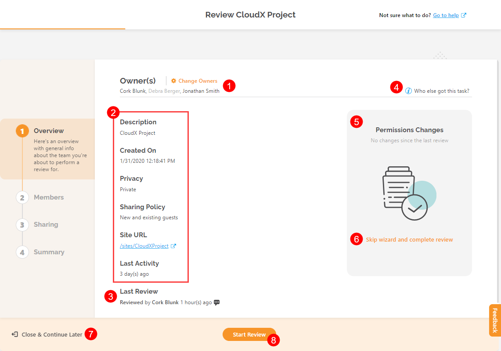

The **Close & Continue Later** option is available on all steps on the left-bottom and enables you to leave the Access Review wizard.


**Hint!**  
No need to worry when you leave the Access Review wizard - all performed actions take effect immediately, and will be visible in the Summary step at the end of the Access Review.


### Members/Users Step

The **Members step** is available **when reviewing Microsoft 365 Groups or Microsoft Teams**. The following options are available:

* **top filters \(1\)** - they help you view only a specific group of users in your resource:
  * **Added users**
  * **Removed users**
  * **Owners**
  * **Members**
  * **Guests**
* **when a user is selected \(2\)**, several options are available:
  * **actions \(3\)** - remove members or owners, promote members to owners, or change owners to members
  * **User Activity report \(4\)** - see all audit logs for the selected user
  * **Additional information \(5\)** - see user's latest activity and when it happened
* when no users are selected, the **Add Owners/Members** action is available
* **click Next \(6\)** to continue to the next step of the Access Review Wizard

The **Users step** is available **when reviewing sites**. The following options are available here:

* **top filters \(1\)** - choose to view only a certain type of users on site:
  * **Administrators**
  * **Users with permissions on the site level** 
  * **External Users**
* **when a user is selected \(2\)**, additional options are available:
  * **actions \(3\)** - based on the type of the selected user, various actions are available - Remove Access, Edit Permissions, Delete SharePoint Group, and Change Admins
  * **User Activity report \(4\)** - see all audit logs for the selected user
  * **Additional information \(5\)** - see user's latest activity and when it happened
* when no users are selected, the **Grant Access** action is available
* **click Next \(6\)** to continue to the next step of the Access Review Wizard


**Please note!**  
Members/Users step is not available when reviewing permissions for OneDrive.


### Sharing Step

The **Sharing step** gives you a simple, yet detailed overview of all shared content. Multiple filters and views enable you to find shared content that you want to review.

* **top filters \(1\)** enable you to filter content by sharing type
  * **All Shared Content** - shows content that has been shared via sharing links or through direct access; use it when you want to see everything that was shared
  * **Shared Outside the Group** - selected by default; use it to find content shared with users that are not a part of the Microsoft 365 Group or Microsoft Team you are reviewing
  * **Shared Externally** - shows content shared with specific people outside your organization
  * **Shared With Anyone** - show content shared with anyone via sharing links; this can be dangerous ground so make sure to examine such content carefully
* **views \(2\)** enable you to see sharing from two different perspectives - you can group by:
  * **Content**
  * **Users**
* **Advanced Filters \(3\)** - by default, only the content with unique permissions is visible down to the document level; with the help of the Advanced Filters, you can choose to:
  * **view content without unique permissions**
  * **view content down to a specific level**, for example, down to the document library or list level
* **when a row is selected \(4\)**, available actions are displayed in the **side panel \(5\)**
* **when no rows are selected**, the **Permissions Changes report link** is visible
* **click Next \(6\)** to continue to the final step of the Access Review Wizard

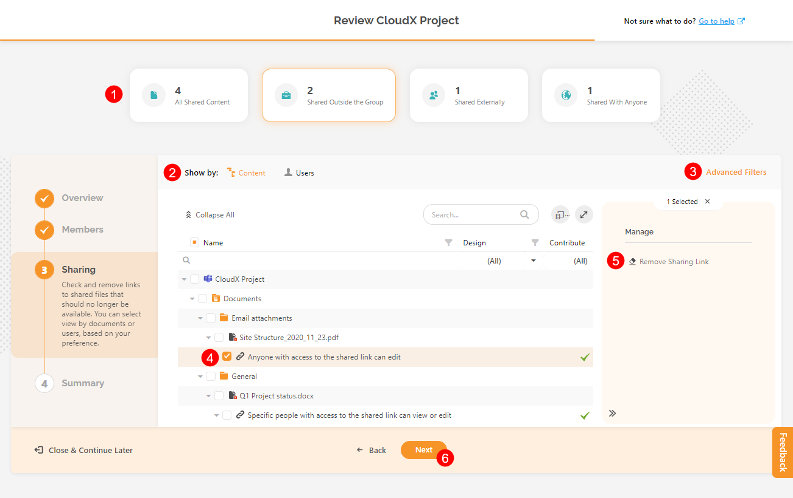

**Actions displayed in the side panel depend on the type and state of the selected object (1)**.
A file with unique permissions is selected in the image below. 
The following **actions (2) are available** in that case:
* **Grant access**
* **Delete Unique Permissions**

If an **object with permission inheritance is selected**, the **Stop Inheriting Permissions action** is available in the side panel.

The following **reports (3) can be generated** regardless of the type of the selected object:
* **File and Page Activities**; **Please note that administrators can limit the visibility of audit reports**
* **Permissions Changes**

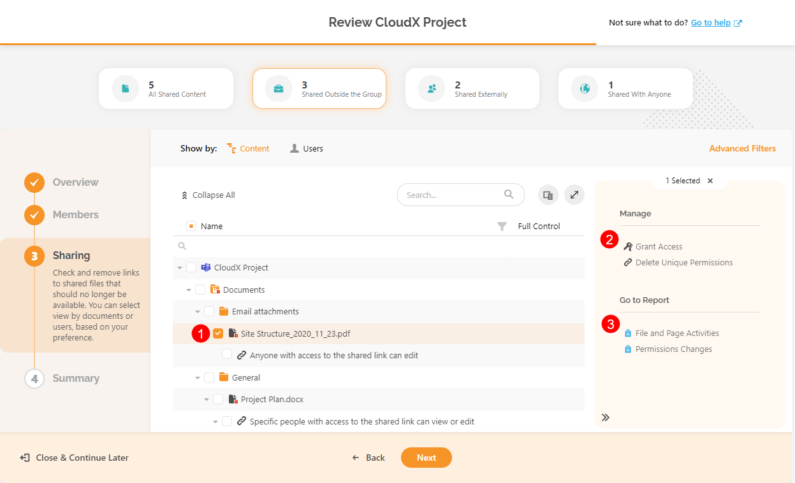

In case you switch to the **Users view**, the **top filters** are changed accordingly and enable you to filter out specific types of users. You can find descriptions for all filters by **hovering your mouse over the filter tile \(1\)**.

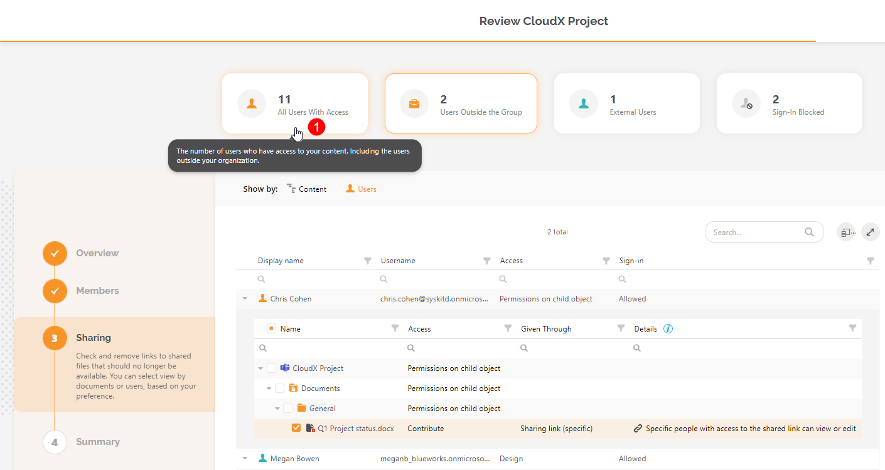

In the example above, Microsoft Team was reviewed. **Filters will differ slightly when you review sites or OneDrive** since there is no Microsoft 365 Group involved whose members would have access by default, so the Users Outside the Group filter is not applicable. Instead, the **Access on Child Objects filter is given**, showing only users that don't have access on a site level but have access to a specific file or folder.

### Summary Step

The **Summary step** gives a recap of all actions performed during the Access Review. Here, the following is displayed:

* **total number of performed actions grouped by action name \(1\)**
* **grid with all actions \(2\)** and information about who performed them, when, and other details
* **Export button \(3\)** that exports the data in the grid into an XLSX file
* **Complete Review button \(4\)** that opens the **Complete Review dialog** 

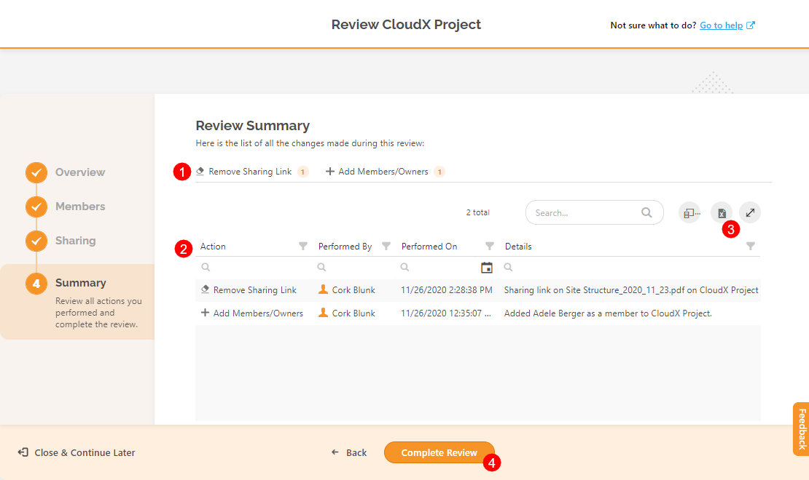

## Complete Access Review Task

When you are done with the review and have made sure that your site is secure, **Complete the Access Review**. To do so:

* **click the Complete Review button \(1\)** on the bottom of the Summary step; the **Complete Review dialog opens**
* **leave a comment**; here, you can describe what kind of changes were made to ensure that the site is secured; the comment is visible to all site owners and SysKit Point Admins
* **type CONFIRM \(3\)** in the appropriate field
* **click the Confirm button \(4\)**


**Please note!** You cannot undo or edit the **Complete Review** action.


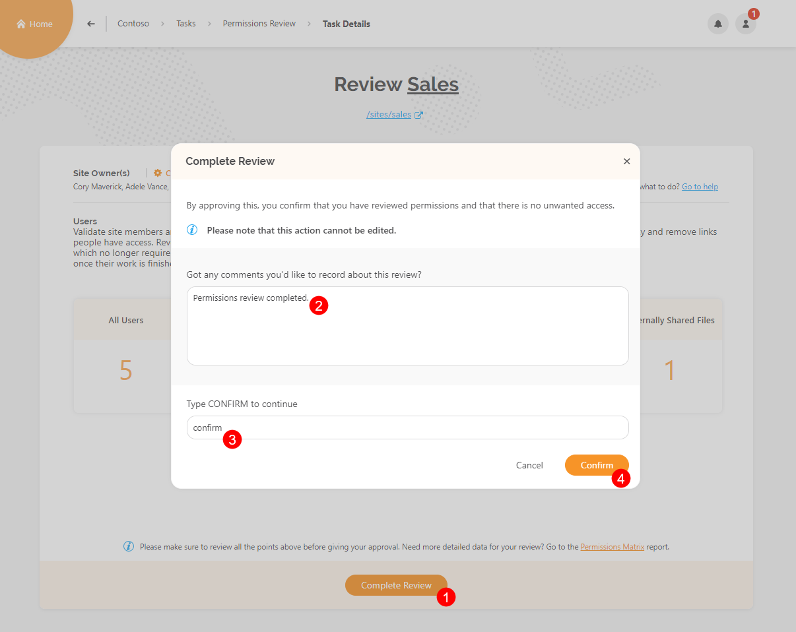

After you complete the Access Review for a site, the **Review Completed** dialog opens confirming the completion. Click the **Close Review** button to leave the screen and navigate to the Access Review screen, where you can find sites that you need to review.

When you complete Access Reviews for all sites you are the owner of, your **Access Review task is completed.** On the **My Tasks** screen, under **Active Access Review \(1\)**, the **No Tasks \(2\)** message is displayed. You can find your **completed Access Review task \(3\)** in the **Completed section \(4\)**, and access task details by clicking the **See Task \(5\)** button.

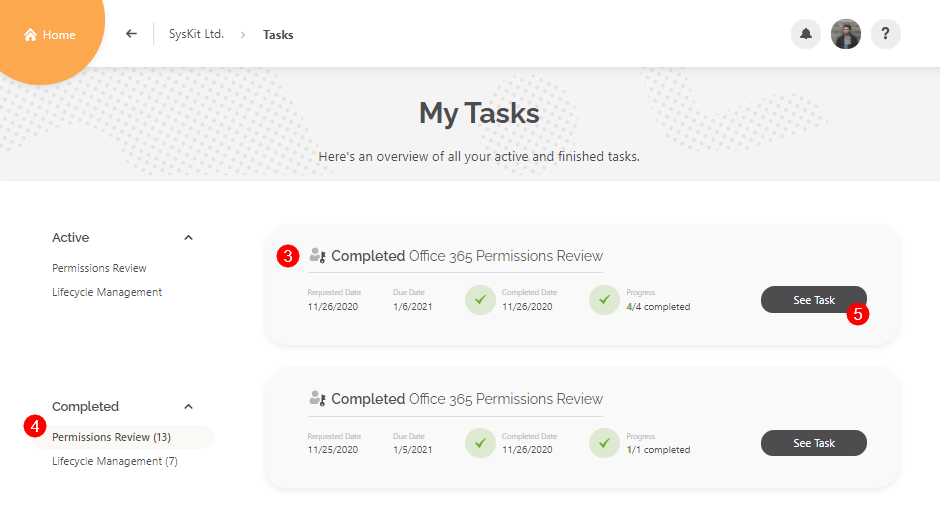

This opens the Access Review screen for the completed Access Review, where you can:

* **select a site \(1\)** 
* **click the Review button \(2\)** to open the **Review Summary report**

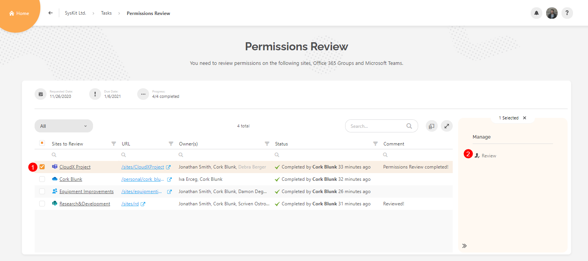

The **Review Summary** report shows a detailed log of actions performed during the Access Review process and can be **exported to an XLSX file \(1\)**

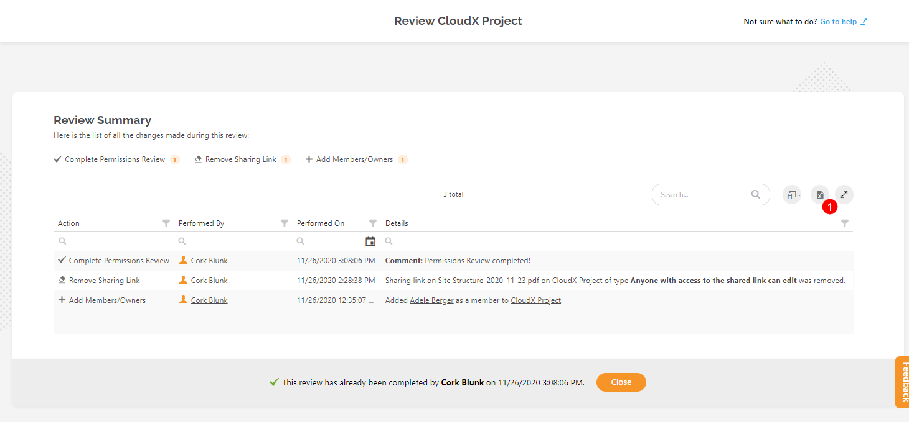

## Overdue Reviews

After ten days, the Access Review cycle ends. SysKit Point automatically changes the status of all uncompleted site reviews to **Overdue**. You can find them on the **Access Review** task screen.

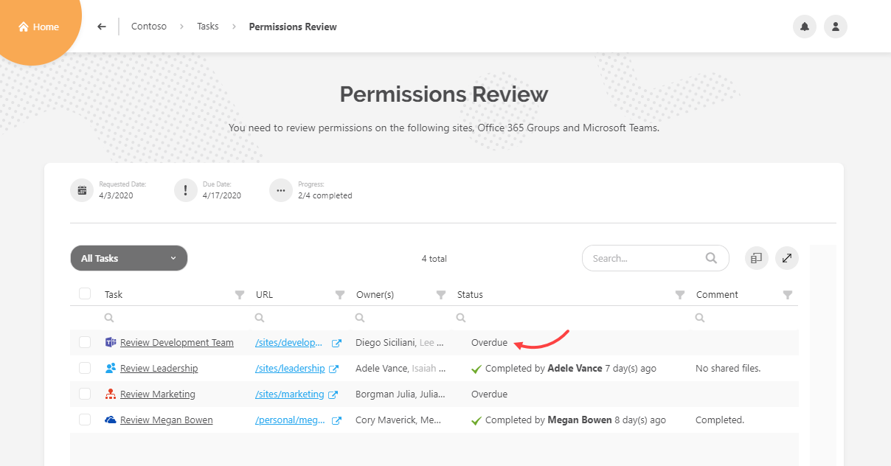

After the Access Review completion, you cannot complete the Access Review.

**With that, the first Access Review cycle is completed**. The cycle will repeat per schedule, as defined by SysKit Point Admin, giving you the same reports and actions to make this process as easy as possible.

