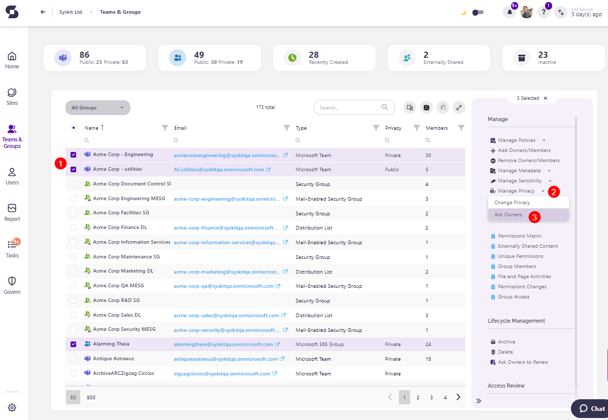
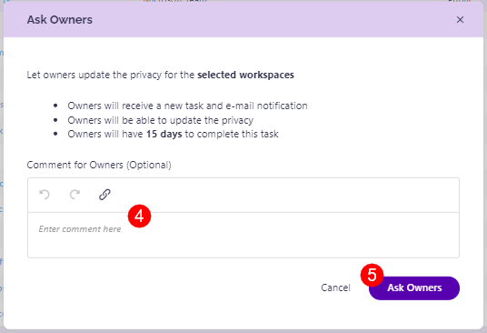

# Privacy Review

The Privacy settings for your workspaces play a vital role in maintaining control over sensitive information.

Workspace owners can set the privacy level for their workspace and determine whether the workspace can be accessed company-wide or should be restricted to specific members. 

As projects progress or even shift in scope, these privacy settings can change, and access might need to be extended or reduced. A workspace that was once public for easy collaboration might now contain confidential documents that need restricted access. 

For example, a public workspace used for initial brainstorming that everyone was welcome to participate could later house project blueprints or client contracts, requiring a change to a more private setting. 

By regularly reviewing and updating privacy levels, workspace owners can ensure that sensitive information is safeguarded and only shared with the appropriate individuals, minimizing the risk of privacy breaches.

With the new Ask Owners to Review Privacy action, you can now select workspaces that you want owners to review the privacy level for.



**Please note:** You can Ask Owners to review the Privacy of Microsoft Teams and Microsoft Groups only.



## Ask Owners to Review Privacy

Here's how to request owners to review the privacy of their workspaces. 

* Navigate to the **Microsoft Teams & Groups Overview screen** by clicking the Teams & Groups button on the left side of the screen
* **Select one or more workspaces (1)** that you want to request a privacy review for
* On the right side of the screen, **click the arrow next to Manage Privacy (2)** button
* **Click the Ask Owners action (3)**, and a confirmation dialog opens 
* Here, you can **leave a comment (4)** if you feel one is needed and **click the Ask Owners button (5)** to request a review

After that, the dialog confirms that the task has been sent and lets you know that you can **check the newly created tasks by going to the Governance screen and, under Privacy Review, clicking Requested Reviews**. 



**After a privacy review is requested:**
* Owners receive a new task and e-mail notification.
* Owners can update the privacy level.
* Owners have **15 days** to complete this task.

**After a Privacy review is completed or if it is overdue**, administrators receive an e-mail informing them of that 1 day after completion.



