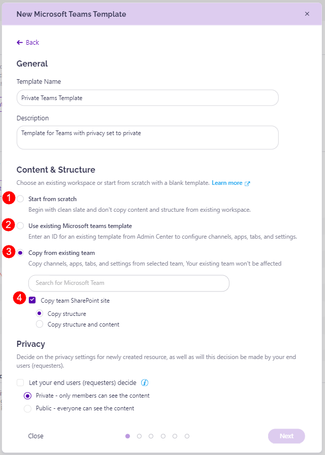

# Content & Structure

The Content & Structure section for Provisioning lets you copy the structure or both the structure and content of an existing Team, Group, or Site in order to make things easier for you when provisioning a new one. 

The options you have are the following:

* **Start from scratch (1)**
  * Selecting this option means that your new provisioned workspace will be a clean slate. 
  * Default apps or channels will not be created, and the content and structure will not be copied from an existing workspace. 

* **Use existing Microsoft Teams template (2)**
  * This option is **only available** when provisioning **Microsoft Teams**.
  * After selecting this option, you need to enter Microsoft template ID for an existing template.
  * Syskit Point integrates with team templates you have created in the **Microsoft 365 Teams admin center**. 
  * When you enter a team template ID, Syskit Point creates predefined apps, channels, and tabs for the new workspaces that use the template.

* **Copy from existing team (3)**
  * When selecting this, you need to select the workspace you want to copy by entering the name (or identifying information) of the workspace in the space provided.
  * This copies channels, apps, tabs, and settings from the selected workspace to the one being provisioned. 
  * You can also select whether to **check the Copy team SharePoint site (4)** checkbox
    * This checkbox is **only available for Microsoft Teams**.
    * If the check is marked, you can also select whether to:
      * Copy structure - this copies only the structure of the workspace but not the content
      * Copy structure and content - this copies both the structure of the workspace and the content within the workspace

## Content & Structure Options

Here, you can find a list of all objects that can be copied, along with which of the three options will copy which objects. 

The objects available for copying are: 

* **Channels & channel folders**
* **Apps**
* **Tabs**
* **Site navigation**
* **Document Libraries and Lists**
* **Content types**
* **Folders**
* **Files/Documents**
* **Default & custom file templates**

When deciding which option to select from the three available, it helps to know which option copies which objects. Here's what each option copies: 

| Objects to Copy | From Scratch | Use Microsoft Teams template | Copy from existing team | Copy Team SharePoint Site - Structure | Copy Team SharePoint Site - Structure & Content |
| --- | --- | --- | --- | --- | --- |
| Channels (& Channel Folders)| No | Yes | Yes | Yes | Yes |
| Apps | No | Yes | Yes | Yes | Yes |
| Tabs | No | Yes | Yes | Yes | Yes |
| Site Theme |No | No | No | Yes | Yes |
| Site Navigation| No | No | No | Yes | Yes |
| Document Libraries & Lists | No | No | No | Yes | Yes |
| Content Types | No | No | No | Yes | Yes |
| Folders | No | No | No | Yes | Yes |
| File templates | No | No | No | Yes | Yes |
| Files/Documents | No | No | No | No | Yes |



**Please note** that: 
* **Channels & channel folders are provisioned by Microsoft** 365 and visible only after the first post is made and by **navigating to the Files tab** in the Teams app
* When copying files, **up to 20 files can be copied** 
  * If **more than 20 files are detected**, they are **not copied and the Admin receives an email** stating that the Content will not be applied
  * Default & custom file templates are not counted toward the 20-file copy limit




The following is **NOT copied or supported**: 
* **Subsites** 
* **Plans**
* **Unpublished pages**
* **Folder color**
* **OneNote**


Find more details on how to create Provisioning templates in the [Templates article](templates.md). For any additional questions about the content & structure aspect of Provisioning, please [take a look at the FAQ article.](../../faq/provisioning-content-structure.md)

