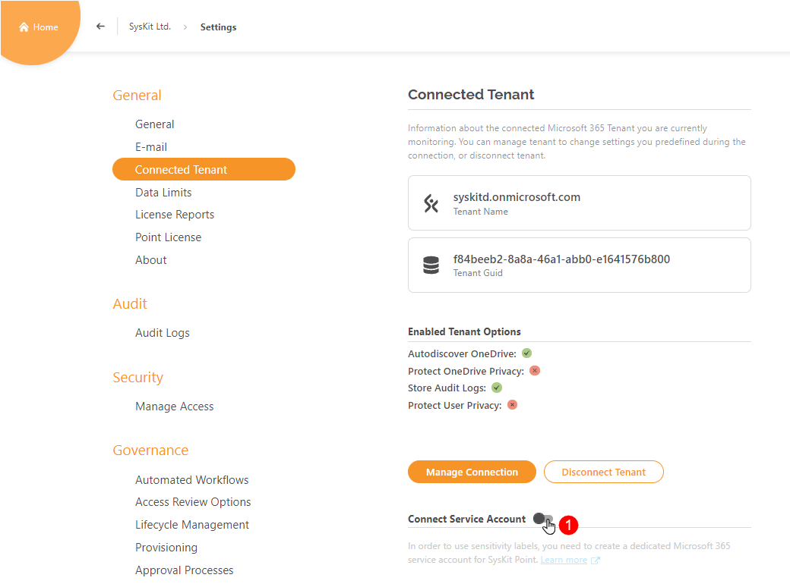
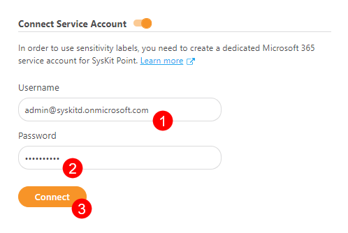

# Enable Sensitivity Labels

In order to use sensitivity labels when creating provisioning templates, the following requirements need to be met:
* **Sensitivity labels are created and published** in [Microsoft compliance center](https://compliance.microsoft.com/informationprotection?viewid=sensitivitylabels)
[Click here to learn how to create and configure sensitivity labels and their policies.](https://docs.microsoft.com/en-us/microsoft-365/compliance/create-sensitivity-labels?view=o365-worldwide)
* **Sensitivity labels are enabled for containers - Microsoft Teams sites, Microsoft 365 groups, and SharePoint sites**
[Use this article to help you enable sensitivity labels for containers](https://docs.microsoft.com/en-us/microsoft-365/compliance/sensitivity-labels-teams-groups-sites?view=o365-worldwide#enable-this-preview-and-synchronize-labels)
* **Dedicated service account is connected to SysKit Point**

The connected service account enables SysKit Point to:
* **collect existing sensitivity labels**
* **apply sensitivity labels when creating new workspaces with provisioning workflows**

## Connect Service Account

To connect the service account in SysKit Point:
* **Navigate to Settings** > **General** > **Connected Tenant**
* **Switch the Connect Service Account toggle (1) on**

Additional fields are displayed, where you can:
* **Enter service account username (1)**
* **Enter service account password (2)**
* **Click the Connect button (3)** to finish


**Please note!**  
**Use a service account that does not require MFA.**


**After successful connection the connect button turns green and shows a checkmark.**

## Next Steps

After you connect the service account to SysKit Point, you will be able to specify a sensitivity label when creating provisioning templates.

To learn more about templates and available options while setting them up, open the [following article](templates.md).
