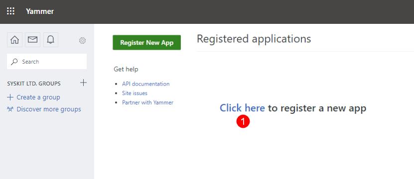

# Register Yammer App

To be able **to create Yammer community templates**, you need to **register a new Yammer app in Yammer portal and SysKit Point**. 

Start by **navigating to Settings** > **Provisioning**, and click the **New Template** button.
The following screen opens:

**Click the Yammer Community tile (1)** to continue.

Yammer app registration screen opens guiding you further through the app registration.

## Register the Yammer App in SysKit Point

Yammer app registration screen in SysKit Point enables you to:
* **Open the Yammer app registration portal (1)**, where you will be able to **register a new Yammer app**
* **Copy the Website (2) and Redirect URI (3) data required in Yammer portal when registering a new Yammer app**
* **Input the Client ID (4) and Secret (5) data which you can access in Yammer portal after the new Yammer app registration is created**
* **Register the Yammer app (6)** in SysKit Point after entering the required data 

To continue, **open the Yammer portal** by clicking the **Open the Yammer app registration portal button (2)**

## Register a New App in Yammer Portal

A **new browser tab opens, showing the Registered applications screen in Yammer portal**. 
* **Click the link (1) to continue**

A registration dialog opens, where you need to:
* **Enter the application name (1)** - enter `SysKit Point Yammer App`
* **Enter organization (2)** - enter `SysKit`
* **Enter support e-mail (3)** - enter `support@syskit.com`
* **Enter website (4)** - **copy and paste the value provided on the SysKit Point app registration screen** described in the previous section
* **Enter Redirect URI (5)** - **copy and paste the value provided on the SysKit Point app registration screen** described in the previous section
* **Check the agreement checkbox (6)**
* **Click Continue (7)** when finished

