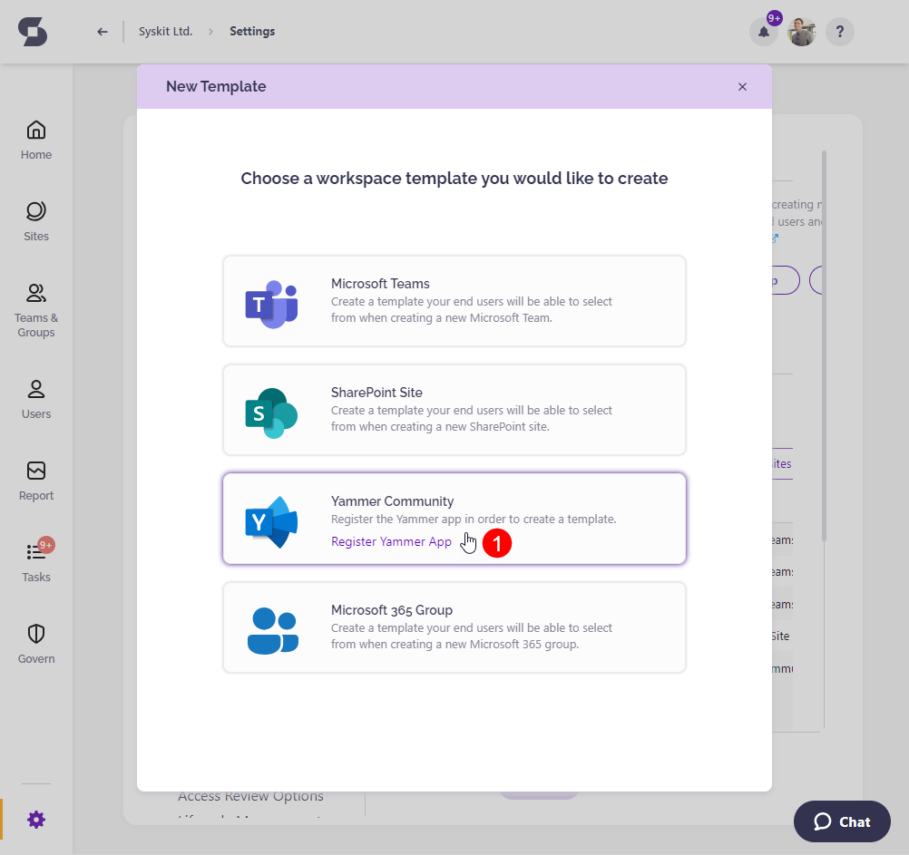
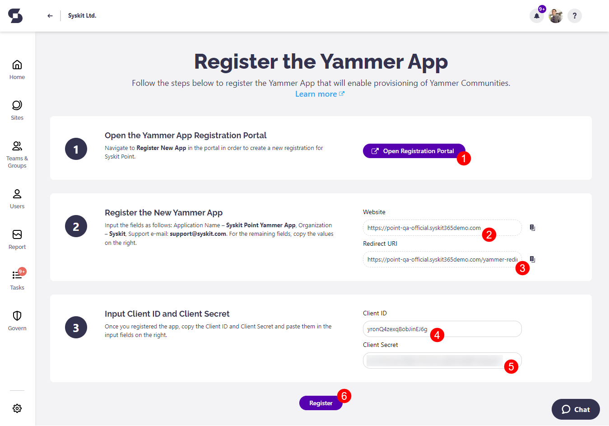

# Register Yammer App

To be able **to create Yammer community templates**, you need to **register a new Yammer app in Yammer portal and Syskit Point**. 

Start by **navigating to Settings** > **Provisioning**, and click the **New Template** button.
The following screen opens:

**Click the Yammer Community tile (1)** to continue.

Yammer app registration screen opens, guiding you further through the app registration.

## Register the Yammer App in Syskit Point

Yammer app registration screen in Syskit Point enables you to:
* **Open the Yammer app registration portal (1)**, where you will be able to **register a new Yammer app**
* **Copy the Website (2) and Redirect URI (3) data required in Yammer portal when registering a new Yammer app**
* **Input the Client ID (4) and Secret (5) data which you can access in the Yammer portal after the new Yammer app registration is created**
* **Register the Yammer app (6)** in Syskit Point after entering the required data 

Next, **open the Yammer portal** by clicking the **Open the Yammer app registration portal button (1)**

## Register a New App in Yammer Portal

A **new browser tab opens, showing the Registered applications screen in Yammer portal**. 
* **Click the link (1) to continue**

A registration dialog opens, where you need to:
* **Enter the application name (1)** - enter `Syskit Point Yammer App`
* **Enter organization (2)** - enter `Syskit`
* **Enter support e-mail (3)** - enter `support@syskit.com`
* **Enter website (4)** - **copy and paste the value provided on the Syskit Point app registration screen** described in the previous section
* **Enter Redirect URI (5)** - **copy and paste the value provided on the Syskit Point app registration screen** described in the previous section
* **Check the agreement checkbox (6)**
* **Click Continue (7)** when finished

Once finished, a new screen loads, showing the following **information about the registered Yammer app**:
* **Client ID (1)**
* **Client Secret (2)**

**Copy and paste the information provided here to the Yammer app registration screen in Syskit Point**, as described in the previous section.

## Next Steps

After you register the Yammer app in Syskit Point, you will be redirected to the Yammer template creation dialog.
Here, you can **set up your first Yammer template** that will be available in the Syskit Point Teams app.

To learn more about templates and available options while setting them up, open the [following article](templates.md).

