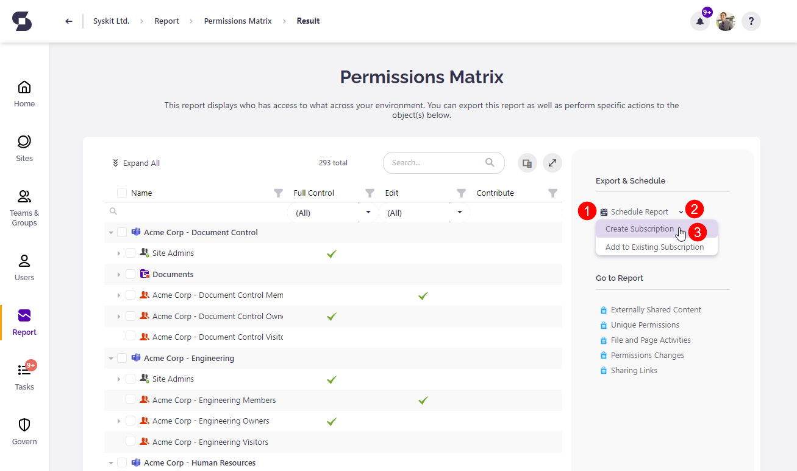
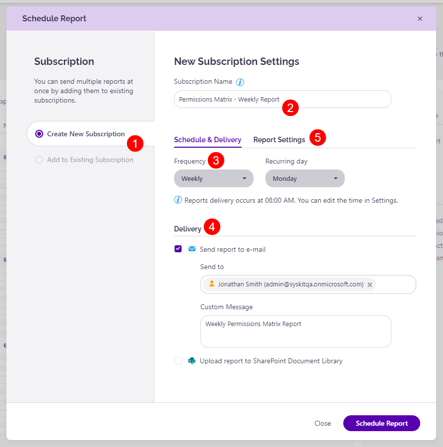
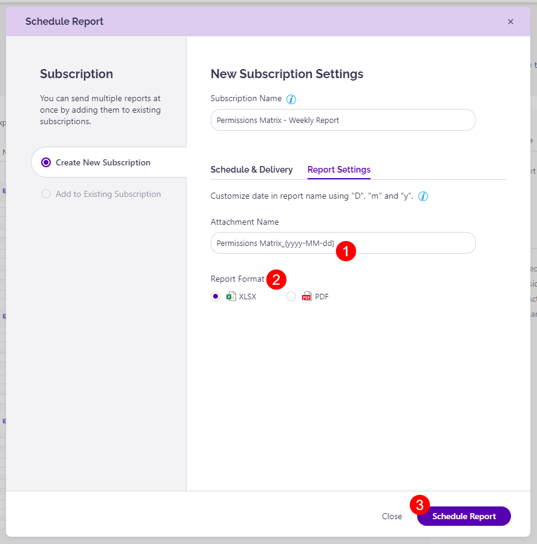
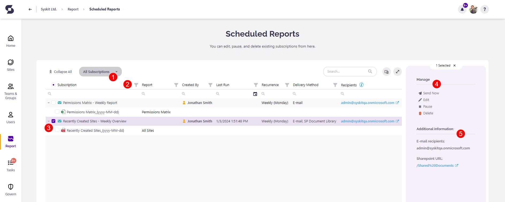
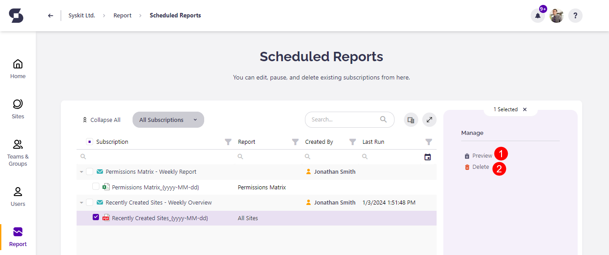
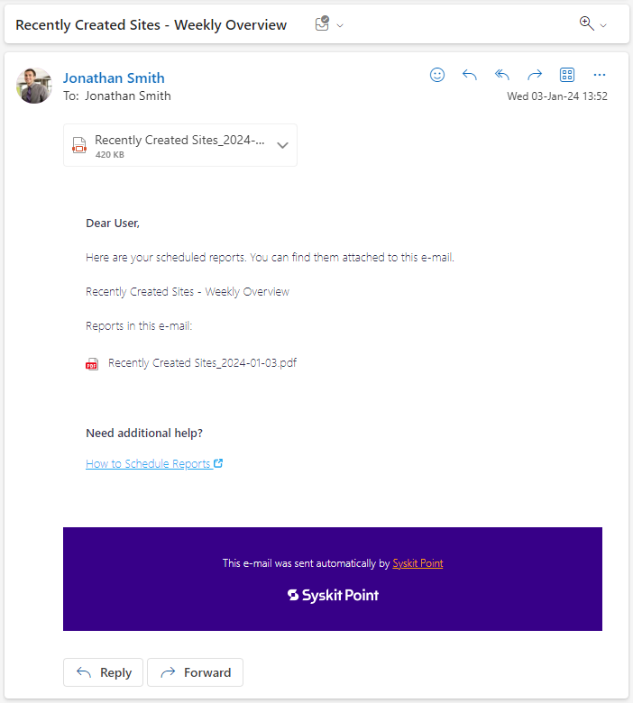
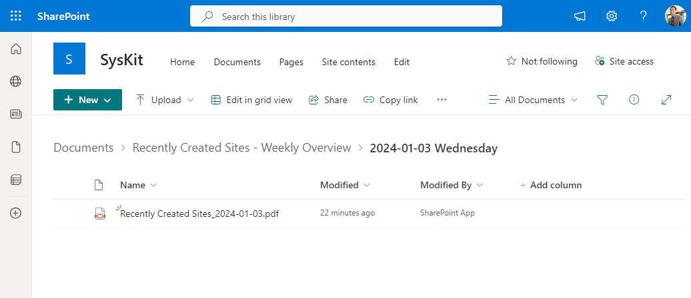
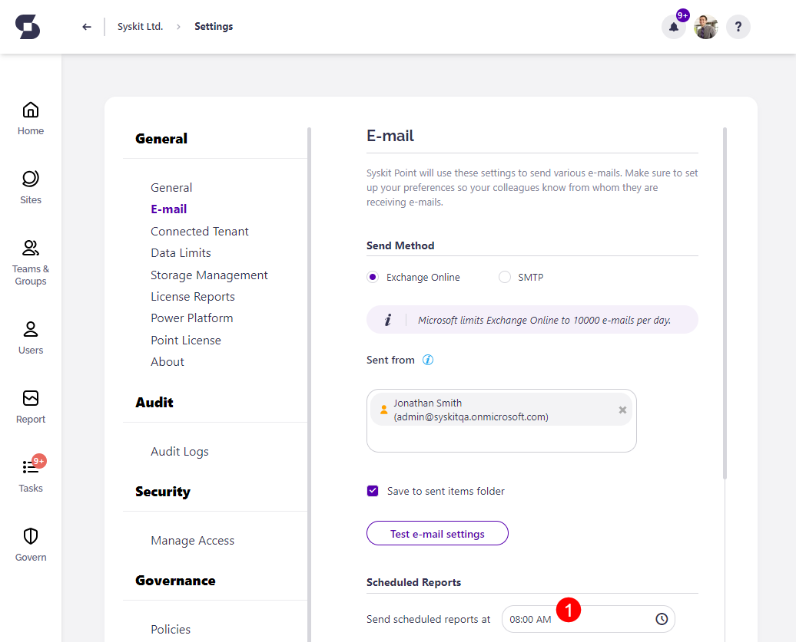

# Schedule Reports


**Scheduled Reports** are available in the Security & Compliance plan and higher tiers. See the [pricing page](https://www.syskit.com/products/point/pricing/) for more details.


When you manage permissions and workspaces in your Microsoft 365 tenant, creating reports, sharing them, or saving them for future reference might take up a lot of your time – that’s where the Scheduled Reports in Syskit Point can help!

With the help of this feature, you can do the following:

* **create Scheduled Reports from views and reports generated in Syskit Point**, meaning that all filters you define when generating a report or view are applied when sending the scheduled report
* **Set up automatic sending of PDF or XLSX reports to one or more email recipients** in your tenant
* **Setup automatic saving of PDF or XLSX reports to a document library** in a SharePoint site
* **Define how often and when to send Scheduled Reports**
* **Create a Subscription - group of Scheduled Reports** that share the same schedule frequency and delivery options

Users with the following roles assigned in Syskit Point can create Scheduled reports:

* **Syskit Point Admins**
* **Syskit Point Global Viewers**
* **Syskit Point Collaborators**

To learn more about roles in Syskit Point, see the [following article](../configuration/enable-role-based-access.md).

## Schedule a Report

In Syskit Point, it is possible to schedule:

* **All reports**, except the Site Analytics report
* **All views** available on the overview screens – Sites, Microsoft Teams & Groups, and the Users overview screen 

For example, in the picture below, a generated Permissions Matrix report is shown. Here, you can find the following options in the side panel:

* **Schedule Report \(1\)**
* **Schedule Report options icon \(2\)**, which, when clicked, opens a drop-down menu with the following **options \(3\)**:
  * **Create Subscription**
  * **Add to Existing Subscriptions**


**Please note!**  
One subscription can contain multiple reports, but they all share the same schedule and delivery options.


The Schedule Report button opens the Schedule Report dialog displayed in the picture below. Here, you can see and do the following:

* **Create New Subscription \(1\)** option is selected by default 
* **Define the Subscription Name \(2\)** – Subscription name is visible as the email subject in case the reports are delivered via email
* **Select the Schedule frequency \(3\)** – you can choose between three options **Daily**, **Weekly**, and **Monthly** schedule
* **Select the delivery method Scheduled Reports \(4\)** – at least one of the options needs to be selected
  * **Send report to e-mail** – here, you can choose recipients with the help of the people picker and define a custom message that will show in each delivered email
  * **Upload report to SharePoint Document Library** – here, you can paste the document library URL directly from your browser
* **Click the Report Settings tab \(5\) to define per-report**


**Please note!**  
Schedule & Delivery options are defined per Subscription.


In the Report Settings tab, you can:

* **Define the name of the attachment \(1\)** that will be sent via email or uploaded to a document library
* **Choose between two file formats \(2\)**:
  * **XLSX**
  * **PDF**
* **Click the Schedule Report button \(3\)** to create your first subscription with a Scheduled Report 


**Please note!**  
Report options are defined per each report in the subscription separately.


A confirmation dialog appears. Close it or use the **View Subscriptions button** to open the **Scheduled Reports** screen.

## Manage Scheduled Reports

You can manage all Scheduled Reports on the dedicated **Scheduled Reports** screen. You can access it in one of the following ways:

* **Click the View Subscriptions button** after you create a subscription
* **Navigate to the Report Center and click the Scheduled Reports button**
* **Click the Scheduled Report option in the user profile menu**

The Scheduled Reports screen enables you to:

* **Choose between All Subscriptions \(1\)** and **My Subscriptions** view
* **View defined subscription and report settings \(2\)**, such as who created the subscription, when it was last run, frequency, delivery method, and other 
* **Select a subscription \(3\) to perform actions**
* **Perform an action on the selected subscription \(4\)**:
  * **Send the subscription manually**
  * **Edit Subscription settings**
  * **Pause or Start a paused Subscription**
  * **Delete the Subscription and all associated reports**
* **View additional information \(5\)**, such as the link to the defined document library or a list of emails for all defined email recipients

If you select a single report inside a subscription, two options are available:

* **Preview \(1\)**, which opens the report which will be sent or uploaded
* **Delete \(2\)**, which removes the selected report from the parent subscription

## Scheduled Reports Delivery

By default, Scheduled Reports are sent once a day. As mentioned, **reports can be delivered via email** or **uploaded to a document library**. The results for both cases are displayed in the pictures below.

To **change the time when the Scheduled Reports are delivered**, use the **Scheduled Reports section in the E-mail Settings \(1\)**.

