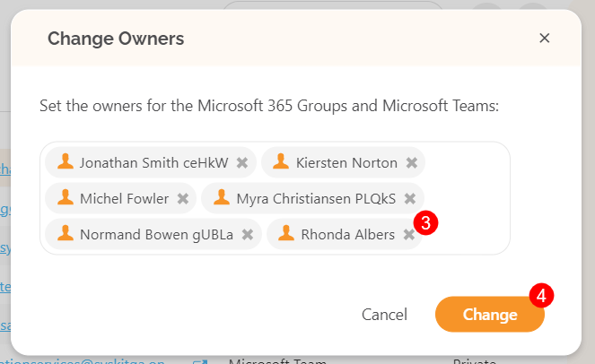
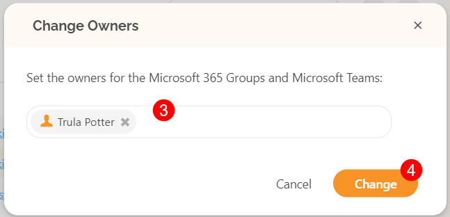

# Security and Compliance Checks: Early Access 

The new **Security and Compliance Checks** visible directly from your SysKit Point home screen pinpoint the **most important vulnerabilities and misalignments** with Microsoft 365 best practices. These checks should keep you aware and help you **react quickly to keep your environment secure and under control**.

Collecting all the important info about the security and compliance state of the environment is a time-consuming and repetitive administration task. SysKit Point will perform regular security and compliance checks for you and present the results on your home screen from where you can click and **drill down to a specific report to investigate further**, and decide if you want to take some action and **resolve** specific issue. 


**Want to join Early Access?** Security and Compliance Checks are not yet publicly available for all users. If you want to learn how it works and see what's coming up next, [schedule a call (calendly)](https://calendly.com/d/yjj-7y5-sky/syskit-point-early-access-program) with our Product Manager and provide feedback to help us shape up this feature to fit your needs.   


 
Directly from your home screen, you will see several things that need to be investigated for each check, and if all is good, there will be a green checkmark. We plan to expand this list of checks. For now, you will be able to see: 

* **Microsoft Teams and Groups with too many owners (1)** – shows the number of workspaces with more than 5 owners. Drill down to Microsoft Teams & Groups overview, where you can explore this easily and remove extra owners. Why is this important - if there are **too many owners, no one feels accountable for access and content management**. 

* **Microsoft Teams and Groups with only 1 owner (2)** – shows the number of workspaces with only 1 owner and takes you to Microsoft Teams & Groups overview, where you will be able to investigate further and assign additional owners if needed. You need to keep an eye on this, **if that one owner leaves, a workspace is left without an owner**. 

* **Workspaces without an active owner (3)** – shows the number of SharePoint sites, Microsoft 365 Groups, and Microsoft Teams without an active owner. If you click on it, it drills down to the Orphaned Resources report, which helps manage Microsoft 365 resources' health and helps **ensure there are no abandoned resources** in your tenant. 

* **Orphaned users (4)** - shows the number of orphaned users and takes you to the Orphaned Users report, which helps **detect and remove blocked/disabled or deleted users** from your Microsoft 365 resources. 

## Automated Governance

To keep all these things **under control proactively and even prevent** possible issues, we suggest exploring and [**setting up various governance policies and automated workflows**](../governance-and-automation/automated-workflows/README.md) in SysKit Point that will control the minimum and maximum number of owners in your workspaces as well as how you automatically find and manage orphaned resources. 
 
## Navigate Security and Compliance Checks

The Security and Compliance checks are visible on the home page of your SysKit Point. 

At the bottom of the screen, you will find:
  * Number of Teams and Groups with too many owners
  * Number of Teams and Groups with only 1 owner
  * Number of Teams and Groups without active owners 
  * Number of Orphaned Users 

By clicking each of the options, you are provided with **more information about the current state of your environment**. 

### Teams and Groups With Too Many Owners

Under the Security & Compliance Checks section, click the **number showing Teams and Groups with too many owners**.

  * The Microsoft Teams & Groups page will open, showing a list of all **Microsoft Teams & Groups with six or more owners** 
    * For more details on all the options available on the Microsoft Teams & Groups page, [ take a look at this article](../reporting/inventory-reports.md#microsoft-teams-and-groups-report)
  * To remove owners from Microsoft Teams & Groups, **select the checkbox (1)** next to the Team or Group
  * **Click the Change Owners button (2)** located on the right side of the screen
    * The Change Owners pop-up opens, showing all the current owners
  * Remove owners by **clicking the x (3)** next to their name
    * Ensure that the Team or Group has less than 6 owners assigned to them
  * Once finished, click **Change (4)** to store your preference

### Teams and Groups With Only 1 Owner

Under the Security & Compliance Checks section, click the **number showing Teams and Groups with only 1 owner**.

  * The Microsoft Teams & Groups page will open, showing a list of all **Microsoft Teams & Groups with only 1 owner assigned** 
    * For more details on all the options available on the Microsoft Teams & Groups page, [ take a look at this article](../reporting/inventory-reports.md#microsoft-teams-and-groups-report)
  * To assign more owners to the Microsoft Teams & Groups, **select the checkbox (1)** next to one of the listed Teams or Groups
  
New owners can be added in two ways:
  * **Click the Change Owners button (2)** located on the right side of the screen
  * **Click the Add Owners/Members button (3)** located on the right side of the screen

  
When clicking the **Change Owners button**:
    * **The Change Owners pop-up (1)** appears showing all the current owners
    * To add more owners to the Team or Group, type the **name or email address (2)** of the person you want to assign as an owner in the space provided
    * When finished, **click Change (3)** to store your preference

 * When clicking the **Add Owners/Members button**:
    * **The Add Owners/Members pop-up (1)** appears, providing a space where you can add members to the group
    * To add an owner or assign a current member as an owner, type the **name or email address (2)** of the person you want to assign as an owner in the space provided
    * Select the **Make selected members group owners checkbox (3)**
    * When finished, **click Change (4)** to store your preference

### Teams and Groups Without Active Owners 

Under the Security & Compliance Checks section, click the **number showing Teams and Groups without active owners**.

  * The Reports section opens, showing a list of all **Microsoft Teams & Groups without active owners** 
  * The following columns are visible on this page:
    * **Name (1)** - the Team or Group
    * **Blocked Admins (2)** - shows the name of the owners assigned to the Group that have been blocked from accessing it
    * **Users (3)** - the number of users currently a part of the Team or Group
  * The right side of the screen provides the option to:
    * **Schedule Report (4)** - set up a subscription to be notified when Teams or Groups are left without active owners
    * **PDF (5)** - export the current report as a PDF file
    * **Excel (6)** - export the current report as an XLSX file

  * Assign new owners by **clicking the Team or Group (1)** to select it 
    * The bar should change color to a light orange when selected
  * **Click the Change Owners button (2)** located on the right side of the screen
    * The Change Owners pop-up will open, showing the currently assigned owner
  * Remove the owner by **clicking the x (3)** next to their name
  * Add new owners to the Team or Group by typing the **name or email address (4)** of the person you want to assign as an owner in the space provided
 * Once finished, click **Change (5)** to store your preference

### Orphaned Users

Under the Security & Compliance Checks section, click the **number showing Orphaned Users**.

  * The Reports section opens, showing a list of all **Orphaned Users** 
    * For more details on all the options available on the Orphaned Users reports page, [take a look at this article](../reporting/cleanup-and-health-reports.md#orphaned-users).
  * To remove orphaned users, **select one or multiple users by clicking the checkbox on the left side next to their name (1)**
    * The bar should change color to a light orange when selected
  * **Click the Remove User button (2)** located on the right side of the screen
    * The Remove User pop-up appears
  * Type **Remove (3)** in the space provided to continue
  * **Click the Remove button (4)** to confirm your action


**Please note!**  
Security & Complicance checks take **two days** to properly sync the current state of your environment. 


**Want to join Early Access?** Security and Compliance Checks are not yet publicly available for all users. If you want to learn more and see how it works, [please find a suitable time slot](https://calendly.com/d/yjj-7y5-sky/syskit-point-early-access-program) and we will gladly guide you through.
