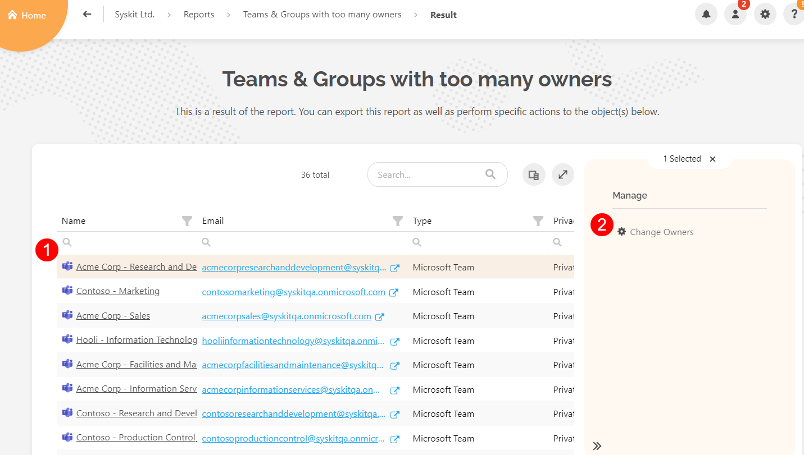

# Security and Compliance Checks: Early Access 

The new **Security and Compliance Checks**, visible directly from your Syskit Point home screen, pinpoint the **most important vulnerabilities and misalignments** with Microsoft 365 best practices. These checks should keep you aware and help you **react quickly to keep your environment secure and under control**.

Collecting all the important info about the security and compliance state of the environment is a time-consuming and repetitive administration task. Syskit Point will perform regular security and compliance checks for you and present the results on your home screen from where you can click and **drill down to a specific report to investigate further** and decide if you want to take some action and **resolve** specific issue. 


**Want to join Early Access?** Security and Compliance Checks are not yet publicly available for all users. If you want to learn how it works and see what's coming up next, [schedule a call (calendly)](https://calendly.com/d/yjj-7y5-sky/syskit-point-early-access-program) with our Product Manager and provide feedback to help us shape up this feature to fit your needs.   


Directly from your home screen, you will see several things that need to be investigated for each check, and if all is good, there will be a green checkmark. We plan to expand this list of checks. For now, you will be able to see: 

* **Teams and Groups with too many owners (1)** – shows the number of workspaces with more than 5 owners. Drill down to Microsoft Teams & Groups overview, where you can explore this easily and remove extra owners. Why is this important - if there are **too many owners, no one feels accountable for access and content management**. 

* **Teams and Groups with only 1 owner (2)** – shows the number of workspaces with only 1 owner and takes you to Microsoft Teams & Groups overview, where you will be able to investigate further and assign additional owners if needed. You need to keep an eye on this, **if that one owner leaves, a workspace is left without an owner**. 

* **Teams and Groups without active owners (3)** – shows the number of Microsoft Teams & Groups without an active owner. If you click on it, it drills down to the Microsoft Teams & Groups without active owners report, which helps manage Microsoft 365 resources' health and helps **ensure there are no abandoned resources** in your tenant. 

* **Orphaned users (4)** - shows the number of orphaned users and takes you to the Orphaned Users report, which helps **detect and remove blocked/disabled or deleted users** from your Microsoft 365 resources. 

* **Blocked users with assigned licenses (5)** - shows the number of users with one or more active licenses assigned that have been blocked, which helps you **detect and remove licenses** that are not being utilized.

* **Inactive guest users (6)** - shows the number of guest users that have been inactive for a certain amount of time and helps you optimize your environment and keep it safe

## Automated Governance

To keep all these things **under control proactively and even prevent** possible issues, we suggest exploring and [**setting up various governance policies and automated workflows**](../governance-and-automation/automated-workflows/README.md) in Syskit Point that will control the minimum and maximum number of owners in your workspaces as well as how you automatically find and manage orphaned resources. 
 
## Navigate Security and Compliance Checks

The Security and Compliance checks are visible on the home page of your Syskit Point. 

At the bottom of the screen, you will find:
  * Number of Teams and Groups with too many owners
  * Number of Teams and Groups with only 1 owner
  * Number of Teams and Groups without active owners 
  * Number of Orphaned Users 
  * Number of Blocked users with assigned licenses
  * Number of Inactive Guest Users

By clicking each of the options, you are provided with **more information about the current state of your environment**. 


**Please note!**  
In case you have any security and compliance checks that need to be resolved, an **email is automatically sent each Wednesday** to Syskit Point admins. Click the **Resolve button** within the email to access the reports in Syskit Point directly and perform the needed actions.


### Teams and Groups With Too Many Owners

Under the Security & Compliance Checks section, click the **number showing Teams and Groups with too many owners**.

  *  The Reports section opens, showing a list of all **Microsoft Teams & Groups with six or more owners** 
  * To remove owners from Microsoft Teams & Groups, **select the Team or Group(1)** by clicking on it
    * The bar should change color to a light orange when selected
  * **Click the Change Owners button (2)** located on the right side of the screen
    * The Change Owners pop-up opens, showing all the current owners
  * Remove owners by **clicking the x (3)** next to their name
    * Ensure that the Team or Group has less than 6 owners assigned to them
  * Once finished, click **Change (4)** to store your preference

### Teams and Groups With Only 1 Owner

Under the Security & Compliance Checks section, click the **number showing Teams and Groups with only 1 owner**.

  *  The Reports section opens, showing a list of all **Microsoft Teams & Groups with only 1 owner assigned** 
  * To assign more owners to the Microsoft Teams & Groups, **select the Team or Group (1)** by clicking on it
    * The bar should change color to a light orange when selected
  * **Click the Change Owners button (2)** located on the right side of the screen
    * **The Change Owners pop-up** appears, showing all of the current owners
    * To **add more owners** to the Team or Group, type the **name or email address (3)** of the person you want to assign as an owner in the space provided
  * When finished, **click Change (4)** to store your preference

### Teams and Groups Without Active Owners 

Under the Security & Compliance Checks section, click the **number showing Teams and Groups without active owners**.

  * The Reports section opens, showing a list of all **Microsoft Teams & Groups without active owners** 
  * Assign new owners by **clicking the Team or Group (1)** to select it 
    * The bar should change color to a light orange when selected
  * **Click the Change Owners button (2)** located on the right side of the screen
    * The Change Owners pop-up will open, showing the currently assigned owner
  * Remove the owner by **clicking the x (3)** next to their name
  * Add new owners to the Team or Group by typing the **name or email address (4)** of the person you want to assign as an owner in the space provided
 * Once finished, click **Change (5)** to store your preference

### Orphaned Users

Under the Security & Compliance Checks section, click the **number showing Orphaned Users**.

  * The Reports section opens, showing a list of all **Orphaned Users** 
  * To remove orphaned users, **select one or multiple users by clicking the checkbox on the left side next to their name (1)**
    * The bar should change color to a light orange when selected
  * **Click the Remove User button (2)** located on the right side of the screen
    * The Remove User pop-up appears
  * Type **Remove (3)** in the space provided to continue
  * **Click the Remove button (4)** to confirm your action

### Blocked Users With Assigned Licenses

Under the Security & Compliance Checks section, click the **number showing Blocked users with assigned licenses**.

  * The Reports section opens, showing a list of all **Inactive Licenses** assigned to blocked users
  * The License column shows information on **User: Name of the blocked user**, and **clicking the arrow symbol (1)** opens a dropdown list of **all licenses assigned to the blocked user**
  * **Select one or multiple licenses that are listed below the user's name (2)** for the option to remove the licenses
  * Click the **Remove Licenses (3)** button, located on the right side
    * The Remove Selected License(s) pop-up appears
  * Type **Remove (4)** in the space provided to continue
  * **Click the Remove button (5)** to confirm your action and remove the assigned licenses

### Inactive Guest Users

Under the Security & Compliance Checks section, click the **number showing Inactive Guest Users**.

  * The Reports section opens, showing a list of all **Inactive Guest Users** 
  * **Select one or multiple users (1)** by clicking the checkbox on the left side next to their name
    * The bar should change color to a light orange when selected
  * To remove inactive guest users, there are **two options**: 
    * To completely remove the user, **click the Delete User button (2)** located on the right side
      * When the Delete User pop-up appears, **click the Delete User option (4)** to confirm your decision
    * To block the sign-in for the user, **click the Block User Sign-In button (3)**
      * Confirm your choice by **clicking the Block button (5)** on the pop-up that appears

**Want to join Early Access?** Security and Compliance Checks are not yet publicly available for all users. If you want to learn more and see how it works, [please find a suitable time slot](https://calendly.com/d/yjj-7y5-sky/syskit-point-early-access-program), and we will gladly guide you through.