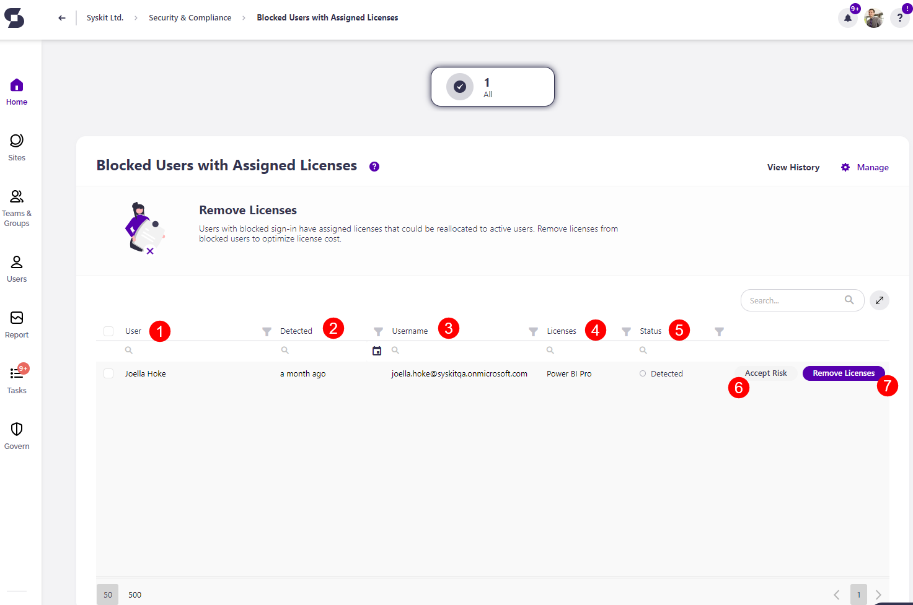

# Blocked Users with Assigned Licenses

On the Security & Compliance Checks section dashboard, click the **Blocked users with assigned licenses** button to see the report.

The Blocked Users with Assigned Licenses screen opens, showing a list of all **blocked users that still have licenses assigned** to them.

The report provides information on:
  * **User (1)** name
  * **Detected (2)** - when the policy violation was detected
  * **Username (3)** - the email of the blocked users
  * **Licenses (4)** - name of licenses that are assigned to the blocked user
  * **Status (5)** - status of the policy violation

Additionally, you can complete the following actions for the policy violation:
  * **Accept Risk (6)** - this means you will close the policy violation task without making any changes to the current state of the workspace
  * **Remove Licenses (7)** - this will remove the licenses from the blocked user

