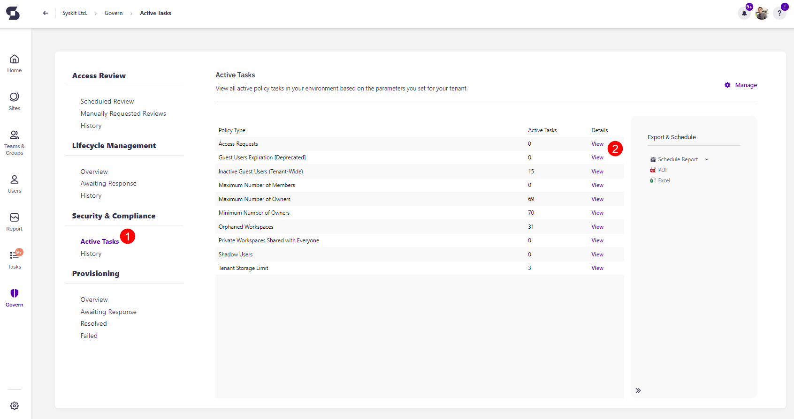

# Security and Compliance: Govern

The **Govern** feature in Syskit Point provides an easy overview of your Active Tasks and History for the Security and Compliance checks. On the Govern screen, you can resolve current vulnerabilities and find more information on previously resolved vulnerabilities.  

You can access the Govern screen by **clicking the Govern button on the left of the screen**. 

## Active Tasks

Current vulnerabilities can be resolved by **clicking the Active Tasks (1) button** under the Security and Complaint section. 

Here, you can find a list of all active policy tasks in your environment based on the parameters you set for your tenant. 

**Clicking the View button (2)** for a policy opens the policy screen that shows a list of all users or workspaces for which the vulnerability was detected. 

The following information is available:

* **Name (1)** - the name of the workspaces or user
* **Policy Name (2)** - the name of the policy that the vulnerability was detected for 
* **Reviewers (3)** - the name of the reviewers that are assigned the task
* **Task Created On (4)** - when the vulnerability was detected and the task created
* **Status (5)** - the status of the policy vulnerability

Selecting one or more workspaces or users also provides the following actions:

* **Resolve Task (6)** - clicking this redirects you to the task screen where you can complete actions that resolve the vulnerability; the actions vary based on the policy
* **Archive (7)** - clicking this archives the workspace
* **Delete (8)** - clicking this deletes the workspace

Completing any of the 3 actions resolves the policy vulnerability.

## History

Previous policy vulnerabilities that have been resolved can be seen by **clicking the History (1) button** under the Security and Complaint section. 

Here, you can find a list of all previous policy vulnerabilities, along with the number of resolved vulnerabilities per policy. 

**Clicking the View button (2)** for a policy opens the Vulnerabilities History screen that shows a list of all users or workspaces where the vulnerability was resolved. 

The following information is available:

* **Name (1)** - the name of the workspaces or user
* **Policy Name (2)** - the name of the policy that the vulnerability was detected for 
* **Reviewers (3)** - the name of the reviewers that are assigned the task
* **Risk Resolved On (4)** - the date the vulnerability was resolved for
* **Task Created On (5)** - when the vulnerability was detected and the task created
* **Status (6)** - the status of the policy vulnerability
* **Comment (7)** - the comment that was left when resolving the vulnerability

For workspaces, the history report also has a URL column that provides a clickable link to the workspaces. 

