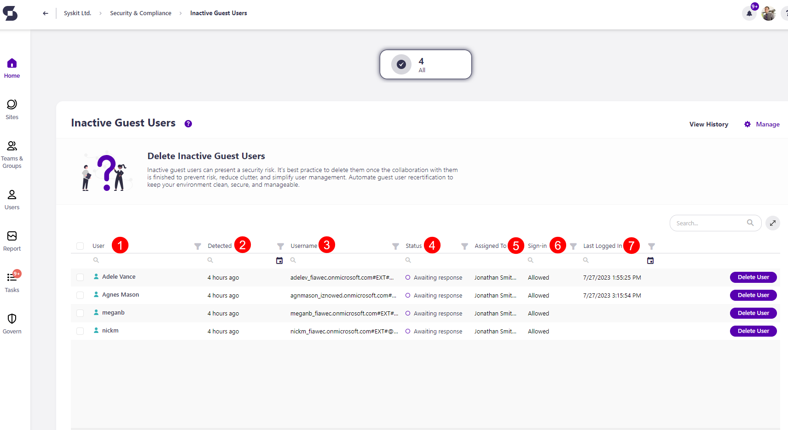
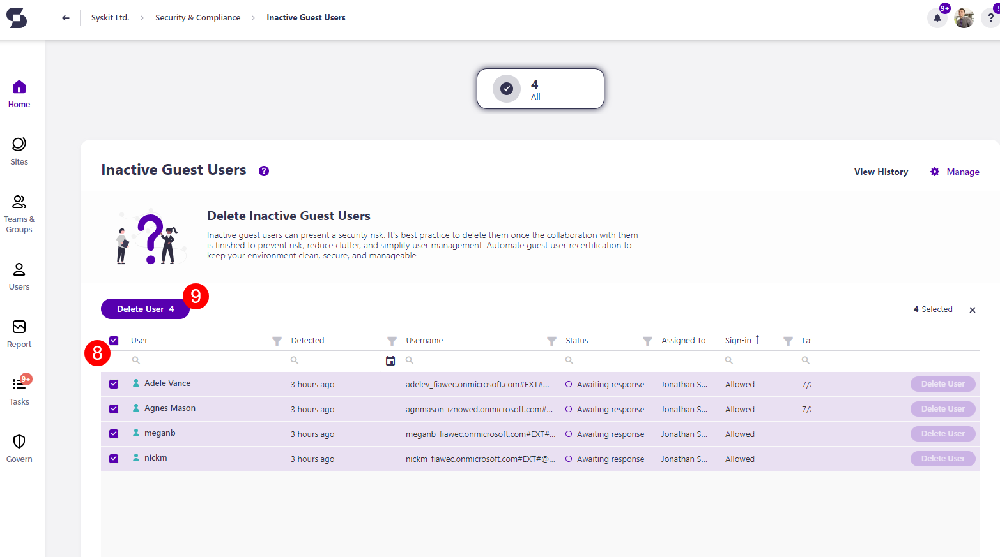

# Inactive Guest Users

Syskit Point detects inactive Guest users based on the settings defined in the tenant-wide [policy](../automated-workflows/inactive-guest-users-admin.md).

When the task delegation option is enabled for the Inactive Guest Users policy, Syskit Point creates tasks and sends emails to users as defined in the policy settings. To learn more, take a look at the [Inactive Guest Users policy article](../../governance-and-automation/automated-workflows/inactive-guest-users-admin.md). 

By default, task delegation is turned off for this policy, but the inactive guest users **are still detected**. **This means that Syskit Point detects a vulnerability on a workspace** based on the applied policy, but it does not create tasks or send any emails to workspace owners. 

The purpose of this is to assist Syskit Point admins by
bringing awareness of potential issues in their Microsoft 365 environment. 

On the Security & Compliance dashboard, click the **Inactive Guest Users** button to see the report.

The Inactive Guest Users screen opens, showing a list of all **users that have not been active for a defined period of time**.

The report itself provides information on:
  * **User (1)** name
  * **Detected (2)** - when the policy violation was detected
  * **Username (3)** - the email of the blocked users
  * **Status (4)** - status of the policy violation
  * **Assigned to (5)** - who the policy violation is assigned to for a resolution
  * **Sign-in (6)** - shows whether the user is blocked or not
  * **Last Logged-in (7)** - date and time when the user was last online

You can remove the user and resolve the vulnerability by **clicking the Delete User button (7)**. 

By **selecting all (8)** or more than one user, you can perform the bulk action for **Delete User (9)**. 

