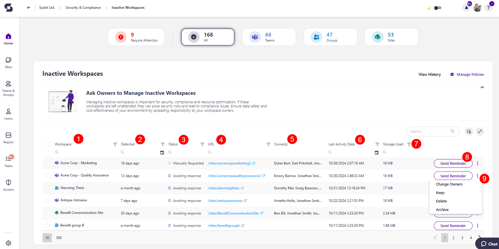

# Inactive Workspaces

Syskit Point detects inactive workspaces based on the settings defined in the tenant-wide [policy](../automated-workflows/inactive-workspaces-admin.md).

Managing inactive workspaces is important for security, compliance, and resource optimization. If these workspaces are left unattended, they can pose security risks and lead to compliance issues. By extending the responsibility to your workspace owners, you can ensure the data safety of your environment.

When the task delegation option is enabled for the Inactive Workspaces policy, Syskit Point creates tasks and sends e-mails to users as defined in the policy settings. To learn more, take a look at the [Inactive Guest Users policy article](../../governance-and-automation/automated-workflows/inactive-guest-users-admin.md). 

By default, task delegation is turned off for this policy, but the inactive workspaces **are still detected**. **This means that Syskit Point detects a vulnerability on a workspace** based on the applied policy, but it does not create tasks or send any e-mails to workspace owners. 

The purpose of this is to assist Syskit Point admins by
bringing awareness of potential issues in their Microsoft 365 environment. 

On the Security & Compliance dashboard, click the **Inactive Workspaces** button to see the report.

The Inactive Workspaces screen opens, showing a list of all **workspaces that have not been active for a defined period**.

The report itself provides information on:
* **Workspace (1)** name
* **Detected (2)** - when the policy vulnerability was detected
* **Status (3)** - status of the policy vulnerability
* **URL (4)** 
* **Owner(s) (5)**
* **Last Activity Date (6)** - date and time when the workspace was last active
* **Storage Used (7)** - the amount of storage used by the workspace

The following actions can be performed on the report:
* Clicking the **Send Reminder (8)** button, you can send an e-mail reminding owners of the pending Inactive Workspaces task
  * This action can only be completed when task delegation is enabled
* **Clicking the three dots (9)** provides additional options:
  * **Change Owners** - opens the selection dialog where you can add or remove owners from the workspace
  * **Keep** - opens the confirmation dialog where you can leave a comment and complete the Keep action
  * **Delete** - opens the confirmation dialog where you can leave a comment and complete the Delete action
  * **Archive** - opens the confirmation dialog where you can leave a comment and complete the Archive action

By **selecting all or more than one workspace**, you can perform the actions above in bulk. 

