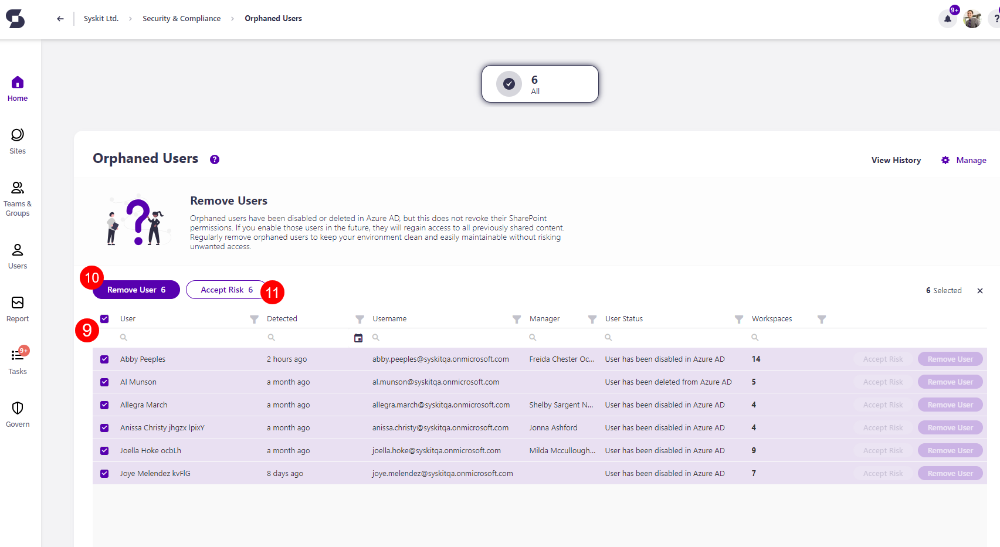

# Orphaned Users

Syskit Point detects users that have been disabled or deleted in Azure AD, but still have access to SharePoint content, which could lead to security risks in case they become active again. 

The Orphaned Users policy is **a tenant-wide policy, and it cannot be automated**. That means that no tasks are created to resolve this policy violation, and no emails are sent to collaborators.

The Orphaned Users **are still detected** and shown on the Security and Compliance dashboard. **This means that Syskit Point detects a vulnerability on a workspace** based on the applied policy, but it does not create tasks or send any emails to collaborators. 

The purpose of this is to assist Syskit Point admins by
bringing awareness of potential issues in their Microsoft 365 environment. 

On the Security & Compliance dashboard, click the **Orphaned Users** button to see the report.

The Orphaned Users screen opens, showing a list of all **users that have the sign-in blocked or are deleted from Azure AD** without having their SharePoint permissions revoked.

The report itself provides information on:
  * **User (1)** name
  * **Detected (2)** - when the policy violation was detected
  * **Username (3)** - the email of the blocked users
  * **Manager (4)** - the name of the person that manages this user
  * **User Status (5)** - status of the user (removed or disabled)
  * **Workspaces (6)** - the number of workspaces this user is a member of

You can complete the following actions for the policy violation:
  * **Accept Risk (7)** - this means you will close the policy violation without making any changes to the current state of the workspace
  * **Remove User (8)** - this will remove the user from the SharePoint site and connected groups, and resolve the policy violation

By **selecting all (9)** or more than one user, you can perform the bulk action for **Remove User (10)** or **Accept Risk (11)**. 

